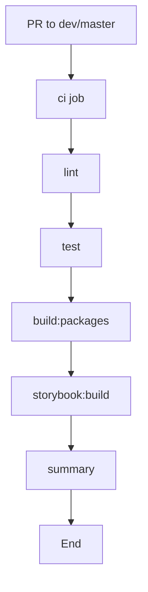
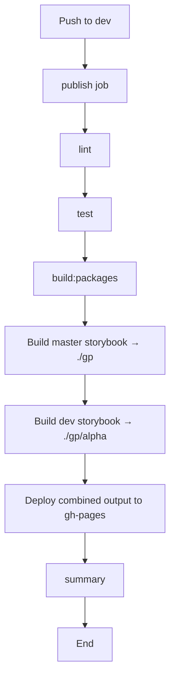
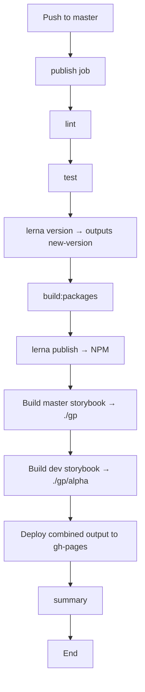
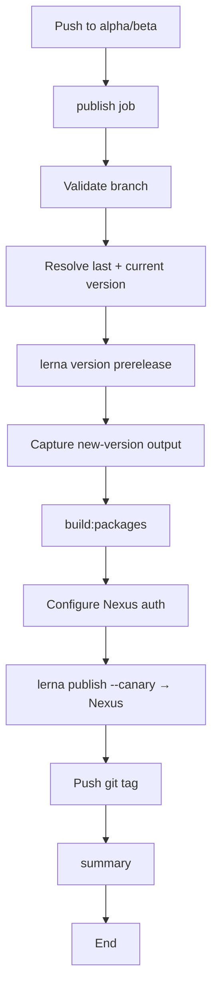

# GitHub Workflows Documentation

This document explains the GitHub Actions workflows structure and strategy for this JavaScript monorepo managed with Lerna and pnpm.

## 📋 Table of Contents

- [Overview](#-overview)
- [Workflow Structure](#️-workflow-structure)
- [Workflow Execution Flow](#workflow-execution-flow)
- [Workflow Details](#-workflow-details)
- [Custom Actions](#-custom-actions)
- [Secrets](#-secrets)
- [Troubleshooting](#-troubleshooting)
- [Additional Resources](#-additional-resources)

## 🔍 Overview

Our CI/CD pipeline is designed around a **monorepo strategy** with multiple packages managed by Lerna and pnpm workspaces. The workflows are optimized for:

- **Fast feedback** on pull requests through linting, testing, and builds
- **Reliable releases** with Lerna-driven versioning
- **Clear separation** between production, pre-release, and storybook preview flows
- **Storybook publishing** to GitHub Pages for both stable and alpha docs
- **Per-workflow step summary** generated as a dedicated `summary` job
- **Comprehensive testing** and quality checks

## 🏗️ Workflow Structure

### Workflow Files

```
.github/
├── workflows/
│   ├── ci.yml                   # Pull request validation
│   ├── publish-dev.yml          # Storybook publishing from dev branch
│   ├── publish-master.yml       # Production releases (master branch) + storybook
│   └── publish-prerelease.yml   # Alpha/Beta pre-releases to Nexus
├── actions/
│   └── node-setup/              # Node.js + pnpm environment setup
└── README.md                    # This file
```

### Trigger Strategy

| Workflow | Trigger | Purpose |
|----------|---------|---------|
| **CI** | Pull requests to `dev` or `master` | Validate code quality, run tests, build packages and storybook |
| **Publish Dev** | Push to `dev` branch | Rebuild and deploy the alpha storybook alongside the master storybook to GitHub Pages |
| **Publish Master** | Push to `master` branch | Version, publish packages to NPM, and deploy storybook to GitHub Pages |
| **Publish Pre-Release** | Push to `alpha`/`beta` branches (or manual dispatch) | Publish pre-release packages to the internal Nexus registry |

### Workflow Execution Flow

Each workflow terminates in a dedicated `summary` job that runs with `if: always()` and writes a Markdown report to `$GITHUB_STEP_SUMMARY`, regardless of whether the upstream job succeeded, failed, or was skipped.

#### CI Workflow


#### Publish Dev Workflow


#### Publish Master Workflow


#### Publish Pre-Release Workflow


## 📋 Workflow Details

### 1. CI Workflow (`ci.yml`)

**Purpose**: Validates pull requests targeting `dev` or `master` with linting, tests, and full builds.

**Strategy**: **Single sequential `ci` job** on an OS/Node matrix (`ubuntu-22.04` / Node `22.x`), followed by a `summary` job.

```yaml
Jobs:
├── ci         # Lint + Test + Build packages + Build storybook
└── summary    # Writes Pull Request Summary to $GITHUB_STEP_SUMMARY (if: always())
```

**Why this approach?**
- **Full validation**: Every PR runs the same lint → test → build → storybook pipeline that feeds the publishing workflows, catching regressions early.
- **Reuse of `node-setup`**: Consistent pnpm, Node, and Puppeteer Chrome caching across all workflows.
- **Matrix-ready**: Matrix definition makes it straightforward to expand OS/Node coverage later.
- **Summary always runs**: `summary` uses `if: always()` so the report is produced even when `ci` fails.

### 2. Publish Dev Workflow (`publish-dev.yml`)

**Purpose**: Keeps the public storybook on GitHub Pages up to date with the `dev` (alpha) branch, alongside the latest `master` storybook.

**Strategy**: **Single `publish` job** that validates and deploys both storybooks, followed by a `summary` job.

```yaml
Jobs:
├── publish    # Lint + Test + Build + Deploy master/alpha storybooks to gh-pages
└── summary    # Writes Publish Dev Summary to $GITHUB_STEP_SUMMARY (if: always())
```

**Why this approach?**
- **Single source of truth for docs**: `gh-pages` always contains the latest `master` storybook at the root and the `dev` (alpha) storybook under `/alpha`.
- **Lint + test gate**: The storybook is only deployed if the working branch passes validation.
- **Summary always runs**: Reports deployment status for both storybooks even on failure.

### 3. Publish Master Workflow (`publish-master.yml`)

**Purpose**: Creates production releases from `master` and redeploys the storybook site.

**Strategy**: **Sequential `publish` job** covering versioning, publishing, and docs, followed by a `summary` job that surfaces the released version.

```yaml
Jobs:
├── publish    # Lint + Test + lerna version + build + lerna publish + storybook deploy
│              # Exposes outputs: new-version, release-tag (read from lerna.json after version)
└── summary    # Writes Release Summary (including version/tag) to $GITHUB_STEP_SUMMARY (if: always())
```

**Permissions**:
- `contents: write` — required to create tags and push version commits.
- `id-token: write` — required for **NPM provenance** via OIDC (`NPM_CONFIG_PROVENANCE: true`).

**Why this approach?**
- **Atomic release**: Versioning, building, publishing, and docs deployment live in one job; a failure in any step halts the release.
- **Provenance**: Production packages are published with NPM provenance for supply-chain traceability.
- **Consistent docs**: Storybook for `master` and `dev` is refreshed together so GitHub Pages always reflects the latest released and in-flight docs.
- **Summary with version context**: The `summary` job consumes `needs.publish.outputs.new-version` / `release-tag` so the report shows exactly what was (or would have been) released.

### 4. Publish Pre-Release Workflow (`publish-prerelease.yml`)

**Purpose**: Publishes `alpha` and `beta` pre-release packages to the internal Nexus registry for testing.

**Strategy**: **Sequential `publish` job** with branch-aware version resolution, followed by a `summary` job. Also supports manual runs via `workflow_dispatch`.

```yaml
Jobs:
├── publish    # Validate branch + resolve versions + lerna prerelease + build + publish to Nexus
│              # Exposes outputs: new-version, release-tag, prerelease-id
└── summary    # Writes Pre-Release Summary (including channel + version) to $GITHUB_STEP_SUMMARY (if: always())
```

**Why this approach?**
- **Channel isolation**: Tag lookup filters out the opposite channel (e.g. on `alpha`, `-beta` tags are ignored), preventing versions from jumping between channels.
- **Resync guard**: When `lerna.json` drifts from the latest tag, the workflow re-aligns it before versioning so `lerna` computes the next prerelease from a clean baseline.
- **Canary publish**: `lerna publish from-git --canary` publishes exactly the tagged versions to Nexus, keeping pre-releases clearly separated from production NPM.
- **Summary with channel context**: The `summary` job reports the resolved pre-release channel (`alpha` / `beta`) and the exact version published to Nexus.

## 🧾 Summary Jobs

All four workflows end with a `summary` job that:

- Runs on `ubuntu-22.04`
- Declares `needs: [<primary job>]` so it runs **after** the main job
- Uses `if: always()` so the summary is written on success, failure, **and** cancelation
- Appends a Markdown report to `$GITHUB_STEP_SUMMARY`, which GitHub renders on the workflow run page

Each report includes:

| Section | Content |
|---------|---------|
| Header | Workflow name + context (commit, branch, environment) |
| Version info | `new-version` / `release-tag` (release workflows only) |
| Component Status | Status chip per job (Success / Skipped / Failed) |
| Action-specific summary | NPM publish, Nexus publish, storybook deploy status, git tag push, etc. |
| Next steps / outcome | Short closing note about what just happened |

The status chips are rendered from the `needs.<job>.result` expression using a GitHub Actions ternary:

```yaml
${{ needs.publish.result == 'success' && '✅ Success'
   || needs.publish.result == 'skipped' && '⏭️ Skipped'
   || '❌ Failed' }}
```

## 🔧 Custom Actions

### `node-setup` Action

**Purpose**: Standardizes the pnpm + Node.js environment (and Puppeteer Chrome cache) across all workflows.

**Inputs**:
- `node-version` — Node.js version to set up (e.g. `22.x`).

**Steps**:
1. Install pnpm (`pnpm/action-setup@v4`, version `8.15.9`).
2. Setup Node.js (`actions/setup-node@v4`) with pnpm cache enabled.
3. `pnpm install` (with `PUPPETEER_SKIP_DOWNLOAD=true` to defer Chrome download).
4. Cache Puppeteer Chrome binary under `~/.cache/puppeteer/`, keyed by `puppeteer-core` and `puppeteer` source files.
5. Run `pnpm postinstall` inside `packages/ui-components/node_modules/puppeteer` to materialize the Chrome binary (cache hit or download).

**Usage**:
```yaml
- name: Setup Node.js
  uses: ./.github/actions/node-setup
  with:
      node-version: 22.x
```

### Branch Types & Workflows

| Branch          | Event           | Workflow                  | Purpose                              |
|-----------------|-----------------|---------------------------|--------------------------------------|
| `master`        | push            | `publish-master.yml`      | Production NPM release + storybook   |
| `dev`           | push            | `publish-dev.yml`         | Alpha storybook deploy               |
| `alpha`         | push / dispatch | `publish-prerelease.yml`  | Alpha pre-release to Nexus           |
| `beta`          | push / dispatch | `publish-prerelease.yml`  | Beta pre-release to Nexus            |
| `dev`/`master`  | pull request    | `ci.yml`                  | Validation only                      |

### Version Strategy

- **Production** (`master`): `1.2.3` — semantic versioning via `lerna version` with conventional commits, published to NPM with provenance.
- **Alpha** (`alpha` branch): `1.2.3-alpha.N` — `lerna version prerelease --preid=alpha`, canary-published to Nexus.
- **Beta** (`beta` branch): `1.2.3-beta.N` — `lerna version prerelease --preid=beta`, canary-published to Nexus.

## 🔐 Secrets

### Required Secrets

| Secret            | Purpose                                                | Used In                  |
|-------------------|--------------------------------------------------------|--------------------------|
| `GITHUB_TOKEN`    | Built-in token for checkout, tagging, and gh-pages deploy | All workflows         |
| `LERNA_PUBLISH`   | Token with write access for Lerna version commits and tag pushes on `master` | `publish-master.yml` |
| `NPM_TOKEN`       | NPM registry authentication for production publishes   | `publish-dev.yml`, `publish-master.yml` |
| `NEXUS_AUTH`      | Base64 auth string for the internal Nexus registry     | `publish-prerelease.yml` |

### Required Permissions

| Workflow                  | `contents` | `id-token` | Notes                                      |
|---------------------------|------------|------------|--------------------------------------------|
| `ci.yml`                  | default    | —          | Read-only validation                       |
| `publish-dev.yml`         | `write`    | —          | Required to push storybook to `gh-pages`   |
| `publish-master.yml`      | `write`    | `write`    | `id-token: write` enables NPM provenance   |
| `publish-prerelease.yml`  | `write`    | —          | Needed for version commits and tag pushes  |

## 🔍 Troubleshooting

### Common Issues

#### 1. NPM / Nexus Authentication Failures
```bash
# Production (publish-master): check NPM_TOKEN is valid and has publish rights
# Nexus  (publish-prerelease): check NEXUS_AUTH is a valid base64 "user:token" string
# For gh-pages deploys: ensure GITHUB_TOKEN has contents: write permission
```

#### 2. Lerna Version / Tag Issues
```bash
# Ensure full git history is fetched
fetch-depth: 0 in the checkout step

# Inspect what lerna would do locally before pushing:
pnpm lerna version --dry-run
pnpm lerna version prerelease --preid=alpha --dry-run
```

#### 3. Pre-Release Version Drift
If `publish-prerelease.yml` fails because `lerna.json` doesn't match the latest tag of the current channel, the workflow's resync step should handle it automatically. If it still fails:
```bash
# Manually align lerna.json with the latest alpha/beta tag, commit, and rerun
git tag -l --sort=-version:refname | grep -v '\-beta'   # for alpha channel
git tag -l --sort=-version:refname | grep -v '\-alpha'  # for beta channel
```

#### 4. Puppeteer Chrome Download Failures
```bash
# node-setup caches Chrome under ~/.cache/puppeteer/.
# If the cache key changes (puppeteer upgrade), the postinstall step downloads Chrome again.
# Verify packages/ui-components/node_modules/puppeteer exists after pnpm install.
```

#### 5. Storybook Deploy Problems
```bash
# publish-dev and publish-master build two storybooks into ./gp and ./gp/alpha
# then deploy with --existing-output-dir='./gp'. Make sure both dry-run builds
# succeed before the final deploy, otherwise gh-pages will be partially updated.
```

#### 6. Missing / Empty Step Summary
```bash
# The summary job uses `if: always()` and `needs: [<primary job>]`.
# If no summary appears, check:
# - The `needs` reference matches the actual job id (e.g. `ci`, `publish`).
# - The primary job is not producing an `outputs` name that differs from the summary
#   references (e.g. `needs.publish.outputs.new-version`).
# - The workflow run didn't fail before any job started (e.g. YAML parse error).
```

### Debug Tips

1. **Enable Debug Logging**: Set `ACTIONS_STEP_DEBUG: true` as a secret.
2. **Local Testing**: Run `pnpm lint`, `pnpm test`, `pnpm build:packages`, and `pnpm storybook:build` locally before pushing.
3. **Lerna Dry Runs**: Use `--dry-run` on `lerna version` / `lerna publish` when diagnosing release issues.
4. **Workflow Logs**: Each job's step logs show the exact pnpm / lerna command and its output.
5. **Step Summary**: Each workflow run's landing page renders the `summary` job's Markdown output — a quick glance shows job status, released version, and deployment outcomes.

## 📚 Additional Resources

- [Lerna Documentation](https://lerna.js.org/)
- [pnpm Documentation](https://pnpm.io/)
- [GitHub Actions Documentation](https://docs.github.com/en/actions)
- [GitHub Actions Job Summaries](https://docs.github.com/en/actions/using-workflows/workflow-commands-for-github-actions#adding-a-job-summary)
- [Semantic Versioning](https://semver.org/)
- [NPM Provenance](https://docs.npmjs.com/generating-provenance-statements)

---

For questions or issues, please contact the frontend team or create an issue in the repository.
