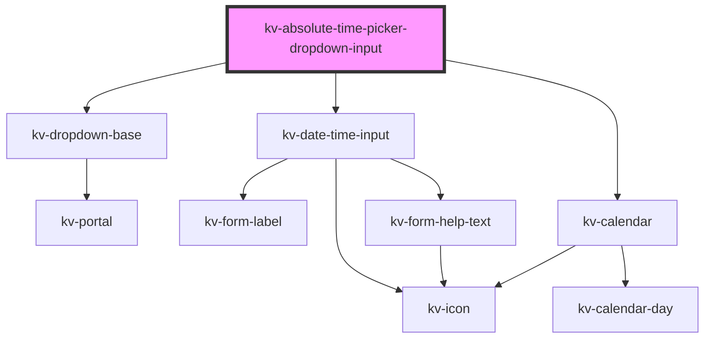

# kv-absolute-time-picker-dropdown-input


<!-- Auto Generated Below -->


## Usage

### React

```tsx
import React from 'react';

import { KvAbsoluteTimePickerDropdownInput } from '@kelvininc/react-ui-components';

export const KvAbsoluteTimePickerDropdownInput: React.FC = () => (
	<>
		{/*-- Default --*/}
		<KvAbsoluteTimePickerDropdownInput />

		{/*-- With selected date --*/}
		<KvAbsoluteTimePickerDropdownInput selectedTime={[1681319856833, 1681406272018]} />

		{/*-- With initial date --*/}
		<KvAbsoluteTimePickerDropdownInput initialDate={1681319856833} />
	</>
);
```


## Properties

| Property                 | Attribute                   | Description                                                            | Type                                                              | Default                         |
| ------------------------ | --------------------------- | ---------------------------------------------------------------------- | ----------------------------------------------------------------- | ------------------------------- |
| `disabled`               | `disabled`                  | (optional) Defines if the inputs for inserting the dates are disabled. | `boolean`                                                         | `false`                         |
| `initialDate`            | `initial-date`              | (optional) Initial date displayed on the calendars                     | `number`                                                          | `undefined`                     |
| `isDropdownOpen`         | `is-dropdown-open`          | (optional) Determines if the dropdown is open                          | `boolean`                                                         | `false`                         |
| `minimumFromInputDate`   | `minimum-from-input-date`   | (optional) calendar from input minimum date                            | `number`                                                          | `undefined`                     |
| `minimumSingleInputDate` | `minimum-single-input-date` | (optional) calendar single input minimum date                          | `number`                                                          | `undefined`                     |
| `minimumToInputDate`     | `minimum-to-input-date`     | (optional) calendar to input minimum date                              | `number`                                                          | `undefined`                     |
| `mode`                   | `mode`                      | (optional) Mode of the input: single, range                            | `EAbsoluteTimePickerMode.Range \| EAbsoluteTimePickerMode.Single` | `EAbsoluteTimePickerMode.Range` |
| `selectedTime`           | `selected-time`             | (optional) Selected time in timestamp                                  | `[] \| [number, number] \| [number]`                              | `undefined`                     |
| `timezone`               | `timezone`                  | (optional) Timezone of the provided timestamp                          | `{ name: string; offset: number; }`                               | `getDefaultTimezoneSettings()`  |


## Events

| Event                 | Description                | Type                                        |
| --------------------- | -------------------------- | ------------------------------------------- |
| `dropdownStateChange` | Dropdown open state change | `CustomEvent<boolean>`                      |
| `selectedTimeChange`  | Selected time change       | `CustomEvent<[number, number] \| [number]>` |


## Dependencies

### Depends on

- [kv-dropdown-base](../dropdown-base)
- [kv-date-time-input](../date-time-input)
- [kv-calendar](../calendar)

### Graph


----------------------------------------------


