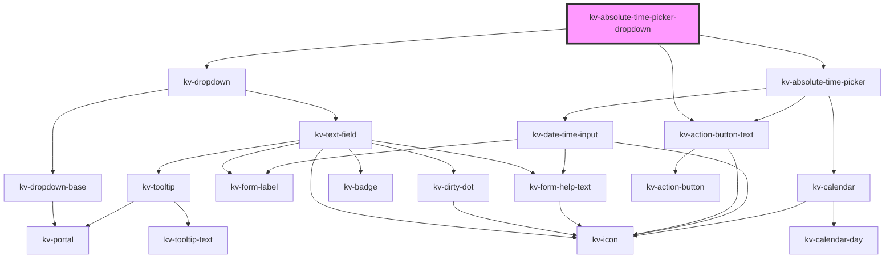

# absolute-time-picker-dropdown


<!-- Auto Generated Below -->


## Usage

### React

```tsx
import React from 'react';

import { KvAbsoluteTimePickerDropdown } from '@kelvininc/react-ui-components/client';

export const KvAbsoluteTimePicker: React.FC = () => (
	<>
		{/*-- Default --*/}
		<KvAbsoluteTimePickerDropdown />

		{/*-- With selected date --*/}
		<KvAbsoluteTimePickerDropdown selectedDates={['2022-08-04', '2022-09-01']} />

		{/*-- With initial date --*/}
		<KvAbsoluteTimePickerDropdown initialDate="2021-12-03" />

		{/*-- With disabled dates --*/}
		<KvAbsoluteTimePickerDropdown disabledDates={['2021-12-01', '2021-12-04', '2021-12-05']} />

		{/*-- With min and max --*/}
		<KvAbsoluteTimePickerDropdown minDate="2021-12-04" maxDate="2023-02-12" />
	</>
);
```


## Properties

| Property                  | Attribute                   | Description                                                                 | Type                                                                                                                                                                                                                                                                                                                                                                                                                                                                                                                                                                                                                                                                                                                                                                                                                                                                                                                                                                                                                                                                                                                                                                             | Default                                        |
| ------------------------- | --------------------------- | --------------------------------------------------------------------------- | -------------------------------------------------------------------------------------------------------------------------------------------------------------------------------------------------------------------------------------------------------------------------------------------------------------------------------------------------------------------------------------------------------------------------------------------------------------------------------------------------------------------------------------------------------------------------------------------------------------------------------------------------------------------------------------------------------------------------------------------------------------------------------------------------------------------------------------------------------------------------------------------------------------------------------------------------------------------------------------------------------------------------------------------------------------------------------------------------------------------------------------------------------------------------------- | ---------------------------------------------- |
| `calendarInputMaxDate`    | `calendar-input-max-date`   | (optional) calendar maximum date to be navigated in timestamp               | `number \| undefined`                                                                                                                                                                                                                                                                                                                                                                                                                                                                                                                                                                                                                                                                                                                                                                                                                                                                                                                                                                                                                                                                                                                                                            | `undefined`                                    |
| `calendarInputMinDate`    | `calendar-input-min-date`   | (optional) calendar minimum date to be navigated in timestamp               | `number \| undefined`                                                                                                                                                                                                                                                                                                                                                                                                                                                                                                                                                                                                                                                                                                                                                                                                                                                                                                                                                                                                                                                                                                                                                            | `undefined`                                    |
| `disabled`                | `disabled`                  | (optional) If `true` the dropdown is disabled. Default: `false`.            | `boolean`                                                                                                                                                                                                                                                                                                                                                                                                                                                                                                                                                                                                                                                                                                                                                                                                                                                                                                                                                                                                                                                                                                                                                                        | `false`                                        |
| `disabledDates`           | `disabled-dates`            | (optional) Disabled dates                                                   | `string[] \| undefined`                                                                                                                                                                                                                                                                                                                                                                                                                                                                                                                                                                                                                                                                                                                                                                                                                                                                                                                                                                                                                                                                                                                                                          | `[]`                                           |
| `dropdownOpen`            | `dropdown-open`             | (optional) If `true`the calendar dropdown is will be open. Default: `false` | `boolean`                                                                                                                                                                                                                                                                                                                                                                                                                                                                                                                                                                                                                                                                                                                                                                                                                                                                                                                                                                                                                                                                                                                                                                        | `false`                                        |
| `dropdownPositionOptions` | `dropdown-position-options` | (optional) Dropdown positioning config                                      | `undefined \| ({ strategy?: Strategy \| undefined; placement?: Placement \| undefined; middleware?: (false \| { name: string; options?: any; fn: (state: { x: number; y: number; initialPlacement: Placement; strategy: Strategy; platform: Platform; placement: Placement; middlewareData: MiddlewareData; rects: ElementRects; elements: Elements; }) => Promisable<MiddlewareReturn>; } \| null \| undefined)[] \| undefined; platform?: Platform \| undefined; })`                                                                                                                                                                                                                                                                                                                                                                                                                                                                                                                                                                                                                                                                                                           | `DEFAULT_TIME_RANGE_DROPDOWN_POSITION_OPTIONS` |
| `headerTitle`             | `header-title`              | (optional) Title displayed on top of the component                          | `string \| undefined`                                                                                                                                                                                                                                                                                                                                                                                                                                                                                                                                                                                                                                                                                                                                                                                                                                                                                                                                                                                                                                                                                                                                                            | `''`                                           |
| `initialDate`             | `initial-date`              | (optional) Initial Date                                                     | `string \| undefined`                                                                                                                                                                                                                                                                                                                                                                                                                                                                                                                                                                                                                                                                                                                                                                                                                                                                                                                                                                                                                                                                                                                                                            | `undefined`                                    |
| `inputConfig`             | `input-config`              | (optional) dropdown input config                                            | `undefined \| { type?: EInputFieldType \| undefined; label?: string \| undefined; icon?: EIconName \| undefined; actionIcon?: EIconName \| undefined; inputName?: string \| undefined; examples?: string[] \| undefined; placeholder?: string \| undefined; maxLength?: number \| undefined; minLength?: number \| undefined; max?: string \| number \| undefined; min?: string \| number \| undefined; step?: string \| number \| undefined; size?: EComponentSize \| undefined; inputDisabled?: boolean \| undefined; inputRequired?: boolean \| undefined; loading?: boolean \| undefined; state?: EValidationState \| undefined; helpText?: string \| string[] \| undefined; value?: string \| number \| null \| undefined; valuePrefix?: string \| undefined; badge?: string \| undefined; inputReadonly?: boolean \| undefined; forcedFocus?: boolean \| undefined; tooltipConfig?: Partial<ITooltip> \| undefined; useInputMask?: boolean \| undefined; inputMaskRegex?: string \| undefined; fitContent?: boolean \| undefined; customStyle?: { [key: string]: string \| undefined; } \| undefined; isDirty?: boolean \| undefined; hideBadge?: boolean \| undefined; }` | `{}`                                           |
| `mode`                    | `mode`                      | (optional) Defines if the calendar is in single date or range mode          | `EAbsoluteTimePickerMode.Range \| EAbsoluteTimePickerMode.Single \| undefined`                                                                                                                                                                                                                                                                                                                                                                                                                                                                                                                                                                                                                                                                                                                                                                                                                                                                                                                                                                                                                                                                                                   | `EAbsoluteTimePickerMode.Single`               |
| `selectedDates`           | `selected-dates`            | (optional) Selected dates                                                   | `[] \| [number, number] \| [number] \| undefined`                                                                                                                                                                                                                                                                                                                                                                                                                                                                                                                                                                                                                                                                                                                                                                                                                                                                                                                                                                                                                                                                                                                                | `[]`                                           |
| `timezone`                | `timezone`                  | (Optional) Timezone of the selected dates                                   | `undefined \| { name: string; offset: number; }`                                                                                                                                                                                                                                                                                                                                                                                                                                                                                                                                                                                                                                                                                                                                                                                                                                                                                                                                                                                                                                                                                                                                 | `undefined`                                    |
| `timezones`               | `timezones`                 | (optional) Available Timezones                                              | `ITimezoneOffset[] \| undefined`                                                                                                                                                                                                                                                                                                                                                                                                                                                                                                                                                                                                                                                                                                                                                                                                                                                                                                                                                                                                                                                                                                                                                 | `buildTimezoneByOffset(getTimezonesNames())`   |
| `tooltipPosition`         | `tooltip-position`          | (optional) Positioning of the tooltip                                       | `ETooltipPosition.Bottom \| ETooltipPosition.BottomEnd \| ETooltipPosition.BottomStart \| ETooltipPosition.Left \| ETooltipPosition.LeftEnd \| ETooltipPosition.LeftStart \| ETooltipPosition.Right \| ETooltipPosition.RightEnd \| ETooltipPosition.RightStart \| ETooltipPosition.Top \| ETooltipPosition.TopEnd \| ETooltipPosition.TopStart \| undefined`                                                                                                                                                                                                                                                                                                                                                                                                                                                                                                                                                                                                                                                                                                                                                                                                                    | `ETooltipPosition.BottomStart`                 |


## Events

| Event                 | Description                | Type                                        |
| --------------------- | -------------------------- | ------------------------------------------- |
| `cancelClicked`       | Cancel button clicked      | `CustomEvent<CustomEvent<MouseEvent>>`      |
| `dropdownStateChange` | Dropdown open state change | `CustomEvent<boolean>`                      |
| `selectedDatesChange` | Selected dates change      | `CustomEvent<[number, number] \| [number]>` |


## Dependencies

### Depends on

- [kv-dropdown](../dropdown)
- [kv-absolute-time-picker](../absolute-time-picker)
- [kv-action-button-text](../action-button-text)

### Graph

```mermaid
graph TD;
  kv-absolute-time-picker-dropdown --> kv-dropdown
  kv-absolute-time-picker-dropdown --> kv-absolute-time-picker
  kv-absolute-time-picker-dropdown --> kv-action-button-text
  kv-dropdown --> kv-dropdown-base
  kv-dropdown --> kv-text-field
  kv-dropdown-base --> kv-portal
  kv-text-field --> kv-tooltip
  kv-text-field --> kv-form-label
  kv-text-field --> kv-icon
  kv-text-field --> kv-dirty-dot
  kv-text-field --> kv-badge
  kv-text-field --> kv-form-help-text
  kv-tooltip --> kv-portal
  kv-tooltip --> kv-tooltip-text
  kv-dirty-dot --> kv-icon
  kv-form-help-text --> kv-icon
  kv-absolute-time-picker --> kv-action-button-text
  kv-absolute-time-picker --> kv-date-time-input
  kv-absolute-time-picker --> kv-calendar
  kv-action-button-text --> kv-action-button
  kv-action-button-text --> kv-icon
  kv-date-time-input --> kv-form-label
  kv-date-time-input --> kv-icon
  kv-date-time-input --> kv-form-help-text
  kv-calendar --> kv-icon
  kv-calendar --> kv-calendar-day
  style kv-absolute-time-picker-dropdown fill:#f9f,stroke:#333,stroke-width:4px
```

----------------------------------------------


