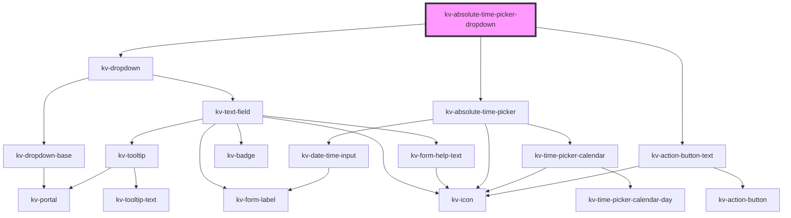

# absolute-time-picker-dropdown


<!-- Auto Generated Below -->


## Usage

### Angular

```html
<!-- Default -->
<kv-absolute-time-picker-dropdown></kv-absolute-time-picker-dropdown>

<!-- With selected ranges date -->
<kv-absolute-time-picker-dropdown [selectedDates]="['2022-08-04', '2022-09-01']"></kv-absolute-time-picker-dropdown>

<!-- With initial date -->
<kv-absolute-time-picker-dropdown initialDate="2022-08-04"></kv-absolute-time-picker-dropdown>

<!-- With disabled dates-->
<kv-absolute-time-picker-dropdown [disabledDates]="['2021-12-01', '2021-12-04', '2021-12-05']"></kv-absolute-time-picker-dropdown>

<!-- With min and max date -->
<kv-absolute-time-picker-dropdown minDate="2021-12-04" maxDate="2023-02-12"></kv-absolute-time-picker-dropdown>
```


### React

```tsx
import React from 'react';

import { KvAbsoluteTimePickerDropdown } from '@kelvininc/react-ui-components';

export const KvAbsoluteTimePicker: React.FC = () => (
	<>
		{/*-- Default --*/}
		<KvAbsoluteTimePickerDropdown />

		{/*-- With selected date --*/}
		<KvAbsoluteTimePickerDropdown selectedDates={['2022-08-04', '2022-09-01']} />

		{/*-- With initial date --*/}
		<KvAbsoluteTimePickerDropdown initialDate="2021-12-03" />

		{/*-- With disabled dates --*/}
		<KvAbsoluteTimePickerDropdown disabledDates={['2021-12-01', '2021-12-04', '2021-12-05']} />

		{/*-- With min and max --*/}
		<KvAbsoluteTimePickerDropdown minDate="2021-12-04" maxDate="2023-02-12" />
	</>
);
```


## Properties

| Property                  | Attribute                 | Description                                                        | Type                                                                                                                                                                                                                                                                                                                                                                                                                                                                                                                                                                                                                                                                        | Default                                        |
| ------------------------- | ------------------------- | ------------------------------------------------------------------ | --------------------------------------------------------------------------------------------------------------------------------------------------------------------------------------------------------------------------------------------------------------------------------------------------------------------------------------------------------------------------------------------------------------------------------------------------------------------------------------------------------------------------------------------------------------------------------------------------------------------------------------------------------------------------- | ---------------------------------------------- |
| `calendarInputMaxDate`    | `calendar-input-max-date` | (optional) calendar maximum date to be navigated                   | `string`                                                                                                                                                                                                                                                                                                                                                                                                                                                                                                                                                                                                                                                                    | `undefined`                                    |
| `calendarInputMinDate`    | `calendar-input-min-date` | (optional) calendar minimum date to be navigated                   | `string`                                                                                                                                                                                                                                                                                                                                                                                                                                                                                                                                                                                                                                                                    | `undefined`                                    |
| `disabledDates`           | --                        | (optional) Disabled dates                                          | `string[]`                                                                                                                                                                                                                                                                                                                                                                                                                                                                                                                                                                                                                                                                  | `[]`                                           |
| `dropdownPositionOptions` | --                        | (optional) Dropdown positioning config                             | `{ placement?: Placement; strategy?: Strategy; middleware?: (false \| { name: string; options?: any; fn: (state: { platform: Platform; placement: Placement; strategy: Strategy; x: number; y: number; initialPlacement: Placement; middlewareData: MiddlewareData; rects: ElementRects; elements: Elements; }) => Promisable<MiddlewareReturn>; })[]; platform?: Platform; }`                                                                                                                                                                                                                                                                                              | `DEFAULT_TIME_RANGE_DROPDOWN_POSITION_OPTIONS` |
| `headerTitle`             | `header-title`            | (optional) Title displayed on top of the component                 | `string`                                                                                                                                                                                                                                                                                                                                                                                                                                                                                                                                                                                                                                                                    | `''`                                           |
| `initialDate`             | `initial-date`            | (optional) Initial Date                                            | `string`                                                                                                                                                                                                                                                                                                                                                                                                                                                                                                                                                                                                                                                                    | `undefined`                                    |
| `inputConfig`             | --                        | (optional) dropdown input config                                   | `{ type?: EInputFieldType; label?: string; icon?: EIconName \| EOtherIconName; actionIcon?: EIconName \| EOtherIconName; inputName?: string; examples?: string[]; placeholder?: string; maxLength?: number; minLength?: number; max?: string \| number; min?: string \| number; step?: string \| number; size?: EComponentSize; disabled?: boolean; required?: boolean; loading?: boolean; state?: EValidationState; helpText?: string \| string[]; value?: string \| number; valuePrefix?: string; badge?: string; readonly?: boolean; forcedFocus?: boolean; tooltipConfig?: Partial<ITooltip>; useInputMask?: boolean; inputMaskRegex?: string; fitContent?: boolean; }` | `{}`                                           |
| `mode`                    | `mode`                    | (optional) Defines if the calendar is in single date or range mode | `EAbsoluteTimePickerMode.Range \| EAbsoluteTimePickerMode.Single`                                                                                                                                                                                                                                                                                                                                                                                                                                                                                                                                                                                                           | `EAbsoluteTimePickerMode.Single`               |
| `selectedDates`           | --                        | (optional) Selected dates                                          | `[] \| [number, number] \| [number]`                                                                                                                                                                                                                                                                                                                                                                                                                                                                                                                                                                                                                                        | `[]`                                           |
| `timezone`                | --                        | (Optional) Timezone of the selected dates                          | `{ name: string; offset: number; }`                                                                                                                                                                                                                                                                                                                                                                                                                                                                                                                                                                                                                                         | `undefined`                                    |
| `timezones`               | --                        | (optional) Available Timezones                                     | `ITimezoneOffset[]`                                                                                                                                                                                                                                                                                                                                                                                                                                                                                                                                                                                                                                                         | `buildTimezoneByOffset(getTimezonesNames())`   |
| `tooltipPosition`         | `tooltip-position`        | (optional) Positioning of the tooltip                              | `ETooltipPosition.Bottom \| ETooltipPosition.BottomEnd \| ETooltipPosition.BottomStart \| ETooltipPosition.Left \| ETooltipPosition.LeftEnd \| ETooltipPosition.LeftStart \| ETooltipPosition.Right \| ETooltipPosition.RightEnd \| ETooltipPosition.RightStart \| ETooltipPosition.Top \| ETooltipPosition.TopEnd \| ETooltipPosition.TopStart`                                                                                                                                                                                                                                                                                                                            | `ETooltipPosition.BottomStart`                 |


## Events

| Event                 | Description                | Type                                              |
| --------------------- | -------------------------- | ------------------------------------------------- |
| `cancelClicked`       | Cancel button clicked      | `CustomEvent<CustomEvent<MouseEvent>>`            |
| `dropdownStateChange` | Dropdown open state change | `CustomEvent<boolean>`                            |
| `selectedDatesChange` | Selected dates change      | `CustomEvent<[] \| [number, number] \| [number]>` |


## Dependencies

### Depends on

- [kv-dropdown](../dropdown)
- [kv-absolute-time-picker](../absolute-time-picker)
- [kv-action-button-text](../action-button-text)

### Graph


----------------------------------------------


