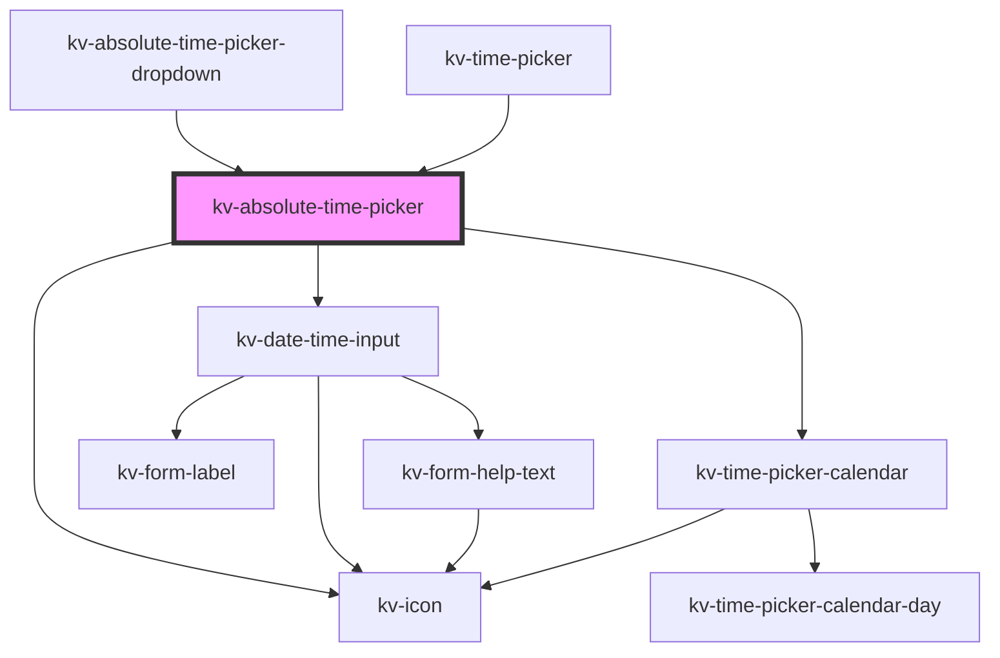

# kv-absolute-time-picker


<!-- Auto Generated Below -->


## Usage

### React

```tsx
import React from 'react';

import { KvAbsoluteTimePicker } from '@kelvininc/react-ui-components';

export const KvAbsoluteTimePicker: React.FC = () => (
	<>
		{/*-- Default --*/}
		<KvAbsoluteTimePicker />

		{/*-- With selected date --*/}
		<KvAbsoluteTimePicker selectedDates={['2022-08-04', '2022-09-01']} />

		{/*-- With initial date --*/}
		<KvAbsoluteTimePicker initialDate="2021-12-03" />

		{/*-- With disabled dates --*/}
		<KvAbsoluteTimePicker disabledDates={['2021-12-01', '2021-12-04', '2021-12-05']} />

		{/*-- With min and max --*/}
		<KvAbsoluteTimePicker minDate="2021-12-04" maxDate="2023-02-12" />
	</>
);
```


## Properties

| Property               | Attribute                 | Description                                                                    | Type                                                                                                                                       | Default                         |
| ---------------------- | ------------------------- | ------------------------------------------------------------------------------ | ------------------------------------------------------------------------------------------------------------------------------------------ | ------------------------------- |
| `calendarInputMaxDate` | `calendar-input-max-date` | (optional) calendar maximum date to be navigated format: DD-MM-YYYY HH:mm:ss   | `string`                                                                                                                                   | `CALENDAR_INPUT_MAX_DATE`       |
| `calendarInputMinDate` | `calendar-input-min-date` | (optional) calendar minimum date to be navigated format: DD-MM-YYYY HH:mm:ss   | `string`                                                                                                                                   | `CALENDAR_INPUT_MIN_DATE`       |
| `disabledDates`        | --                        | (optional) Disabled dates                                                      | `string[]`                                                                                                                                 | `[]`                            |
| `displayBackButton`    | `display-back-button`     | (optional) Enables the back button displayed on top                            | `boolean`                                                                                                                                  | `false`                         |
| `error`                | `error`                   | (optional) It is used to determine if the time picker as date time input error | `EAbsoluteTimeError.EndDateAfterMaximumDate \| EAbsoluteTimeError.EndDateBeforeStartDate \| EAbsoluteTimeError.StartDateBeforeMinimumDate` | `undefined`                     |
| `headerTitle`          | `header-title`            | (optional) Title disaplayed on top of the component                            | `string`                                                                                                                                   | `DEFAULT_HEADER_TITLE`          |
| `initialDate`          | `initial-date`            | (optional) Initial Date                                                        | `string`                                                                                                                                   | `undefined`                     |
| `mode`                 | `mode`                    | (optional) Defines if the calendar is in single date or range mode             | `EAbsoluteTimePickerMode.Range \| EAbsoluteTimePickerMode.Single`                                                                          | `EAbsoluteTimePickerMode.Range` |
| `relativeTimeConfig`   | --                        | (optional) use to determine if the chart inputs have custom strings            | `IRelativeTimeInput`                                                                                                                       | `undefined`                     |
| `selectedDates`        | --                        | (optional) Selected dates                                                      | `string[]`                                                                                                                                 | `[]`                            |


## Events

| Event                      | Description                                                          | Type                                       |
| -------------------------- | -------------------------------------------------------------------- | ------------------------------------------ |
| `backButtonClicked`        | Emitted when the back button is clicked                              | `CustomEvent<MouseEvent>`                  |
| `relativeTimeConfigChange` | Emitted when there is a change in the relative config                | `CustomEvent<IAbsoluteSelectedRangeDates>` |
| `relativeTimeConfigReset`  | Emitted when the input is clicked and it were displaying custom text | `CustomEvent<MouseEvent>`                  |
| `selectedDatesChange`      | Selected dates change                                                | `CustomEvent<IAbsoluteSelectedRangeDates>` |


## Dependencies

### Used by

 - [kv-absolute-time-picker-dropdown](../absolute-time-picker-dropdown)
 - [kv-time-picker](../time-picker)

### Depends on

- [kv-icon](../icon)
- [kv-date-time-input](../date-time-input)
- [kv-time-picker-calendar](../time-picker-calendar)

### Graph


----------------------------------------------


