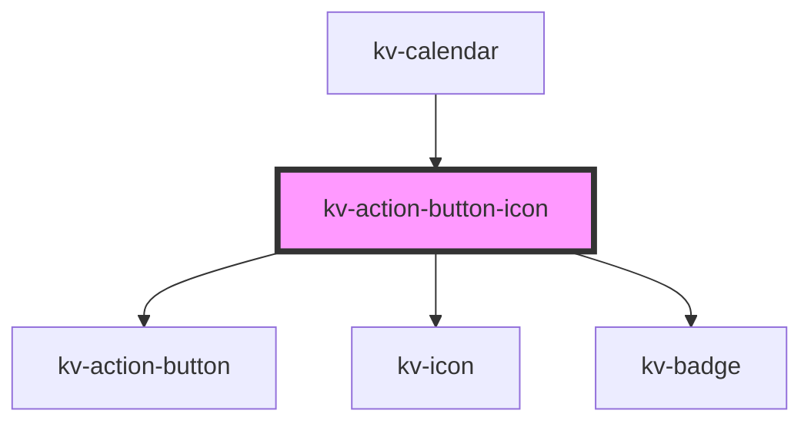

# _<kv-action-button-icon>_

<!-- Auto Generated Below -->


## Usage

### Angular

```html
<!-- Primary -->
<kv-action-button-icon [icon]="EIconName.Add" [type]="EActionButtonType.Primary"></kv-action-button-icon>

<!-- Secondary -->
<kv-action-button-icon [icon]="EIconName.Add" [type]="EActionButtonType.Secondary"></kv-action-button-icon>

<!-- Tertiary -->
<kv-action-button-icon [icon]="EIconName.Add" [type]="EActionButtonType.Tertiary"></kv-action-button-icon>

<!-- Danger -->
<kv-action-button-icon [icon]="EIconName.Add" [type]="EActionButtonType.Danger" disabled></kv-action-button-icon>

<!-- Disabled -->
<kv-action-button-icon [icon]="EIconName.Add" [type]="EActionButtonType.Primary" disabled></kv-action-button-icon>

<!-- Anchor -->
<kv-action-button-icon [icon]="EIconName.Add" href="/link-to-url" target="_blank" [type]="EActionButtonType.Primary"></kv-action-button>

<!-- Badge -->
<kv-action-button-icon [icon]="EIconName.Add" [type]="EActionButtonType.Primary" badge="12"></kv-action-button>
```


### React

```tsx
import React from 'react';

import { KvActionButtonIcon, EIconName } from '@kelvininc/react-ui-components';

export const SwitchButtonExample: React.FC = () => (
	<>
		{/*-- Primary --*/}
		<KvActionButtonIcon icon={EIconName.Add} type={EActionButtonType.Primary}></KvActionButtonIcon>

		{/*--Secondary --*/}
		<KvActionButtonIcon icon={EIconName.Add} type={EActionButtonType.Secondary}></KvActionButtonIcon>

		{/*-- Tertiary --*/}
		<KvActionButtonIcon icon={EIconName.Add} type={EActionButtonType.Tertiary}></KvActionButtonIcon>

		{/*-- Danger --*/}
		<KvActionButtonIcon icon={EIconName.Add} type={EActionButtonType.Danger}></KvActionButtonIcon>

		{/*-- Disabled --*/}
		<KvActionButtonIcon disabled icon={EIconName.Add} type={EActionButtonType.Primary}></KvActionButtonIcon>

		{/*-- Anchor --*/}
		<KvActionButtonIcon icon={EIconName.Add} type={EActionButtonType.Primary} href="/link-to-url" target="_blank"></KvActionButtonIcon>

		{/*-- Badge --*/}
		<KvActionButtonIcon icon={EIconName.Customize} type={EActionButtonType.Primary} badge="12"></kv-action-button>
	</>
);
```


## Properties

| Property            | Attribute     | Description                                                                                                     | Type                                                                                                                 | Default                |
| ------------------- | ------------- | --------------------------------------------------------------------------------------------------------------- | -------------------------------------------------------------------------------------------------------------------- | ---------------------- |
| `active`            | `active`      | (optional) If `true` the button is active                                                                       | `boolean`                                                                                                            | `false`                |
| `badgeLabel`        | `badge-label` | (optional) Defines button's badge label. If set, an badge will be displayed in the end of action icon button.   | `string`                                                                                                             | `undefined`            |
| `badgeState`        | `badge-state` | (optional) Defines button's badge type.                                                                         | `EBadgeState.Error \| EBadgeState.Info \| EBadgeState.None \| EBadgeState.Success \| EBadgeState.Warning`            | `undefined`            |
| `disabled`          | `disabled`    | (optional) If `true` the button is disabled                                                                     | `boolean`                                                                                                            | `false`                |
| `download`          | `download`    | (optional) Specifies that the target will be downloaded when a user clicks on. The value should be the filename | `string`                                                                                                             | `undefined`            |
| `href`              | `href`        | (optional) The anchor's link to open when clicking                                                              | `string`                                                                                                             | `undefined`            |
| `icon` _(required)_ | `icon`        | (required) Button's icon symbol name                                                                            | `EIconName \| EOtherIconName`                                                                                        | `undefined`            |
| `size`              | `size`        | (optional) Button's size                                                                                        | `EComponentSize.Large \| EComponentSize.Small`                                                                       | `EComponentSize.Small` |
| `target`            | `target`      | (optional) The anchor's target                                                                                  | `EAnchorTarget.BrowserDefault \| EAnchorTarget.NewTab \| EAnchorTarget.Parent \| EAnchorTarget.Top`                  | `undefined`            |
| `type` _(required)_ | `type`        | (required) Button's type                                                                                        | `EActionButtonType.Danger \| EActionButtonType.Primary \| EActionButtonType.Secondary \| EActionButtonType.Tertiary` | `undefined`            |


## Events

| Event         | Description                           | Type                      |
| ------------- | ------------------------------------- | ------------------------- |
| `blurButton`  | Emitted when action button is blur    | `CustomEvent<FocusEvent>` |
| `clickButton` | Emitted when action button is clicked | `CustomEvent<MouseEvent>` |
| `focusButton` | Emitted when action button is focused | `CustomEvent<FocusEvent>` |


## CSS Custom Properties

| Name                         | Description                 |
| ---------------------------- | --------------------------- |
| `--button-icon-large-height` | Button's icon large height. |
| `--button-icon-large-width`  | Button's icon large width.  |
| `--button-icon-small-height` | Button's icon small height. |
| `--button-icon-small-width`  | Button's icon small width.  |


## Dependencies

### Used by

 - [kv-calendar](../calendar)

### Depends on

- [kv-action-button](../action-button)
- [kv-icon](../icon)
- [kv-badge](../badge)

### Graph


----------------------------------------------


