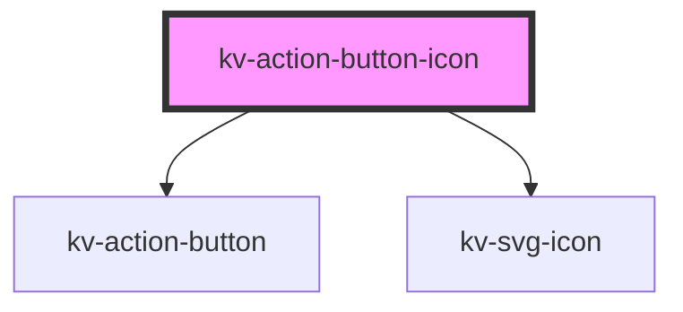

# *<kv-action-button>*


<!-- Auto Generated Below -->


## Usage

### Angular

```html
<!-- Primary -->
<action-button-icon icon="kv-add" [type]="EActionButtonType.Primary"></action-button-icon>

<!-- Secondary -->
<action-button-icon icon="kv-add" [type]="EActionButtonType.Secondary"></action-button-icon>

<!-- Tertiary -->
<action-button-icon icon="kv-add" [type]="EActionButtonType.Tertiary"></action-button-icon>

<!-- Disabled -->
<action-button-icon icon="kv-add" [type]="EActionButtonType.Primary" disabled></action-button-icon>
```


### React

```tsx
import React from 'react';

import { KvActionButtonIcon } from '@kelvininc/react-ui-components';

export const SwitchButtonExample: React.FC = () => (
	<>
		{/*-- Primary --*/}
		<KvActionButtonIcon icon="kv-add" type={EActionButtonType.Primary}></KvActionButtonIcon>

		{/*--Secondary --*/}
		<KvActionButtonIcon icon="kv-add" type={EActionButtonType.Secondary}></KvActionButtonIcon>

		{/*-- Tertiary --*/}
		<KvActionButtonIcon icon="kv-add" type={EActionButtonType.Tertiary}></KvActionButtonIcon>

		{/*-- Disabled --*/}
		<KvActionButtonIcon disabled icon="kv-add" type={EActionButtonType.Primary}></KvActionButtonIcon>
	</>
);
```


## Properties

| Property            | Attribute  | Description                                 | Type                                                                                                                 | Default                |
| ------------------- | ---------- | ------------------------------------------- | -------------------------------------------------------------------------------------------------------------------- | ---------------------- |
| `active`            | `active`   | (optional) If `true` the button is active   | `boolean`                                                                                                            | `false`                |
| `disabled`          | `disabled` | (optional) If `true` the button is disabled | `boolean`                                                                                                            | `false`                |
| `icon` _(required)_ | `icon`     | (required) Button's icon symbol name        | `string`                                                                                                             | `undefined`            |
| `size`              | `size`     | (optional) Button's size                    | `EComponentSize.Large \| EComponentSize.Small`                                                                       | `EComponentSize.Small` |
| `type` _(required)_ | `type`     | (required) Button's type                    | `EActionButtonType.Danger \| EActionButtonType.Primary \| EActionButtonType.Secondary \| EActionButtonType.Tertiary` | `undefined`            |


## Events

| Event         | Description                           | Type                      |
| ------------- | ------------------------------------- | ------------------------- |
| `clickButton` | Emitted when action button is clicked | `CustomEvent<MouseEvent>` |


## CSS Custom Properties

| Name                          | Description                  |
| ----------------------------- | ---------------------------- |
| `--button-icon-normal-height` | Button's icon normal height. |
| `--button-icon-normal-width`  | Button's icon normal width.  |
| `--button-icon-small-height`  | Button's icon small height.  |
| `--button-icon-small-width`   | Button's icon small width.   |


## Dependencies

### Depends on

- [kv-action-button](../action-button)
- [kv-svg-icon](../svg-icon)

### Graph

```mermaid
graph TD;
  kv-action-button-icon --> kv-action-button
  kv-action-button-icon --> kv-svg-icon
  style kv-action-button-icon fill:#f9f,stroke:#333,stroke-width:4px
```

----------------------------------------------


