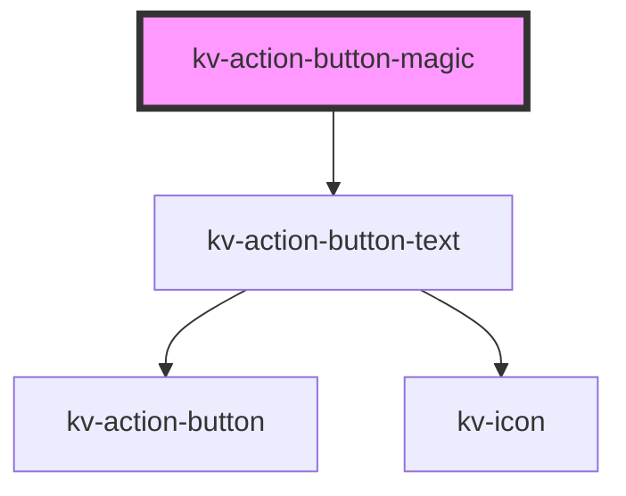

# kv-action-button-magic

<!-- Auto Generated Below -->

## Properties

| Property            | Attribute    | Description                                        | Type                                                                                                                                           | Default                |
| ------------------- | ------------ | -------------------------------------------------- | ---------------------------------------------------------------------------------------------------------------------------------------------- | ---------------------- |
| `active`            | `active`     | (optional) If `true` the button is active          | `boolean`                                                                                                                                      | `false`                |
| `disabled`          | `disabled`   | (optional) If `true` the button is disabled        | `boolean`                                                                                                                                      | `false`                |
| `icon`              | `icon`       | (optional) Button's left icon symbol name          | `EIconName`                                                                                                                                    | `undefined`            |
| `loading`           | `loading`    | (optional) If `true` the button is of type loading | `boolean`                                                                                                                                      | `false`                |
| `rightIcon`         | `right-icon` | (optional) Button's right icon symbol name         | `EIconName`                                                                                                                                    | `undefined`            |
| `size`              | `size`       | (optional) Button's size                           | `EComponentSize.Large \| EComponentSize.Small`                                                                                                 | `EComponentSize.Large` |
| `text` _(required)_ | `text`       | (optional) Button's text                           | `string`                                                                                                                                       | `undefined`            |
| `type` _(required)_ | `type`       | (optional) Button's type                           | `EActionButtonType.Danger \| EActionButtonType.Primary \| EActionButtonType.Secondary \| EActionButtonType.Tertiary \| EActionButtonType.Text` | `undefined`            |

## Events

| Event         | Description                           | Type                      |
| ------------- | ------------------------------------- | ------------------------- |
| `blurButton`  | Emitted when action button is blur    | `CustomEvent<FocusEvent>` |
| `clickButton` | Emitted when action button is clicked | `CustomEvent<MouseEvent>` |
| `focusButton` | Emitted when action button is focused | `CustomEvent<FocusEvent>` |

## Shadow Parts

| Part            | Description      |
| --------------- | ---------------- |
| `"button-text"` | The text button. |
| `"icon"`        | The icon button. |

## Dependencies

### Depends on

- [kv-action-button-text](../action-button-text)

### Graph

----------------------------------------------

