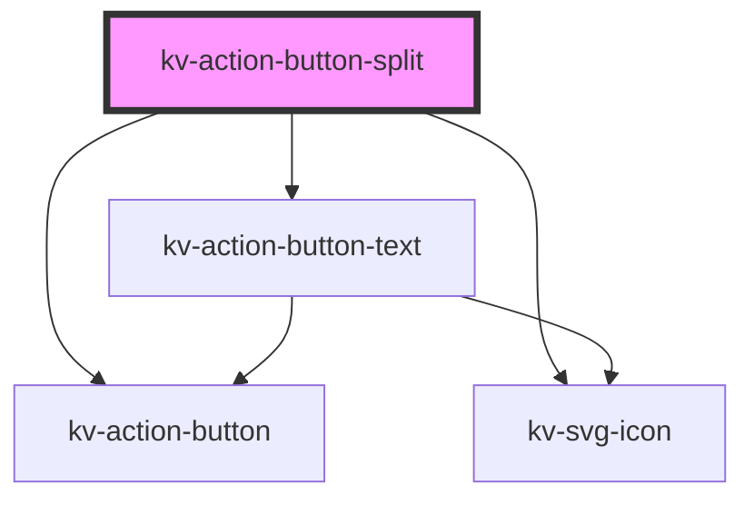

# *<kv-action-button-split>*


<!-- Auto Generated Below -->


## Usage

### Angular

```html
<!-- Primary -->
<kv-action-button-split text="Primary Button" icon="kv-add" split-icon="kv-arrow-drop-down" [type]="EActionButtonType.Primary"></kv-action-button-split>

<!-- Secondary -->
<kv-action-button-split text="Secondary Button" icon="kv-add" split-icon="kv-arrow-drop-down" [type]="EActionButtonType.Secondary"></kv-action-button-split>

<!-- Tertiary -->
<kv-action-button-split text="Tertiary Button" icon="kv-add" split-icon="kv-arrow-drop-down" [type]="EActionButtonType.Tertiary"></kv-action-button-split>

<!-- Disabled -->
<kv-action-button-split text="Disabled Button" icon="kv-add" split-icon="kv-arrow-drop-down" [type]="EActionButtonType.Primary" disabled></kv-action-button-split>

<!-- Anchor -->
<kv-action-button-split text="Link Button icon="kv-add" split-icon="kv-arrow-drop-down" [type]="EActionButtonType.Primary" href="/link-to-url" target="_blank">Link Button</kv-action-button>
```


### React

```tsx
import React from 'react';

import { KvActionButtonText } from '@kelvininc/react-ui-components';

export const SwitchButtonExample: React.FC = () => (
	<>
		{/*-- Primary --*/}
		<KvActionButtonText text="Primary Button" icon="kv-add" type={EActionButtonType.Primary}></KvActionButtonText>

		{/*--Secondary --*/}
		<KvActionButtonText text="Secondary Button" icon="kv-add" type={EActionButtonType.Secondary}></KvActionButtonText>

		{/*-- Tertiary --*/}
		<KvActionButtonText text="Tertiary Button" icon="kv-add" type={EActionButtonType.Tertiary}></KvActionButtonText>

		{/*-- Disabled --*/}
		<KvActionButtonText disabled text="Disabled Button" icon="kv-add" type={EActionButtonType.Primary}></KvActionButtonText>

		{/*-- Anchor --*/}
		<KvActionButtonText text="Anchor Button" icon="kv-add" type={EActionButtonType.Tertiary} href="/link-to-url" target="_blank"></KvActionButtonText>
	</>
);
```


## Properties

| Property                 | Attribute        | Description                                                                                                     | Type                                                                                                                 | Default                |
| ------------------------ | ---------------- | --------------------------------------------------------------------------------------------------------------- | -------------------------------------------------------------------------------------------------------------------- | ---------------------- |
| `active`                 | `active`         | (optional) If `true` the button is active                                                                       | `boolean`                                                                                                            | `false`                |
| `disabled`               | `disabled`       | (optional) If `true` the button is disabled                                                                     | `boolean`                                                                                                            | `false`                |
| `download`               | `download`       | (optional) Specifies that the target will be downloaded when a user clicks on. The value should be the filename | `string`                                                                                                             | `undefined`            |
| `icon`                   | `icon`           | (optional) Button's left icon symbol name                                                                       | `string`                                                                                                             | `''`                   |
| `leftDownload`           | `left-download`  | (optional) The left button anchor's download filename                                                           | `string`                                                                                                             | `undefined`            |
| `leftHref`               | `left-href`      | (optional) The left button anchor's link to open when clicking                                                  | `string`                                                                                                             | `undefined`            |
| `leftTarget`             | `left-target`    | (optional) The left button anchor's target                                                                      | `EAnchorTarget.BrowserDefault \| EAnchorTarget.NewTab \| EAnchorTarget.Parent \| EAnchorTarget.Top`                  | `undefined`            |
| `rightDownload`          | `right-download` | (optional) The right button anchor's download filename                                                          | `string`                                                                                                             | `undefined`            |
| `rightHref`              | `right-href`     | (optional) The right button anchor's link to open when clicking                                                 | `string`                                                                                                             | `undefined`            |
| `rightTarget`            | `right-target`   | (optional) The right button anchor's target                                                                     | `EAnchorTarget.BrowserDefault \| EAnchorTarget.NewTab \| EAnchorTarget.Parent \| EAnchorTarget.Top`                  | `undefined`            |
| `size`                   | `size`           | (optional) Button's size                                                                                        | `EComponentSize.Large \| EComponentSize.Small`                                                                       | `EComponentSize.Large` |
| `splitIcon` _(required)_ | `split-icon`     | (required) Right button icon symbol name                                                                        | `string`                                                                                                             | `undefined`            |
| `target`                 | `target`         | (optional) The anchor's target                                                                                  | `EAnchorTarget.BrowserDefault \| EAnchorTarget.NewTab \| EAnchorTarget.Parent \| EAnchorTarget.Top`                  | `undefined`            |
| `text` _(required)_      | `text`           | (required) (required) Button's text                                                                             | `string`                                                                                                             | `undefined`            |
| `type` _(required)_      | `type`           | (required) Button's type                                                                                        | `EActionButtonType.Danger \| EActionButtonType.Primary \| EActionButtonType.Secondary \| EActionButtonType.Tertiary` | `undefined`            |


## Events

| Event              | Description                          | Type                      |
| ------------------ | ------------------------------------ | ------------------------- |
| `blurLeftButton`   | Emitted when left button is blur     | `CustomEvent<FocusEvent>` |
| `blurRightButton`  | Emitted when right button is blur    | `CustomEvent<FocusEvent>` |
| `clickLeftButton`  | Emitted when left button is clicked  | `CustomEvent<MouseEvent>` |
| `clickRightButton` | Emitted when right button is clicked | `CustomEvent<MouseEvent>` |
| `focusLeftButton`  | Emitted when left button is focused  | `CustomEvent<FocusEvent>` |
| `focusRightButton` | Emitted when right button is focused | `CustomEvent<FocusEvent>` |


## CSS Custom Properties

| Name                             | Description                                         |
| -------------------------------- | --------------------------------------------------- |
| `--button-split-height-large`    | Split button height when size is large.             |
| `--button-split-height-small`    | Split button height when size is size.              |
| `--button-split-icon-height`     | Split button icon height.                           |
| `--button-split-icon-width`      | Split button icon width.                            |
| `--button-split-padding-x-large` | Split button horizontal padding when size is large. |
| `--button-split-padding-x-small` | Split button horizontal padding when size is size.  |


## Dependencies

### Depends on

- [kv-action-button-text](../action-button-text)
- [kv-action-button](../action-button)
- [kv-svg-icon](../svg-icon)

### Graph


----------------------------------------------


