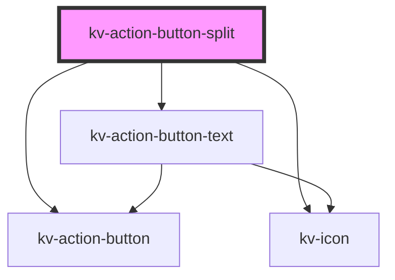

# _<kv-action-button-split>_

<!-- Auto Generated Below -->


## Usage

### React

```tsx
import React from 'react';

import { KvActionButtonText } from '@kelvininc/react-ui-components/client';

export const SwitchButtonExample: React.FC = () => (
	<>
		{/*-- Primary --*/}
		<KvActionButtonText text="Primary Button" icon={EIconName.Add} splitIcon={EIconNameArrowDropDown} type={EActionButtonType.Primary}></KvActionButtonText>

		{/*--Secondary --*/}
		<KvActionButtonText text="Secondary Button" icon={EIconName.Add} splitIcon={EIconNameArrowDropDown} type={EActionButtonType.Secondary}></KvActionButtonText>

		{/*-- Tertiary --*/}
		<KvActionButtonText text="Tertiary Button" icon={EIconName.Add} splitIcon={EIconNameArrowDropDown} type={EActionButtonType.Tertiary}></KvActionButtonText>

		{/*-- Ghost --*/}
		<KvActionButtonText text="Ghost Button" icon={EIconName.Add} splitIcon={EIconNameArrowDropDown} type={EActionButtonType.Ghost}></KvActionButtonText>

		{/*-- Disabled --*/}
		<KvActionButtonText disabled text="Disabled Button" icon={EIconName.Add} splitIcon={EIconNameArrowDropDown} type={EActionButtonType.Primary}></KvActionButtonText>
	</>
);
```


## Properties

| Property                 | Attribute    | Description                                        | Type                                                                                                                                            | Default                |
| ------------------------ | ------------ | -------------------------------------------------- | ----------------------------------------------------------------------------------------------------------------------------------------------- | ---------------------- |
| `active`                 | `active`     | (optional) If `true` the button is active          | `boolean`                                                                                                                                       | `false`                |
| `disabled`               | `disabled`   | (optional) If `true` the button is disabled        | `boolean`                                                                                                                                       | `false`                |
| `icon`                   | `icon`       | (optional) Button's left icon symbol name          | `EIconName`                                                                                                                                     | `undefined`            |
| `loading`                | `loading`    | (optional) If `true` the button is of type loading | `boolean`                                                                                                                                       | `false`                |
| `size`                   | `size`       | (optional) Button's size                           | `EComponentSize.Large \| EComponentSize.Small`                                                                                                  | `EComponentSize.Large` |
| `splitIcon` _(required)_ | `split-icon` | (required) Right button icon symbol name           | `EIconName`                                                                                                                                     | `undefined`            |
| `text` _(required)_      | `text`       | (required) (required) Button's text                | `string`                                                                                                                                        | `undefined`            |
| `type` _(required)_      | `type`       | (optional) Button's type                           | `EActionButtonType.Danger \| EActionButtonType.Ghost \| EActionButtonType.Primary \| EActionButtonType.Secondary \| EActionButtonType.Tertiary` | `undefined`            |


## Events

| Event              | Description                          | Type                      |
| ------------------ | ------------------------------------ | ------------------------- |
| `blurLeftButton`   | Emitted when left button is blur     | `CustomEvent<FocusEvent>` |
| `blurRightButton`  | Emitted when right button is blur    | `CustomEvent<FocusEvent>` |
| `clickLeftButton`  | Emitted when left button is clicked  | `CustomEvent<MouseEvent>` |
| `clickRightButton` | Emitted when right button is clicked | `CustomEvent<MouseEvent>` |
| `focusLeftButton`  | Emitted when left button is focused  | `CustomEvent<FocusEvent>` |
| `focusRightButton` | Emitted when right button is focused | `CustomEvent<FocusEvent>` |


## CSS Custom Properties

| Name                             | Description                                         |
| -------------------------------- | --------------------------------------------------- |
| `--button-split-height-large`    | Split button height when size is large.             |
| `--button-split-height-small`    | Split button height when size is size.              |
| `--button-split-icon-height`     | Split button icon height.                           |
| `--button-split-icon-width`      | Split button icon width.                            |
| `--button-split-padding-x-large` | Split button horizontal padding when size is large. |
| `--button-split-padding-x-small` | Split button horizontal padding when size is size.  |


## Dependencies

### Depends on

- [kv-action-button-text](../action-button-text)
- [kv-action-button](../action-button)
- [kv-icon](../icon)

### Graph


----------------------------------------------


