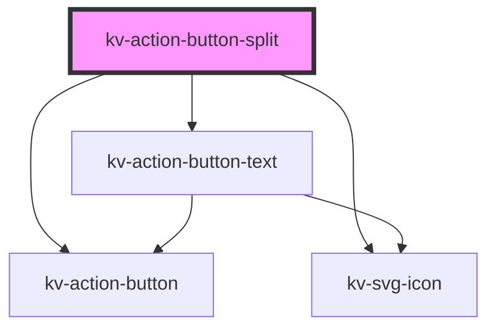

# *<kv-action-button>*


<!-- Auto Generated Below -->


## Usage

### Angular

```html
<!-- Primary -->
<kv-action-button-text text="Primary Button" icon="kv-add" [type]="EActionButtonType.Primary"></kv-action-button-text>

<!-- Secondary -->
<kv-action-button-text text="Secondary Button" icon="kv-add" [type]="EActionButtonType.Secondary"></kv-action-button-text>

<!-- Tertiary -->
<kv-action-button-text text="Tertiary Button" icon="kv-add" [type]="EActionButtonType.Tertiary"></kv-action-button-text>

<!-- Disabled -->
<kv-action-button-text text="Disabled Button" icon="kv-add" [type]="EActionButtonType.Primary" disabled></kv-action-button-text>
```


### React

```tsx
import React from 'react';

import { KvActionButtonText } from '@kelvininc/react-ui-components';

export const SwitchButtonExample: React.FC = () => (
	<>
		{/*-- Primary --*/}
		<KvActionButtonText text="Primary Button" icon="kv-add" type={EActionButtonType.Primary}></KvActionButtonText>

		{/*--Secondary --*/}
		<KvActionButtonText text="Secondary Button" icon="kv-add" type={EActionButtonType.Secondary}></KvActionButtonText>

		{/*-- Tertiary --*/}
		<KvActionButtonText text="Tertiary Button" icon="kv-add" type={EActionButtonType.Tertiary}></KvActionButtonText>

		{/*-- Disabled --*/}
		<KvActionButtonText disabled text="Disabled Button" icon="kv-add" type={EActionButtonType.Primary}></KvActionButtonText>
	</>
);
```


## Properties

| Property                 | Attribute    | Description                                   | Type                                                                                                                 | Default                |
| ------------------------ | ------------ | --------------------------------------------- | -------------------------------------------------------------------------------------------------------------------- | ---------------------- |
| `disabled`               | `disabled`   | (optional) If `true` the buttons are disabled | `boolean`                                                                                                            | `false`                |
| `icon`                   | `icon`       | (optional) Left button icon symbol name       | `string`                                                                                                             | `''`                   |
| `size`                   | `size`       | (optional) Buttons size                       | `EComponentSize.Large \| EComponentSize.Small`                                                                       | `EComponentSize.Large` |
| `splitIcon` _(required)_ | `split-icon` | (required) Right button icon symbol name      | `string`                                                                                                             | `undefined`            |
| `text` _(required)_      | `text`       | (required) Right button text                  | `string`                                                                                                             | `undefined`            |
| `type` _(required)_      | `type`       | (required) Buttons type                       | `EActionButtonType.Danger \| EActionButtonType.Primary \| EActionButtonType.Secondary \| EActionButtonType.Tertiary` | `undefined`            |


## Events

| Event              | Description                          | Type                      |
| ------------------ | ------------------------------------ | ------------------------- |
| `clickLeftButton`  | Emitted when left button is clicked  | `CustomEvent<MouseEvent>` |
| `clickRightButton` | Emitted when right button is clicked | `CustomEvent<MouseEvent>` |


## CSS Custom Properties

| Name                              | Description                                          |
| --------------------------------- | ---------------------------------------------------- |
| `--button-split-height-normal`    | Split button height when size is normal.             |
| `--button-split-height-small`     | Split button height when size is size.               |
| `--button-split-icon-height`      | Split button icon height.                            |
| `--button-split-icon-width`       | Split button icon width.                             |
| `--button-split-padding-x-normal` | Split button horizontal padding when size is normal. |
| `--button-split-padding-x-small`  | Split button horizontal padding when size is size.   |


## Dependencies

### Depends on

- [kv-action-button-text](../action-button-text)
- [kv-action-button](../action-button)
- [kv-svg-icon](../svg-icon)

### Graph

```mermaid
graph TD;
  kv-action-button-split --> kv-action-button-text
  kv-action-button-split --> kv-action-button
  kv-action-button-split --> kv-svg-icon
  kv-action-button-text --> kv-action-button
  kv-action-button-text --> kv-svg-icon
  style kv-action-button-split fill:#f9f,stroke:#333,stroke-width:4px
```

----------------------------------------------


