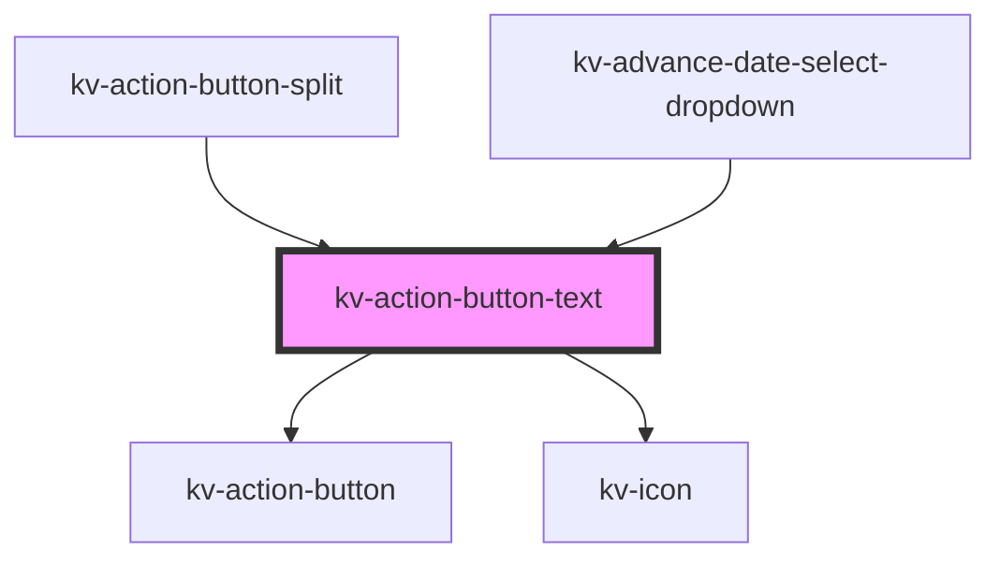

# *<kv-action-button-text>*


<!-- Auto Generated Below -->


## Usage

### Angular

```html
<!-- Primary -->
<kv-action-button-text text="Primary Button" [icon]="EIconName.Add" [type]="EActionButtonType.Primary"></kv-action-button-text>

<!-- Secondary -->
<kv-action-button-text text="Secondary Button" [icon]="EIconName.Add" [type]="EActionButtonType.Secondary"></kv-action-button-text>

<!-- Tertiary -->
<kv-action-button-text text="Tertiary Button" [icon]="EIconName.Add" [type]="EActionButtonType.Tertiary"></kv-action-button-text>

<!-- Disabled -->
<kv-action-button-text text="Disabled Button" [icon]="EIconName.Add" [type]="EActionButtonType.Primary" disabled></kv-action-button-text>

<!-- Anchor -->
<kv-action-button-text text="Link Button" [icon]="EIconName.Add" [type]="EActionButtonType.Primary" href="/link-to-url" target="_blank"></kv-action-button-text>
```


### React

```tsx
import React from 'react';

import { KvActionButtonText, EActionButtonType, EIconName } from '@kelvininc/react-ui-components';

export const SwitchButtonExample: React.FC = () => (
	<>
		{/*-- Primary --*/}
		<KvActionButtonText text="Primary Button" icon={EIconName.Add} type={EActionButtonType.Primary}></KvActionButtonText>

		{/*--Secondary --*/}
		<KvActionButtonText text="Secondary Button" icon={EIconName.Add} type={EActionButtonType.Secondary}></KvActionButtonText>

		{/*-- Tertiary --*/}
		<KvActionButtonText text="Tertiary Button" icon={EIconName.Add} type={EActionButtonType.Tertiary}></KvActionButtonText>

		{/*-- Disabled --*/}
		<KvActionButtonText disabled text="Disabled Button" icon={EIconName.Add} type={EActionButtonType.Primary}></KvActionButtonText>

		{/*-- Anchor --*/}
		<KvActionButton href="/link-to-url" target="_blank" type={EActionButtonType.Primary} text="Anchor Button" icon={EIconName.Add}></KvActionButton>
	</>
);
```


## Properties

| Property            | Attribute  | Description                                                                                                     | Type                                                                                                                 | Default                |
| ------------------- | ---------- | --------------------------------------------------------------------------------------------------------------- | -------------------------------------------------------------------------------------------------------------------- | ---------------------- |
| `active`            | `active`   | (optional) If `true` the button is active                                                                       | `boolean`                                                                                                            | `false`                |
| `disabled`          | `disabled` | (optional) If `true` the button is disabled                                                                     | `boolean`                                                                                                            | `false`                |
| `download`          | `download` | (optional) Specifies that the target will be downloaded when a user clicks on. The value should be the filename | `string`                                                                                                             | `undefined`            |
| `href`              | `href`     | (optional) The anchor's link to open when clicking                                                              | `string`                                                                                                             | `undefined`            |
| `icon`              | `icon`     | (optional) Button's left icon symbol name                                                                       | `EIconName \| EOtherIconName`                                                                                        | `undefined`            |
| `size`              | `size`     | (optional) Button's size                                                                                        | `EComponentSize.Large \| EComponentSize.Small`                                                                       | `EComponentSize.Large` |
| `target`            | `target`   | (optional) The anchor's target                                                                                  | `EAnchorTarget.BrowserDefault \| EAnchorTarget.NewTab \| EAnchorTarget.Parent \| EAnchorTarget.Top`                  | `undefined`            |
| `text` _(required)_ | `text`     | (required) (required) Button's text                                                                             | `string`                                                                                                             | `undefined`            |
| `type` _(required)_ | `type`     | (required) Button's type                                                                                        | `EActionButtonType.Danger \| EActionButtonType.Primary \| EActionButtonType.Secondary \| EActionButtonType.Tertiary` | `undefined`            |


## Events

| Event         | Description                           | Type                      |
| ------------- | ------------------------------------- | ------------------------- |
| `blurButton`  | Emitted when action button is blur    | `CustomEvent<FocusEvent>` |
| `clickButton` | Emitted when action button is clicked | `CustomEvent<MouseEvent>` |
| `focusButton` | Emitted when action button is focused | `CustomEvent<FocusEvent>` |


## Shadow Parts

| Part            | Description      |
| --------------- | ---------------- |
| `"button-text"` | The text button. |


## CSS Custom Properties

| Name                   | Description           |
| ---------------------- | --------------------- |
| `--button-icon-height` | Button's icon height. |
| `--button-icon-width`  | Button's icon width.  |


## Dependencies

### Used by

 - [kv-action-button-split](../action-button-split)
 - [kv-advance-date-select-dropdown](../advance-date-select-dropdown)

### Depends on

- [kv-action-button](../action-button)
- [kv-icon](../icon)

### Graph


----------------------------------------------


