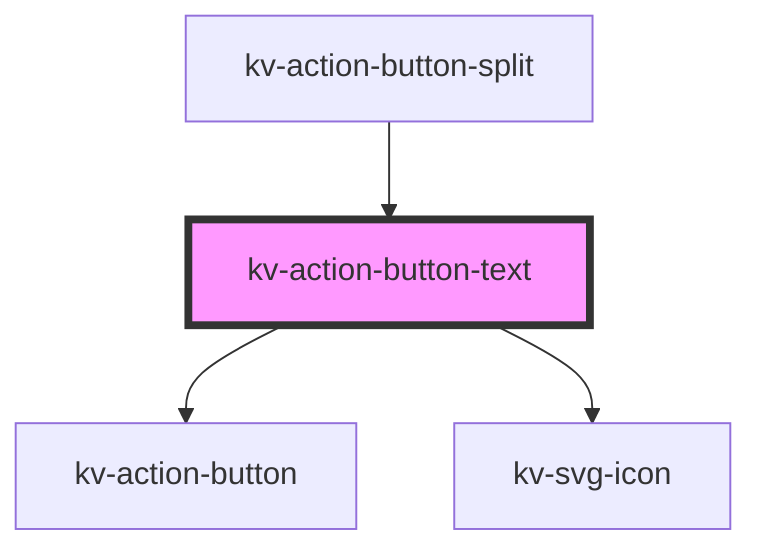

# *<kv-action-button>*


<!-- Auto Generated Below -->


## Usage

### Angular

```html
<!-- Primary -->
<kv-action-button-text text="Primary Button" icon="kv-add" [type]="EActionButtonType.Primary"></kv-action-button-text>

<!-- Secondary -->
<kv-action-button-text text="Secondary Button" icon="kv-add" [type]="EActionButtonType.Secondary"></kv-action-button-text>

<!-- Tertiary -->
<kv-action-button-text text="Tertiary Button" icon="kv-add" [type]="EActionButtonType.Tertiary"></kv-action-button-text>

<!-- Disabled -->
<kv-action-button-text text="Disabled Button" icon="kv-add" [type]="EActionButtonType.Primary" disabled></kv-action-button-text>
```


### React

```tsx
import React from 'react';

import { KvActionButtonText } from '@kelvininc/react-ui-components';

export const SwitchButtonExample: React.FC = () => (
	<>
		{/*-- Primary --*/}
		<KvActionButtonText text="Primary Button" icon="kv-add" type={EActionButtonType.Primary}></KvActionButtonText>

		{/*--Secondary --*/}
		<KvActionButtonText text="Secondary Button" icon="kv-add" type={EActionButtonType.Secondary}></KvActionButtonText>

		{/*-- Tertiary --*/}
		<KvActionButtonText text="Tertiary Button" icon="kv-add" type={EActionButtonType.Tertiary}></KvActionButtonText>

		{/*-- Disabled --*/}
		<KvActionButtonText disabled text="Disabled Button" icon="kv-add" type={EActionButtonType.Primary}></KvActionButtonText>
	</>
);
```


## Properties

| Property            | Attribute  | Description                                 | Type                                                                                                                 | Default                |
| ------------------- | ---------- | ------------------------------------------- | -------------------------------------------------------------------------------------------------------------------- | ---------------------- |
| `disabled`          | `disabled` | (optional) If `true` the button is disabled | `boolean`                                                                                                            | `false`                |
| `icon`              | `icon`     | (optional) Button's left icon symbol name   | `string`                                                                                                             | `''`                   |
| `size`              | `size`     | (optional) Button's size                    | `EComponentSize.Large \| EComponentSize.Small`                                                                       | `EComponentSize.Large` |
| `text` _(required)_ | `text`     | (required) (required) Button's text         | `string`                                                                                                             | `undefined`            |
| `type` _(required)_ | `type`     | (required) Button's type                    | `EActionButtonType.Danger \| EActionButtonType.Primary \| EActionButtonType.Secondary \| EActionButtonType.Tertiary` | `undefined`            |


## Shadow Parts

| Part              | Description        |
| ----------------- | ------------------ |
| `"action-button"` | The action button. |
| `"button-text"`   | The text button.   |


## CSS Custom Properties

| Name                   | Description           |
| ---------------------- | --------------------- |
| `--button-icon-height` | Button's icon height. |
| `--button-icon-width`  | Button's icon width.  |


## Dependencies

### Used by

 - [kv-action-button-split](../action-button-split)

### Depends on

- [kv-action-button](../action-button)
- [kv-svg-icon](../svg-icon)

### Graph

```mermaid
graph TD;
  kv-action-button-text --> kv-action-button
  kv-action-button-text --> kv-svg-icon
  kv-action-button-split --> kv-action-button-text
  style kv-action-button-text fill:#f9f,stroke:#333,stroke-width:4px
```

----------------------------------------------


