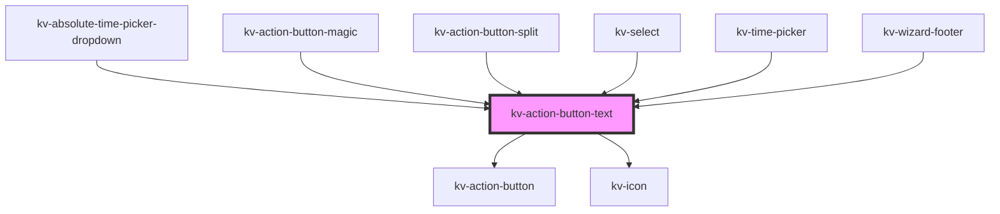

# _<kv-action-button-text>_

<!-- Auto Generated Below -->


## Usage

### React

```tsx
import React from 'react';

import { KvActionButtonText, EActionButtonType, EIconName } from '@kelvininc/react-ui-components/client';

export const ActionButtonTextExample: React.FC = () => (
	<>
		{/*-- Primary --*/}
		<KvActionButtonText text="Primary Button" icon={EIconName.Add} type={EActionButtonType.Primary}></KvActionButtonText>

		{/*--Secondary --*/}
		<KvActionButtonText text="Secondary Button" icon={EIconName.Add} type={EActionButtonType.Secondary}></KvActionButtonText>

		{/*-- Tertiary --*/}
		<KvActionButtonText text="Tertiary Button" icon={EIconName.Add} type={EActionButtonType.Tertiary}></KvActionButtonText>

		{/*-- Text --*/}
		<KvActionButtonText text="Text Button" icon={EIconName.Add} type={EActionButtonType.Text}></KvActionButtonText>

		{/*-- Disabled --*/}
		<KvActionButtonText disabled text="Disabled Button" icon={EIconName.Add} type={EActionButtonType.Primary}></KvActionButtonText>
	</>
);
```


## Properties

| Property            | Attribute    | Description                                        | Type                                                                                                                                           | Default                |
| ------------------- | ------------ | -------------------------------------------------- | ---------------------------------------------------------------------------------------------------------------------------------------------- | ---------------------- |
| `active`            | `active`     | (optional) If `true` the button is active          | `boolean`                                                                                                                                      | `false`                |
| `disabled`          | `disabled`   | (optional) If `true` the button is disabled        | `boolean`                                                                                                                                      | `false`                |
| `icon`              | `icon`       | (optional) Button's left icon symbol name          | `EIconName`                                                                                                                                    | `undefined`            |
| `loading`           | `loading`    | (optional) If `true` the button is of type loading | `boolean`                                                                                                                                      | `false`                |
| `rightIcon`         | `right-icon` | (optional) Button's right icon symbol name         | `EIconName`                                                                                                                                    | `undefined`            |
| `size`              | `size`       | (optional) Button's size                           | `EComponentSize.Large \| EComponentSize.Small`                                                                                                 | `EComponentSize.Large` |
| `text` _(required)_ | `text`       | (required) (required) Button's text                | `string`                                                                                                                                       | `undefined`            |
| `type` _(required)_ | `type`       | (optional) Button's type                           | `EActionButtonType.Danger \| EActionButtonType.Primary \| EActionButtonType.Secondary \| EActionButtonType.Tertiary \| EActionButtonType.Text` | `undefined`            |


## Events

| Event         | Description                           | Type                      |
| ------------- | ------------------------------------- | ------------------------- |
| `blurButton`  | Emitted when action button is blur    | `CustomEvent<FocusEvent>` |
| `clickButton` | Emitted when action button is clicked | `CustomEvent<MouseEvent>` |
| `focusButton` | Emitted when action button is focused | `CustomEvent<FocusEvent>` |


## Shadow Parts

| Part            | Description      |
| --------------- | ---------------- |
| `"button-text"` | The text button. |
| `"icon"`        | The icon button. |


## Dependencies

### Used by

 - [kv-absolute-time-picker-dropdown](../absolute-time-picker-dropdown)
 - [kv-action-button-magic](../action-button-magic)
 - [kv-action-button-split](../action-button-split)
 - [kv-select](../select)
 - [kv-time-picker](../time-picker)
 - [kv-wizard-footer](../wizard-footer)

### Depends on

- [kv-action-button](../action-button)
- [kv-icon](../icon)

### Graph

```mermaid
graph TD;
  kv-action-button-text --> kv-action-button
  kv-action-button-text --> kv-icon
  kv-absolute-time-picker-dropdown --> kv-action-button-text
  kv-action-button-magic --> kv-action-button-text
  kv-action-button-split --> kv-action-button-text
  kv-select --> kv-action-button-text
  kv-time-picker --> kv-action-button-text
  kv-wizard-footer --> kv-action-button-text
  style kv-action-button-text fill:#f9f,stroke:#333,stroke-width:4px
```

----------------------------------------------


