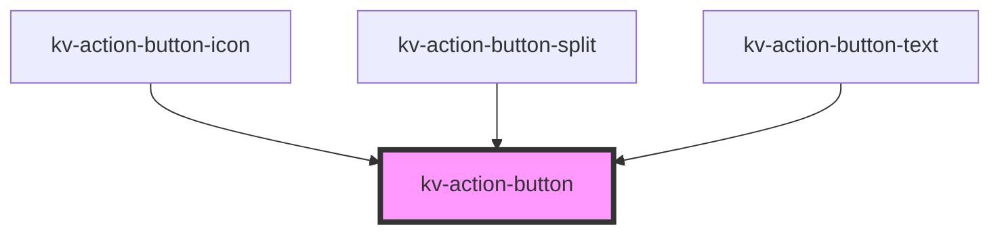

# *<kv-action-button>*


<!-- Auto Generated Below -->


## Usage

### Angular

```html
<!-- Primary -->
<kv-action-button [type]="EActionButtonType.Primary">Primary Button</kv-action-button>

<!-- Secondary -->
<kv-action-button [type]="EActionButtonType.Secondary">Secondary Button</kv-action-button>

<!-- Tertiary -->
<kv-action-button [type]="EActionButtonType.Tertiary">Tertiary Button</kv-action-button>

<!-- Disabled -->
<kv-action-button disabled [type]="EActionButtonType.Primary">Disabled Button</kv-action-button>

<!-- Anchor -->
<kv-action-button href="/link-to-url" target="_blank" [type]="EActionButtonType.Primary">Link Button</kv-action-button>
```


### React

```tsx
import React from 'react';

import { KvActionButton } from '@kelvininc/react-ui-components';

export const SwitchButtonExample: React.FC = () => (
	<>
		{/*-- Primary --*/}
		<KvActionButton type={EActionButtonType.Primary}>Primary Button</KvActionButton>

		{/*--Secondary --*/}
		<KvActionButton type={EActionButtonType.Secondary}>Secondary Button</KvActionButton>

		{/*-- Tertiary --*/}
		<KvActionButton type={EActionButtonType.Tertiary}>Tertiary Button</KvActionButton>

		{/*-- Tertiary --*/}
		<KvActionButton type={EActionButtonType.Ghost}>Ghost Button</KvActionButton>

		{/*-- Disabled --*/}
		<KvActionButton disabled type={EActionButtonType.Primary}>
			Disabled Button
		</KvActionButton>

		{/*-- Anchor --*/}
		<KvActionButton href="/link-to-url" target="_blank" type={EActionButtonType.Primary}>
			Anchor Button
		</KvActionButton>
	</>
);
```


## Properties

| Property            | Attribute  | Description                                                                                                     | Type                                                                                                                                            | Default                |
| ------------------- | ---------- | --------------------------------------------------------------------------------------------------------------- | ----------------------------------------------------------------------------------------------------------------------------------------------- | ---------------------- |
| `active`            | `active`   | (optional) If `true` the button is active                                                                       | `boolean`                                                                                                                                       | `false`                |
| `disabled`          | `disabled` | (optional) If `true` the button is disabled                                                                     | `boolean`                                                                                                                                       | `false`                |
| `download`          | `download` | (optional) Specifies that the target will be downloaded when a user clicks on. The value should be the filename | `string`                                                                                                                                        | `undefined`            |
| `href`              | `href`     | (optional) The anchor's link to open when clicking                                                              | `string`                                                                                                                                        | `undefined`            |
| `loading`           | `loading`  | (optional) If `true` the button is of type loading                                                              | `boolean`                                                                                                                                       | `false`                |
| `size`              | `size`     | (optional) Button's size                                                                                        | `EComponentSize.Large \| EComponentSize.Small`                                                                                                  | `EComponentSize.Large` |
| `target`            | `target`   | (optional) The anchor's target                                                                                  | `EAnchorTarget.BrowserDefault \| EAnchorTarget.NewTab \| EAnchorTarget.Parent \| EAnchorTarget.Top`                                             | `undefined`            |
| `type` _(required)_ | `type`     | (required) Button's type                                                                                        | `EActionButtonType.Danger \| EActionButtonType.Ghost \| EActionButtonType.Primary \| EActionButtonType.Secondary \| EActionButtonType.Tertiary` | `undefined`            |


## Events

| Event         | Description                           | Type                      |
| ------------- | ------------------------------------- | ------------------------- |
| `blurButton`  | Emitted when action button is blur    | `CustomEvent<FocusEvent>` |
| `clickButton` | Emitted when action button is clicked | `CustomEvent<MouseEvent>` |
| `focusButton` | Emitted when action button is focused | `CustomEvent<FocusEvent>` |


## Shadow Parts

| Part       | Description        |
| ---------- | ------------------ |
| `"button"` | The action button. |


## CSS Custom Properties

| Name                                    | Description                                                     |
| --------------------------------------- | --------------------------------------------------------------- |
| `--background-color-active-danger`      | Background color when state is active and theme is danger.      |
| `--background-color-active-primary`     | Background color when state is active and theme is primary.     |
| `--background-color-active-secondary`   | Background color when state is active and theme is secondary.   |
| `--background-color-active-tertiary`    | Background color when state is active and theme is tertiary.    |
| `--background-color-default-danger`     | Background color when state is default and theme is danger.     |
| `--background-color-default-primary`    | Background color when state is default and theme is primary.    |
| `--background-color-default-secondary`  | Background color when state is default and theme is secondary.  |
| `--background-color-default-tertiary`   | Background color when state is default and theme is tertiary.   |
| `--background-color-disabled-danger`    | Background color when state is disabled and theme is danger.    |
| `--background-color-disabled-primary`   | Background color when state is disabled and theme is primary.   |
| `--background-color-disabled-secondary` | Background color when state is disabled and theme is secondary. |
| `--background-color-disabled-tertiary`  | Background color when state is disabled and theme is tertiary.  |
| `--background-color-focus-danger`       | Background color when state is focus and theme is danger.       |
| `--background-color-focus-primary`      | Background color when state is focus and theme is primary.      |
| `--background-color-focus-secondary`    | Background color when state is focus and theme is secondary.    |
| `--background-color-focus-tertiary`     | Background color when state is focus and theme is tertiary.     |
| `--background-color-hover-danger`       | Background color when state is hover and theme is danger.       |
| `--background-color-hover-primary`      | Background color when state is hover and theme is primary.      |
| `--background-color-hover-secondary`    | Background color when state is hover and theme is secondary.    |
| `--background-color-hover-tertiary`     | Background color when state is hover and theme is tertiary.     |
| `--border-color-active-danger`          | Border color when state is active and theme is danger.          |
| `--border-color-active-primary`         | Border color when state is active and theme is primary.         |
| `--border-color-active-secondary`       | Border color when state is active and theme is secondary.       |
| `--border-color-active-tertiary`        | Border color when state is active and theme is tertiary.        |
| `--border-color-default-danger`         | Border color when state is default and theme is danger.         |
| `--border-color-default-primary`        | Border color when state is default and theme is primary.        |
| `--border-color-default-secondary`      | Border color when state is default and theme is secondary.      |
| `--border-color-default-tertiary`       | Border color when state is default and theme is tertiary.       |
| `--border-color-disabled-danger`        | Border color when state is disabled and theme is danger.        |
| `--border-color-disabled-primary`       | Border color when state is disabled and theme is primary.       |
| `--border-color-disabled-secondary`     | Border color when state is disabled and theme is secondary.     |
| `--border-color-disabled-tertiary`      | Border color when state is disabled and theme is tertiary.      |
| `--border-color-focus-danger`           | Border color when state is focus and theme is danger.           |
| `--border-color-focus-primary`          | Border color when state is focus and theme is primary.          |
| `--border-color-focus-secondary`        | Border color when state is focus and theme is secondary.        |
| `--border-color-focus-tertiary`         | Border color when state is focus and theme is tertiary.         |
| `--border-color-hover-danger`           | Border color when state is hover and theme is danger.           |
| `--border-color-hover-primary`          | Border color when state is hover and theme is primary.          |
| `--border-color-hover-secondary`        | Border color when state is hover and theme is secondary.        |
| `--border-color-hover-tertiary`         | Border color when state is hover and theme is tertiary.         |
| `--button-height-large`                 | Button's height when size large.                                |
| `--button-height-small`                 | Button's height when size small.                                |
| `--button-padding-x-large`              | Button's horizontal padding when size is large.                 |
| `--button-padding-x-small`              | Button's horizontal padding when size is small.                 |
| `--text-color-active-danger`            | Text color when state is active and theme is danger.            |
| `--text-color-active-primary`           | Text color when state is active and theme is primary.           |
| `--text-color-active-secondary`         | Text color when state is active and theme is secondary.         |
| `--text-color-active-tertiary`          | Text color when state is active and theme is tertiary.          |
| `--text-color-default-danger`           | Text color when state is default and theme is danger.           |
| `--text-color-default-primary`          | Text color when state is default and theme is primary.          |
| `--text-color-default-secondary`        | Text color when state is default and theme is secondary.        |
| `--text-color-default-tertiary`         | Text color when state is default and theme is tertiary.         |
| `--text-color-disabled-danger`          | Text color when state is disabled and theme is danger.          |
| `--text-color-disabled-primary`         | Text color when state is disabled and theme is primary.         |
| `--text-color-disabled-secondary`       | Text color when state is disabled and theme is secondary.       |
| `--text-color-disabled-tertiary`        | Text color when state is disabled and theme is tertiary.        |
| `--text-color-focus-danger`             | Text color when state is focus and theme is danger.             |
| `--text-color-focus-primary`            | Text color when state is focus and theme is primary.            |
| `--text-color-focus-secondary`          | Text color when state is focus and theme is secondary.          |
| `--text-color-focus-tertiary`           | Text color when state is focus and theme is tertiary.           |
| `--text-color-hover-danger`             | Text color when state is hover and theme is danger.             |
| `--text-color-hover-primary`            | Text color when state is hover and theme is primary.            |
| `--text-color-hover-secondary`          | Text color when state is hover and theme is secondary.          |
| `--text-color-hover-tertiary`           | Text color when state is hover and theme is tertiary.           |


## Dependencies

### Used by

 - [kv-action-button-icon](../action-button-icon)
 - [kv-action-button-split](../action-button-split)
 - [kv-action-button-text](../action-button-text)

### Graph


----------------------------------------------


