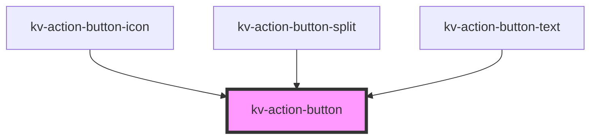

# _<kv-action-button>_

<!-- Auto Generated Below -->


## Usage

### React

```tsx
import React from 'react';

import { KvActionButton } from '@kelvininc/react-ui-components/client';

export const ActionButtonExample: React.FC = () => (
	<>
		{/*-- Primary --*/}
		<KvActionButton type={EActionButtonType.Primary}>Primary Button</KvActionButton>

		{/*--Secondary --*/}
		<KvActionButton type={EActionButtonType.Secondary}>Secondary Button</KvActionButton>

		{/*-- Tertiary --*/}
		<KvActionButton type={EActionButtonType.Tertiary}>Tertiary Button</KvActionButton>

		{/*-- Text --*/}
		<KvActionButton type={EActionButtonType.Text}>Text Button</KvActionButton>

		{/*-- Disabled --*/}
		<KvActionButton disabled type={EActionButtonType.Primary}>
			Disabled Button
		</KvActionButton>
	</>
);
```


## Properties

| Property   | Attribute  | Description                                        | Type                                                                                                                                           | Default                |
| ---------- | ---------- | -------------------------------------------------- | ---------------------------------------------------------------------------------------------------------------------------------------------- | ---------------------- |
| `active`   | `active`   | (optional) If `true` the button is active          | `boolean`                                                                                                                                      | `false`                |
| `disabled` | `disabled` | (optional) If `true` the button is disabled        | `boolean`                                                                                                                                      | `false`                |
| `loading`  | `loading`  | (optional) If `true` the button is of type loading | `boolean`                                                                                                                                      | `false`                |
| `size`     | `size`     | (optional) Button's size                           | `EComponentSize.Large \| EComponentSize.Small`                                                                                                 | `EComponentSize.Large` |
| `type`     | `type`     | (optional) Button's type                           | `EActionButtonType.Danger \| EActionButtonType.Primary \| EActionButtonType.Secondary \| EActionButtonType.Tertiary \| EActionButtonType.Text` | `undefined`            |


## Events

| Event         | Description                           | Type                      |
| ------------- | ------------------------------------- | ------------------------- |
| `blurButton`  | Emitted when action button is blur    | `CustomEvent<FocusEvent>` |
| `clickButton` | Emitted when action button is clicked | `CustomEvent<MouseEvent>` |
| `focusButton` | Emitted when action button is focused | `CustomEvent<FocusEvent>` |


## Shadow Parts

| Part       | Description        |
| ---------- | ------------------ |
| `"button"` | The action button. |


## CSS Custom Properties

| Name                                    | Description                                                     |
| --------------------------------------- | --------------------------------------------------------------- |
| `--background-color-active-danger`      | Background color when state is active and theme is danger.      |
| `--background-color-active-primary`     | Background color when state is active and theme is primary.     |
| `--background-color-active-secondary`   | Background color when state is active and theme is secondary.   |
| `--background-color-active-tertiary`    | Background color when state is active and theme is tertiary.    |
| `--background-color-active-text`        | Background color when state is active and theme is text.        |
| `--background-color-default-danger`     | Background color when state is default and theme is danger.     |
| `--background-color-default-primary`    | Background color when state is default and theme is primary.    |
| `--background-color-default-secondary`  | Background color when state is default and theme is secondary.  |
| `--background-color-default-tertiary`   | Background color when state is default and theme is tertiary.   |
| `--background-color-default-text`       | Background color when state is default and theme is text.       |
| `--background-color-disabled-danger`    | Background color when state is disabled and theme is danger.    |
| `--background-color-disabled-primary`   | Background color when state is disabled and theme is primary.   |
| `--background-color-disabled-secondary` | Background color when state is disabled and theme is secondary. |
| `--background-color-disabled-tertiary`  | Background color when state is disabled and theme is tertiary.  |
| `--background-color-disabled-text`      | Background color when state is disabled and theme is text.      |
| `--background-color-focus-danger`       | Background color when state is focus and theme is danger.       |
| `--background-color-focus-primary`      | Background color when state is focus and theme is primary.      |
| `--background-color-focus-secondary`    | Background color when state is focus and theme is secondary.    |
| `--background-color-focus-tertiary`     | Background color when state is focus and theme is tertiary.     |
| `--background-color-focus-text`         | Background color when state is focus and theme is text.         |
| `--background-color-hover-danger`       | Background color when state is hover and theme is danger.       |
| `--background-color-hover-primary`      | Background color when state is hover and theme is primary.      |
| `--background-color-hover-secondary`    | Background color when state is hover and theme is secondary.    |
| `--background-color-hover-tertiary`     | Background color when state is hover and theme is tertiary.     |
| `--background-color-hover-text`         | Background color when state is hover and theme is text.         |
| `--border-color-active-danger`          | Border color when state is active and theme is danger.          |
| `--border-color-active-primary`         | Border color when state is active and theme is primary.         |
| `--border-color-active-secondary`       | Border color when state is active and theme is secondary.       |
| `--border-color-active-tertiary`        | Border color when state is active and theme is tertiary.        |
| `--border-color-active-text`            | Border color when state is active and theme is text.            |
| `--border-color-default-danger`         | Border color when state is default and theme is danger.         |
| `--border-color-default-primary`        | Border color when state is default and theme is primary.        |
| `--border-color-default-secondary`      | Border color when state is default and theme is secondary.      |
| `--border-color-default-tertiary`       | Border color when state is default and theme is tertiary.       |
| `--border-color-default-text`           | Border color when state is default and theme is text.           |
| `--border-color-disabled-danger`        | Border color when state is disabled and theme is danger.        |
| `--border-color-disabled-primary`       | Border color when state is disabled and theme is primary.       |
| `--border-color-disabled-secondary`     | Border color when state is disabled and theme is secondary.     |
| `--border-color-disabled-tertiary`      | Border color when state is disabled and theme is tertiary.      |
| `--border-color-disabled-text`          | Border color when state is disabled and theme is text.          |
| `--border-color-focus-danger`           | Border color when state is focus and theme is danger.           |
| `--border-color-focus-primary`          | Border color when state is focus and theme is primary.          |
| `--border-color-focus-secondary`        | Border color when state is focus and theme is secondary.        |
| `--border-color-focus-tertiary`         | Border color when state is focus and theme is tertiary.         |
| `--border-color-focus-text`             | Border color when state is focus and theme is text.             |
| `--border-color-hover-danger`           | Border color when state is hover and theme is danger.           |
| `--border-color-hover-primary`          | Border color when state is hover and theme is primary.          |
| `--border-color-hover-secondary`        | Border color when state is hover and theme is secondary.        |
| `--border-color-hover-tertiary`         | Border color when state is hover and theme is tertiary.         |
| `--border-color-hover-text`             | Border color when state is hover and theme is text.             |
| `--button-border-radius-large`          | Button's border radius when size is large.                      |
| `--button-border-radius-small`          | Button's border radius when size is small.                      |
| `--button-border-thickness`             | Button's border thickness.                                      |
| `--button-gap-large`                    | Button's gap between elements when size is large.               |
| `--button-gap-small`                    | Button's gap between elements when size is small.               |
| `--button-height-large`                 | Button's height when size is large.                             |
| `--button-height-small`                 | Button's height when size is small.                             |
| `--button-icon-size-danger-large`       | Icon size when theme is danger and size is large.               |
| `--button-icon-size-danger-small`       | Icon size when theme is danger and size is small.               |
| `--button-icon-size-primary-large`      | Icon size when theme is primary and size is large.              |
| `--button-icon-size-primary-small`      | Icon size when theme is primary and size is small.              |
| `--button-icon-size-secondary-large`    | Icon size when theme is secondary and size is large.            |
| `--button-icon-size-secondary-small`    | Icon size when theme is secondary and size is small.            |
| `--button-icon-size-tertiary-large`     | Icon size when theme is tertiary and size is large.             |
| `--button-icon-size-tertiary-small`     | Icon size when theme is tertiary and size is small.             |
| `--button-icon-size-text-large`         | Icon size when theme is text and size is large.                 |
| `--button-icon-size-text-small`         | Icon size when theme is text and size is small.                 |
| `--button-padding-x-large`              | Button's horizontal padding when size is large.                 |
| `--button-padding-x-small`              | Button's horizontal padding when size is small.                 |
| `--button-padding-y-large`              | Button's vertical padding when size is large.                   |
| `--button-padding-y-small`              | Button's vertical padding when size is small.                   |
| `--icon-color-active-danger`            | Icon color when state is active and theme is danger.            |
| `--icon-color-active-primary`           | Icon color when state is active and theme is primary.           |
| `--icon-color-active-secondary`         | Icon color when state is active and theme is secondary.         |
| `--icon-color-active-tertiary`          | Icon color when state is active and theme is tertiary.          |
| `--icon-color-active-text`              | Icon color when state is active and theme is text.              |
| `--icon-color-default-danger`           | Icon color when state is default and theme is danger.           |
| `--icon-color-default-primary`          | Icon color when state is default and theme is primary.          |
| `--icon-color-default-secondary`        | Icon color when state is default and theme is secondary.        |
| `--icon-color-default-tertiary`         | Icon color when state is default and theme is tertiary.         |
| `--icon-color-default-text`             | Icon color when state is default and theme is text.             |
| `--icon-color-disabled-danger`          | Icon color when state is disabled and theme is danger.          |
| `--icon-color-disabled-primary`         | Icon color when state is disabled and theme is primary.         |
| `--icon-color-disabled-secondary`       | Icon color when state is disabled and theme is secondary.       |
| `--icon-color-disabled-tertiary`        | Icon color when state is disabled and theme is tertiary.        |
| `--icon-color-disabled-text`            | Icon color when state is disabled and theme is text.            |
| `--icon-color-focus-danger`             | Icon color when state is focus and theme is danger.             |
| `--icon-color-focus-primary`            | Icon color when state is focus and theme is primary.            |
| `--icon-color-focus-secondary`          | Icon color when state is focus and theme is secondary.          |
| `--icon-color-focus-tertiary`           | Icon color when state is focus and theme is tertiary.           |
| `--icon-color-focus-text`               | Icon color when state is focus and theme is text.               |
| `--icon-color-hover-danger`             | Icon color when state is hover and theme is danger.             |
| `--icon-color-hover-primary`            | Icon color when state is hover and theme is primary.            |
| `--icon-color-hover-secondary`          | Icon color when state is hover and theme is secondary.          |
| `--icon-color-hover-tertiary`           | Icon color when state is hover and theme is tertiary.           |
| `--icon-color-hover-text`               | Icon color when state is hover and theme is text.               |
| `--text-color-active-danger`            | Text color when state is active and theme is danger.            |
| `--text-color-active-primary`           | Text color when state is active and theme is primary.           |
| `--text-color-active-secondary`         | Text color when state is active and theme is secondary.         |
| `--text-color-active-tertiary`          | Text color when state is active and theme is tertiary.          |
| `--text-color-active-text`              | Text color when state is active and theme is text.              |
| `--text-color-default-danger`           | Text color when state is default and theme is danger.           |
| `--text-color-default-primary`          | Text color when state is default and theme is primary.          |
| `--text-color-default-secondary`        | Text color when state is default and theme is secondary.        |
| `--text-color-default-tertiary`         | Text color when state is default and theme is tertiary.         |
| `--text-color-default-text`             | Text color when state is default and theme is text.             |
| `--text-color-disabled-danger`          | Text color when state is disabled and theme is danger.          |
| `--text-color-disabled-primary`         | Text color when state is disabled and theme is primary.         |
| `--text-color-disabled-secondary`       | Text color when state is disabled and theme is secondary.       |
| `--text-color-disabled-tertiary`        | Text color when state is disabled and theme is tertiary.        |
| `--text-color-disabled-text`            | Text color when state is disabled and theme is text.            |
| `--text-color-focus-danger`             | Text color when state is focus and theme is danger.             |
| `--text-color-focus-primary`            | Text color when state is focus and theme is primary.            |
| `--text-color-focus-secondary`          | Text color when state is focus and theme is secondary.          |
| `--text-color-focus-tertiary`           | Text color when state is focus and theme is tertiary.           |
| `--text-color-focus-text`               | Text color when state is focus and theme is text.               |
| `--text-color-hover-danger`             | Text color when state is hover and theme is danger.             |
| `--text-color-hover-primary`            | Text color when state is hover and theme is primary.            |
| `--text-color-hover-secondary`          | Text color when state is hover and theme is secondary.          |
| `--text-color-hover-tertiary`           | Text color when state is hover and theme is tertiary.           |
| `--text-color-hover-text`               | Text color when state is hover and theme is text.               |


## Dependencies

### Used by

 - [kv-action-button-icon](../action-button-icon)
 - [kv-action-button-split](../action-button-split)
 - [kv-action-button-text](../action-button-text)

### Graph

```mermaid
graph TD;
  kv-action-button-icon --> kv-action-button
  kv-action-button-split --> kv-action-button
  kv-action-button-text --> kv-action-button
  style kv-action-button fill:#f9f,stroke:#333,stroke-width:4px
```

----------------------------------------------


