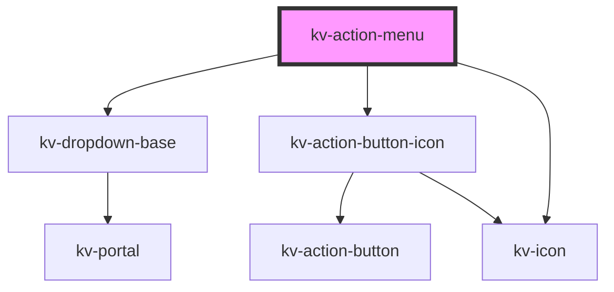

# kv-action-menu


<!-- Auto Generated Below -->


## Usage

### React

```tsx
import React from 'react';
import { EIconName, KvActionMenu } from '@kelvininc/react-ui-components/client';

export const TopicActions: React.FC<{ onAction: (id: string) => void }> = ({ onAction }) => (
	<KvActionMenu
		accessibleLabel="Topic 1 actions"
		icon={EIconName.More}
		items={[
			{ id: 'move-up', label: 'Move up', icon: EIconName.ArrowUpward, disabled: true },
			{ id: 'move-down', label: 'Move down', icon: EIconName.ArrowDownward },
			{ id: 'remove', label: 'Remove Topic 1', icon: EIconName.Delete, destructive: true, separatorBefore: true }
		]}
		onItemSelected={event => onAction(event.detail)}
	/>
);
```

Item ids must be unique within the menu. The menu returns focus to its trigger before it emits `itemSelected`, so your handler can choose another focus destination.

Use a ref and call `await ref.current.setFocus()` to focus the trigger. `triggerTabIndex={-1}` removes it from sequential Tab navigation while keeping explicit focus available. A disabled menu keeps its trigger out of Tab order and ignores `setFocus()`.

Moving a mounted row closes its menu and recreates the panel. The same menu ref can reopen it; `setFocus()` waits for the replacement trigger to render.

Enter, Space and ArrowDown open on the first enabled item. ArrowUp/ArrowDown wrap around enabled items; Home/End move to the ends. Escape returns to the trigger. Tab/Shift+Tab close and move to the adjacent field. Empty and all-disabled menus focus their named container.


## Properties

| Property                       | Attribute           | Description                                                                                          | Type                                           | Default                |
| ------------------------------ | ------------------- | ---------------------------------------------------------------------------------------------------- | ---------------------------------------------- | ---------------------- |
| `accessibleLabel` _(required)_ | `accessible-label`  | (required) Nonblank accessible name for the trigger and its menu.                                    | `string`                                       | `undefined`            |
| `disabled`                     | `disabled`          | (optional) Disables the trigger and closes its menu.                                                 | `boolean`                                      | `false`                |
| `icon`                         | `icon`              | (optional) Trigger icon. Defaults to More.                                                           | `EIconName`                                    | `EIconName.More`       |
| `items`                        | `items`             | (optional) Actions in display order, with unique ids.                                                | `readonly IActionMenuItem[]`                   | `[]`                   |
| `size`                         | `size`              | (optional) Trigger size. Defaults to Small.                                                          | `EComponentSize.Large \| EComponentSize.Small` | `EComponentSize.Small` |
| `triggerTabIndex`              | `trigger-tab-index` | (optional) Trigger Tab index. Use -1 to exclude it from sequential focus while retaining setFocus(). | `number`                                       | `undefined`            |


## Events

| Event          | Description                                                                                   | Type                  |
| -------------- | --------------------------------------------------------------------------------------------- | --------------------- |
| `itemSelected` | Emitted once with the selected action's id, after closing and returning focus to the trigger. | `CustomEvent<string>` |


## Methods

### `setFocus(canFocus?: () => boolean) => Promise<void>`

Waits for readiness, then focuses the enabled trigger without opening or choosing an action.

#### Parameters

| Name       | Type            | Description                                                                |
| ---------- | --------------- | -------------------------------------------------------------------------- |
| `canFocus` | `() => boolean` | Optional live check; returning false cancels the readiness wait and focus. |

#### Returns

Type: `Promise<void>`


## Dependencies

### Depends on

- [kv-dropdown-base](../dropdown-base)
- [kv-action-button-icon](../action-button-icon)
- [kv-icon](../icon)

### Graph


----------------------------------------------
