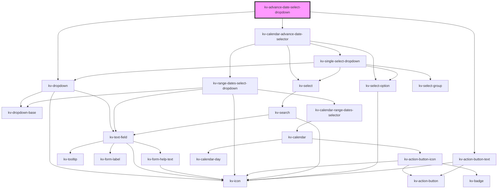

# _kv-advance-date-select-dropdown_

<!-- Auto Generated Below -->


## Usage

### Angular

```html
<!-- Default -->
<kv-advance-date-select-dropdown></kv-advance-date-select-dropdown>

<!-- With selected absolute time -->
<kv-advance-date-select-dropdown
	[selectedTime]="{
		type: ECalendarAdvanceTimeType.Relative,
		payload: {
			key: 'last-24-h',
			range: ['2021-12-01T00:00:00', '2021-12-05T23:59:59Z']
		}
	}"
></kv-advance-date-select-dropdown>

<!-- With selected relative time -->
<kv-advance-date-select-dropdown
	[selectedTime]="{
		type: ECalendarAdvanceTimeType.Absolute,
		payload: {
			key: '2021-12-01T00:00:00Z#2021-12-05T23:59:59Z',
			range: ['2021-12-01T00:00:00', '2021-12-05T23:59:59Z']
		}
	}"
></kv-advance-date-select-dropdown>

<!-- With selected timezone time -->
<kv-advance-date-select-dropdown selectedTimezone="Europe/Lisbon"></kv-advance-date-select-dropdown>
```


### React

```tsx
import React from 'react';

import { KvAvanceDateSelectDropdown, ECalendarAdvanceTimeType } from '@kelvininc/react-ui-components';

export const KvAvanceDateExample: React.FC = () => (
	<>
		{/*-- Default --*/}
		<KvAvanceDateSelectDropdown />

		{/*-- With selected relative time --*/}
		<KvAvanceDateSelectDropdown
			selectedTime={{
				type: ECalendarAdvanceTimeType.Relative,
				payload: {
					key: 'last-24-h',
					range: ['2021-12-01T00:00:00', '2021-12-05T23:59:59Z']
				}
			}}
		/>

		{/*-- With selected absolute time --*/}
		<KvAvanceDateSelectDropdown
			selectedTime={{
				type: ECalendarAdvanceTimeType.Absolute,
				payload: {
					key: '2021-12-01T00:00:00Z#2021-12-05T23:59:59Z',
					range: ['2021-12-01T00:00:00', '2021-12-05T23:59:59Z']
				}
			}}
		/>

		{/*-- With selected timezone --*/}
		<KvAvanceDateSelectDropdown selectedTimezone="Europe/Lisbon" />
	</>
);
```


## Properties

| Property                  | Attribute           | Description                                                   | Type                                                                                                                                                                                                                                                                                                                                                                                                                                                                                                  | Default                             |
| ------------------------- | ------------------- | ------------------------------------------------------------- | ----------------------------------------------------------------------------------------------------------------------------------------------------------------------------------------------------------------------------------------------------------------------------------------------------------------------------------------------------------------------------------------------------------------------------------------------------------------------------------------------------- | ----------------------------------- |
| `absoluteTimeConfig`      | --                  | (optional) The absolute time custom configurations            | `ICalendarAdvanceAbsoluteTimeConfig`                                                                                                                                                                                                                                                                                                                                                                                                                                                                  | `undefined`                         |
| `dateMask`                | `date-mask`         | (optional) The text field date format mask in ISO 8601 format | `string`                                                                                                                                                                                                                                                                                                                                                                                                                                                                                              | `undefined`                         |
| `dropdownPositionOptions` | --                  | (optional) The dropdown position options                      | `{ platform?: Platform; placement?: Placement; strategy?: Strategy; middleware?: Middleware[]; }`                                                                                                                                                                                                                                                                                                                                                                                                     | `DEFAULT_DROPDOWN_POSITION_OPTIONS` |
| `inputConfig`             | --                  | (optional) The text field dropdown custom configurations      | `{ type?: EInputFieldType; label?: string; icon?: EIconName \| EOtherIconName; inputName?: string; examples?: string[]; placeholder?: string; maxLength?: number; minLength?: number; max?: string \| number; min?: string \| number; step?: string \| number; size?: EComponentSize; disabled?: boolean; required?: boolean; loading?: boolean; state?: EValidationState; helpText?: string \| string[]; value?: string \| number; uneditable?: boolean; forcedFocus?: boolean; tooltip?: string; }` | `{}`                                |
| `relativeTimeConfig`      | --                  | (optional) The absolute time custom configurations            | `ICalendarAdvanceRelativeTimeConfig`                                                                                                                                                                                                                                                                                                                                                                                                                                                                  | `undefined`                         |
| `selectedTime`            | --                  | (optional) The selected time range                            | `ICalendarAdvanceSelectedTime`                                                                                                                                                                                                                                                                                                                                                                                                                                                                        | `undefined`                         |
| `selectedTimezone`        | `selected-timezone` | (optional) Currently selected timezone name                   | `string`                                                                                                                                                                                                                                                                                                                                                                                                                                                                                              | `undefined`                         |
| `timezones`               | --                  | (optional) List with all selectable timezones                 | `string[]`                                                                                                                                                                                                                                                                                                                                                                                                                                                                                            | `getTimezonesNames()`               |


## Events

| Event                | Description                                            | Type                                                  |
| -------------------- | ------------------------------------------------------ | ----------------------------------------------------- |
| `absoluteTimeChange` | Emitted when the absolute time selector changes        | `CustomEvent<{ key: string; range: SelectedRange; }>` |
| `openStateChange`    | Emitted when the calendar selector opens state changes | `CustomEvent<boolean>`                                |
| `relativeTimeChange` | Emitted when the relative time selector changes        | `CustomEvent<{ key: string; range: SelectedRange; }>` |
| `timeApplied`        | Emitted when a time selector is applied                | `CustomEvent<ITimeChange>`                            |
| `timezoneChange`     | Emitted when selected timezone changes                 | `CustomEvent<string>`                                 |


## Dependencies

### Depends on

- [kv-dropdown](../dropdown)
- [kv-calendar-advance-date-selector](../calendar-advance-date-selector)
- [kv-action-button-text](../action-button-text)

### Graph


----------------------------------------------


