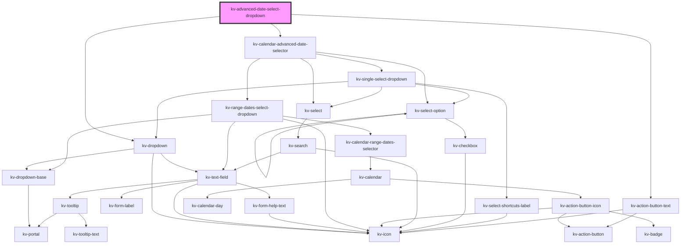

# _kv-advanced-date-select-dropdown_

<!-- Auto Generated Below -->


## Usage

### Angular

```html
<!-- Default -->
<kv-advanced-date-select-dropdown></kv-advanced-date-select-dropdown>

<!-- With selected absolute time -->
<kv-advanced-date-select-dropdown
	[selectedTime]="{
		type: ECalendarAdvanceTimeType.Relative,
		payload: {
			key: 'last-24-h',
			range: ['2021-12-01T00:00:00', '2021-12-05T23:59:59Z']
		}
	}"
></kv-advanced-date-select-dropdown>

<!-- With selected relative time -->
<kv-advanced-date-select-dropdown
	[selectedTime]="{
		type: ECalendarAdvanceTimeType.Absolute,
		payload: {
			key: '2021-12-01T00:00:00Z#2021-12-05T23:59:59Z',
			range: ['2021-12-01T00:00:00', '2021-12-05T23:59:59Z']
		}
	}"
></kv-advanced-date-select-dropdown>

<!-- With selected timezone time -->
<kv-advanced-date-select-dropdown selectedTimezone="Europe/Lisbon"></kv-advanced-date-select-dropdown>
```


### React

```tsx
import React from 'react';

import { KvAdvancedDateSelectDropdown, ECalendarAdvanceTimeType } from '@kelvininc/react-ui-components';

export const KvAdvancedDateExample: React.FC = () => (
	<>
		{/*-- Default --*/}
		<KvAdvancedDateSelectDropdown />

		{/*-- With selected relative time --*/}
		<KvAdvancedDateSelectDropdown
			selectedTime={{
				type: ECalendarAdvanceTimeType.Relative,
				payload: {
					key: 'last-24-h',
					range: ['2021-12-01T00:00:00', '2021-12-05T23:59:59Z']
				}
			}}
		/>

		{/*-- With selected absolute time --*/}
		<KvAdvancedDateSelectDropdown
			selectedTime={{
				type: ECalendarAdvanceTimeType.Absolute,
				payload: {
					key: '2021-12-01T00:00:00Z#2021-12-05T23:59:59Z',
					range: ['2021-12-01T00:00:00', '2021-12-05T23:59:59Z']
				}
			}}
		/>

		{/*-- With selected timezone --*/}
		<KvAdvancedDateSelectDropdown selectedTimezone="Europe/Lisbon" />
	</>
);
```


## Properties

| Property                  | Attribute           | Description                                                                                                                                                                             | Type                                                                                                                                                                                                                                                                                                                                                                                                                                                                                                                                                                                         | Default                             |
| ------------------------- | ------------------- | --------------------------------------------------------------------------------------------------------------------------------------------------------------------------------------- | -------------------------------------------------------------------------------------------------------------------------------------------------------------------------------------------------------------------------------------------------------------------------------------------------------------------------------------------------------------------------------------------------------------------------------------------------------------------------------------------------------------------------------------------------------------------------------------------- | ----------------------------------- |
| `absoluteTimeConfig`      | --                  | (optional) The absolute time custom configurations                                                                                                                                      | `ICalendarAdvanceAbsoluteTimeConfig`                                                                                                                                                                                                                                                                                                                                                                                                                                                                                                                                                         | `undefined`                         |
| `customClass`             | `custom-class`      | (optional) Additional classes to apply for custom CSS. If multiple classes are provided they should be separated by spaces. It is also valid to provide CssClassMap with boolean logic. | `CssClassMap \| string \| string[]`                                                                                                                                                                                                                                                                                                                                                                                                                                                                                                                                                          | `''`                                |
| `dateMask`                | `date-mask`         | (optional) The text field date format mask in ISO 8601 format                                                                                                                           | `string`                                                                                                                                                                                                                                                                                                                                                                                                                                                                                                                                                                                     | `undefined`                         |
| `disabled`                | `disabled`          | (optional) If `true` clicking on the input will not open the calendar dropdown. Default: false                                                                                          | `boolean`                                                                                                                                                                                                                                                                                                                                                                                                                                                                                                                                                                                    | `false`                             |
| `dropdownPositionOptions` | --                  | (optional) The dropdown position options                                                                                                                                                | `{ placement?: Placement; strategy?: Strategy; middleware?: (false \| { name: string; options?: any; fn: (state: { x: number; y: number; initialPlacement: Placement; platform: Platform; placement: Placement; strategy: Strategy; middlewareData: MiddlewareData; rects: ElementRects; elements: Elements; }) => Promisable<MiddlewareReturn>; })[]; platform?: Platform; }`                                                                                                                                                                                                               | `DEFAULT_DROPDOWN_POSITION_OPTIONS` |
| `inputConfig`             | --                  | (optional) The text field dropdown custom configurations                                                                                                                                | `{ type?: EInputFieldType; label?: string; icon?: EIconName \| EOtherIconName; inputName?: string; examples?: string[]; placeholder?: string; maxLength?: number; minLength?: number; max?: string \| number; min?: string \| number; step?: string \| number; size?: EComponentSize; disabled?: boolean; required?: boolean; loading?: boolean; state?: EValidationState; helpText?: string \| string[]; value?: string \| number; readonly?: boolean; forcedFocus?: boolean; highlighted?: boolean; tooltipConfig?: Partial<ITooltip>; useInputMask?: boolean; inputMaskRegex?: string; }` | `{}`                                |
| `relativeTimeConfig`      | --                  | (optional) The absolute time custom configurations                                                                                                                                      | `ICalendarAdvanceRelativeTimeConfig`                                                                                                                                                                                                                                                                                                                                                                                                                                                                                                                                                         | `undefined`                         |
| `selectedTime`            | --                  | (optional) The selected time range                                                                                                                                                      | `ICalendarAdvanceSelectedTime`                                                                                                                                                                                                                                                                                                                                                                                                                                                                                                                                                               | `undefined`                         |
| `selectedTimezone`        | `selected-timezone` | (optional) Currently selected timezone name                                                                                                                                             | `string`                                                                                                                                                                                                                                                                                                                                                                                                                                                                                                                                                                                     | `getDefaultTimezone()`              |
| `timezones`               | --                  | (optional) List with all selectable timezones                                                                                                                                           | `string[]`                                                                                                                                                                                                                                                                                                                                                                                                                                                                                                                                                                                   | `getTimezonesNames()`               |


## Events

| Event                 | Description                                           | Type                       |
| --------------------- | ----------------------------------------------------- | -------------------------- |
| `dropdownStateChange` | Emitted when the calendar dropdown open state changes | `CustomEvent<boolean>`     |
| `timeApplied`         | Emitted when a time selector is applied               | `CustomEvent<ITimeChange>` |


## Dependencies

### Depends on

- [kv-dropdown](../dropdown)
- [kv-calendar-advanced-date-selector](../calendar-advanced-date-selector)
- [kv-action-button-text](../action-button-text)

### Graph


----------------------------------------------


