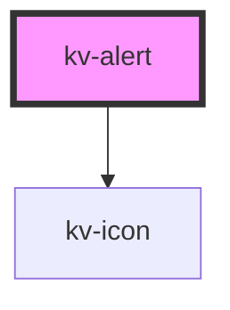

# _<kv-alert>_


<!-- Auto Generated Below -->


## Usage

### React

```tsx
import React from 'react';

import { KvAlert, IAlertConfig, EAlertType, EComponentSize } from '@kelvininc/react-ui-components';

export const AlertExample: React.FC<IAlertConfig> = () => (
	<>
		{/** Default info alert with required props */}
		<KvAlert
			type={EAlertType.Info}
			label="Primary Message"
		/>

		{/** Error state */}
		<KvAlert
			type={EAlertType.Error}
			label="Primary Message"
			description="Secondary Message"
		/>

		{/** Success state */}
		<KvAlert
			type={EAlertType.Success}
			label="Primary Message"
			description="Secondary Message"
		/>

		{/** Warning state */}
		<KvAlert
			type={EAlertType.Warning}
			label="Primary Message"
			description="Secondary Message"
		/>

		{/** With description */}
		<KvAlert
			type={EAlertType.Info}
			label="Primary Message"
			description="Secondary Message"
		/>

		{/** Hiding icon */}
		<KvAlert
			type={EAlertType.Info}
			showIcon={false}
			label="Primary Message"
			description="Secondary Message"
		/>

		{/** Small size */}
		<KvAlert
			type={EAlertType.Info}
			showIcon={false}
			size={EComponentSize.Small}
			label="Primary Message"
			description="Secondary Message"
		/>
	</>
)

```


## Properties

| Property             | Attribute     | Description                                                                               | Type                                                                              | Default                |
| -------------------- | ------------- | ----------------------------------------------------------------------------------------- | --------------------------------------------------------------------------------- | ---------------------- |
| `description`        | `description` | (optional) Defines the description text to show                                           | `string`                                                                          | `undefined`            |
| `label` _(required)_ | `label`       | (required) Defines the label (title) text to show                                         | `string`                                                                          | `undefined`            |
| `showIcon`           | `show-icon`   | (optional) Defines if the icon should be shown, defaults to `true`                        | `boolean`                                                                         | `true`                 |
| `size`               | `size`        | (optional) Defines the size of the component, defaults to EComponentType.Large            | `EComponentSize.Large \| EComponentSize.Small`                                    | `EComponentSize.Large` |
| `type` _(required)_  | `type`        | (required) Defines the type of alert to show, possible values are defined in `EAlertType` | `EAlertType.Error \| EAlertType.Info \| EAlertType.Success \| EAlertType.Warning` | `undefined`            |


## Shadow Parts

| Part          | Description          |
| ------------- | -------------------- |
| `"container"` | The alert container. |


## Dependencies

### Depends on

- [kv-icon](../icon)

### Graph


----------------------------------------------


