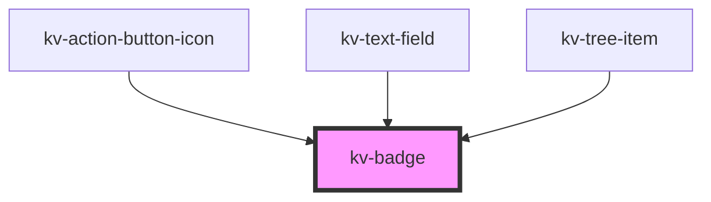

# _<kv-badge>_

<!-- Auto Generated Below -->


## Usage

### React

```tsx
import React from 'react';

import { KvBadge, EBadgeState } from '@kelvininc/react-ui-components/client';

export const BadgeExample: React.FC = () => (
	<>
		{/*-- Default --*/}
		<KvBadge>Badge</KvBadge>

		{/*-- Info --*/}
		<KvBadge state={EBadgeState.Info}>Info Badge</KvBadge>

		{/*-- Warning --*/}
		<KvBadge state={EBadgeState.Warning}>Warning Badge</KvBadge>

		{/*-- Error --*/}
		<KvBadge state={EBadgeState.Error}>Error Badge</KvBadge>

		{/*-- Success --*/}
		<KvBadge state={EBadgeState.Success}>Success Badge</KvBadge>
	</>x
);
```


## Properties

| Property | Attribute | Description                         | Type                                                                                                      | Default            |
| -------- | --------- | ----------------------------------- | --------------------------------------------------------------------------------------------------------- | ------------------ |
| `state`  | `state`   | (optional) Defines the badge state. | `EBadgeState.Error \| EBadgeState.Info \| EBadgeState.None \| EBadgeState.Success \| EBadgeState.Warning` | `EBadgeState.None` |


## Shadow Parts

| Part      | Description |
| --------- | ----------- |
| `"badge"` | The badge.  |


## CSS Custom Properties

| Name                               | Description                                     |
| ---------------------------------- | ----------------------------------------------- |
| `--badge-background-color-error`   | Badge's background color when state is error.   |
| `--badge-background-color-error`   | Badge's background color when state is error.   |
| `--badge-background-color-info`    | Badge's background color when state is info.    |
| `--badge-background-color-info`    | Badge's background color when state is info.    |
| `--badge-background-color-none`    | Badge's background color when state is none.    |
| `--badge-background-color-none`    | Badge's background color when state is none.    |
| `--badge-background-color-success` | Badge's background color when state is success. |
| `--badge-background-color-success` | Badge's background color when state is success. |
| `--badge-background-color-warning` | Badge's background color when state is warning. |
| `--badge-background-color-warning` | Badge's background color when state is warning. |
| `--badge-height`                   | Badge's height.                                 |
| `--badge-height`                   | Badge's height.                                 |
| `--badge-max-width`                | Badge's maximum width.                          |
| `--badge-max-width`                | Badge's maximum width.                          |
| `--badge-min-width`                | Badge's minimum width.                          |
| `--badge-min-width`                | Badge's minimum width.                          |
| `--badge-text-color-error`         | Badge's text color when state is error.         |
| `--badge-text-color-error`         | Badge's text color when state is error.         |
| `--badge-text-color-info`          | Badge's text color when state is info.          |
| `--badge-text-color-info`          | Badge's text color when state is info.          |
| `--badge-text-color-none`          | Badge's text color when state is none.          |
| `--badge-text-color-none`          | Badge's text color when state is none.          |
| `--badge-text-color-success`       | Badge's text color when state is success.       |
| `--badge-text-color-success`       | Badge's text color when state is success.       |
| `--badge-text-color-warning`       | Badge's text color when state is warning.       |
| `--badge-text-color-warning`       | Badge's text color when state is warning.       |
| `--badge-warning-text-color`       | Badge's text color when state is warning.       |
| `--badge-warning-text-color`       | Badge's text color when state is warning.       |
| `--badge-width`                    | Badge's width.                                  |
| `--badge-width`                    | Badge's width.                                  |


## Dependencies

### Used by

 - [kv-action-button-icon](../action-button-icon)
 - [kv-text-field](../text-field)
 - [kv-tree-item](../tree-item)

### Graph


----------------------------------------------


