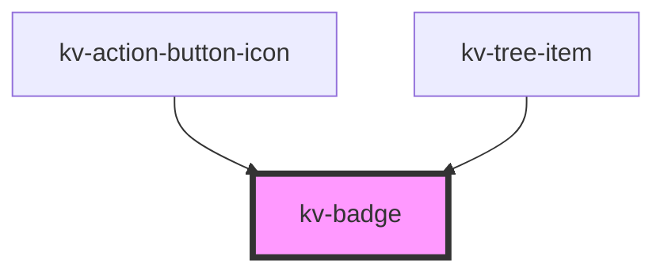

# _<kv-badge>_

<!-- Auto Generated Below -->


## Usage

### Angular

```html
<kv-badge>Badge</kv-badge>
```


### React

```tsx
import React from 'react';

import { KvActionButton } from '@kelvininc/react-ui-components';

export const BadgeExample: React.FC = () => (
	<>
		<KvBadge>Primary Badge</KvBadge>
	</>
);
```


## Shadow Parts

| Part      | Description |
| --------- | ----------- |
| `"badge"` | The badge.  |


## CSS Custom Properties

| Name                       | Description               |
| -------------------------- | ------------------------- |
| `--badge-background-color` | Badge's background color. |
| `--badge-height`           | Badge's height.           |
| `--badge-text-color`       | Badge's text color.       |
| `--badge-width`            | Badge's width.            |


## Dependencies

### Used by

 - [kv-action-button-icon](../action-button-icon)
 - [kv-tree-item](../tree-item)

### Graph

```mermaid
graph TD;
  kv-action-button-icon --> kv-badge
  kv-tree-item --> kv-badge
  style kv-badge fill:#f9f,stroke:#333,stroke-width:4px
```

----------------------------------------------


