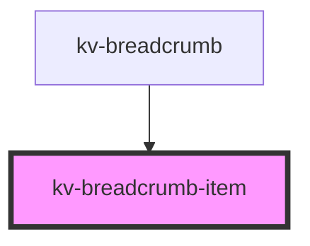

# *<kv-breadcrumb-item>*


<!-- Auto Generated Below -->


## Usage

### Angular

```html
<!-- With all properties (only label is mandatory) -->
<kv-breadcrumb-item
	label="Your label here"
	link="Your link here"
	[target]="EBreadcrumbItemTarget.NewTab"
	separator='/'
	active>
</kv-breadcrumb-item>
```


### Javascript

```html
<!-- With all properties (only label is mandatory) -->
<kv-breadcrumb-item
	label="Your label here"
	link="Your link here"
	target="_blank"
	separator='/'
	active>
</kv-breadcrumb-item>
```


### React

```tsx
import React from 'react';
import { KvBreadcrumbItem } from '@kelvininc/react-ui-components';
export const KvBreadcrumbItemExample: React.FC = () => (
  <>
    {/*-- With all properties (only label is mandatory) --*/}
	<KvBreadcrumbItem
		label="Your label here"
		link="Your link here"
		target={EBreadcrumbItemTarget.NewTab}
		separator='/'
		active>
	</KvBreadcrumbItem>
  </>
);
```


### Stencil

```tsx
import { Component, h } from '@stencil/core';
@Component({
  tag: 'kv-link-example',
  styleUrl: 'kv-link-example.css',
  shadow: true,
})
export class KvBreadcrumbItemExample {
  render() {
    return (
		<KvBreadcrumbItem
			label="Your label here"
			link="Your link here"
			target={EBreadcrumbItemTarget.NewTab}
			separator='/'
			active>
		</KvBreadcrumbItem>
	);
  }
}
```


## Properties

| Property             | Attribute   | Description                                                                         | Type                                                                                                | Default     |
| -------------------- | ----------- | ----------------------------------------------------------------------------------- | --------------------------------------------------------------------------------------------------- | ----------- |
| `active`             | `active`    | (optional) Sets this breadcrumb styling to be the active one (usually the last one) | `boolean`                                                                                           | `undefined` |
| `href`               | `href`      | (optional) The breadcrumb's link                                                    | `string`                                                                                            | `undefined` |
| `label` _(required)_ | `label`     | (required) The text to display on the breadcrumb                                    | `string`                                                                                            | `undefined` |
| `separator`          | `separator` | (optional) The separator to use                                                     | `string`                                                                                            | `undefined` |
| `target`             | `target`    | (optional) The target of the link (only used if href is provided)                   | `EAnchorTarget.BrowserDefault \| EAnchorTarget.NewTab \| EAnchorTarget.Parent \| EAnchorTarget.Top` | `undefined` |


## Events

| Event                 | Description                                    | Type                           |
| --------------------- | ---------------------------------------------- | ------------------------------ |
| `breadcrumbItemClick` | Emitted when the user clicks on the breadcrumb | `CustomEvent<IBreadcrumbItem>` |


## Dependencies

### Used by

 - [kv-breadcrumb](../breadcrumb)

### Graph


----------------------------------------------


