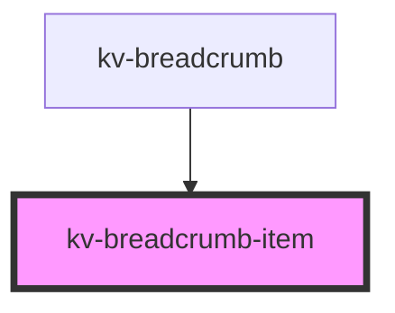

# *<kv-breadcrumb-item>*


<!-- Auto Generated Below -->


## Usage

### Angular

```html
<!-- With all properties (only label is mandatory) -->
<kv-breadcrumb-item
	label="Your label here"
	href="https://your-link.here"
	[target]="EBreadcrumbItemTarget.NewTab"
	active>
</kv-breadcrumb-item>
```


### React

```tsx
import React from 'react';
import { KvBreadcrumbItem } from '@kelvininc/react-ui-components';
export const KvBreadcrumbItemExample: React.FC = () => (
  <>
    {/*-- With all properties (only label is mandatory) --*/}
	<KvBreadcrumbItem
		label="Your label here"
		href="https://your-link.here"
		target={EBreadcrumbItemTarget.NewTab}
		active>
	</KvBreadcrumbItem>
  </>
);
```


## Properties

| Property             | Attribute  | Description                                                                                                     | Type                                                                                                | Default     |
| -------------------- | ---------- | --------------------------------------------------------------------------------------------------------------- | --------------------------------------------------------------------------------------------------- | ----------- |
| `active`             | `active`   | (optional) Sets this breadcrumb styling to be the active one (usually the last one)                             | `boolean`                                                                                           | `undefined` |
| `download`           | `download` | (optional) Specifies that the target will be downloaded when a user clicks on. The value should be the filename | `string`                                                                                            | `undefined` |
| `href`               | `href`     | (optional) The anchor's link to open when clicking                                                              | `string`                                                                                            | `undefined` |
| `label` _(required)_ | `label`    | (required) The text to display on the breadcrumb                                                                | `string`                                                                                            | `undefined` |
| `target`             | `target`   | (optional) The anchor's target                                                                                  | `EAnchorTarget.BrowserDefault \| EAnchorTarget.NewTab \| EAnchorTarget.Parent \| EAnchorTarget.Top` | `undefined` |


## Events

| Event                 | Description                                    | Type                           |
| --------------------- | ---------------------------------------------- | ------------------------------ |
| `breadcrumbItemClick` | Emitted when the user clicks on the breadcrumb | `CustomEvent<IBreadcrumbItem>` |


## Shadow Parts

| Part       | Description         |
| ---------- | ------------------- |
| `"anchor"` | The anchor element. |


## CSS Custom Properties

| Name                              | Description                      |
| --------------------------------- | -------------------------------- |
| `--breadcrumb-item-active-color`  | Breadcrumb's item active color.  |
| `--breadcrumb-item-default-color` | Breadcrumb's item default color. |
| `--breadcrumb-item-hover-color`   | Breadcrumb's item hover color.   |


## Dependencies

### Used by

 - [kv-breadcrumb](../breadcrumb)

### Graph


----------------------------------------------


