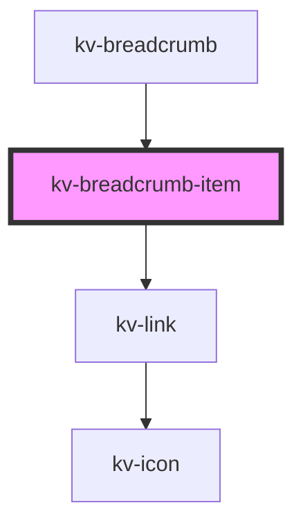

# _<kv-breadcrumb-item>_

<!-- Auto Generated Below -->


## Usage

### React

```tsx
import React from 'react';
import { KvBreadcrumbItem } from '@kelvininc/react-ui-components/client';
export const KvBreadcrumbItemExample: React.FC = () => (
	<>
		{/*-- With all properties (only label is mandatory) --*/}
		<KvBreadcrumbItem label="Your label here" active></KvBreadcrumbItem>
	</>
);
```


## Properties

| Property | Attribute | Description                                                                         | Type                   | Default     |
| -------- | --------- | ----------------------------------------------------------------------------------- | ---------------------- | ----------- |
| `active` | `active`  | (optional) Sets this breadcrumb styling to be the active one (usually the last one) | `boolean \| undefined` | `undefined` |
| `label`  | `label`   | (optional) The text to display on the breadcrumb                                    | `string`               | `undefined` |


## Events

| Event                 | Description                                    | Type                           |
| --------------------- | ---------------------------------------------- | ------------------------------ |
| `breadcrumbItemClick` | Emitted when the user clicks on the breadcrumb | `CustomEvent<IBreadcrumbItem>` |


## Dependencies

### Used by

 - [kv-breadcrumb](../breadcrumb)

### Depends on

- [kv-link](../link)

### Graph

```mermaid
graph TD;
  kv-breadcrumb-item --> kv-link
  kv-link --> kv-icon
  kv-breadcrumb --> kv-breadcrumb-item
  style kv-breadcrumb-item fill:#f9f,stroke:#333,stroke-width:4px
```

----------------------------------------------


