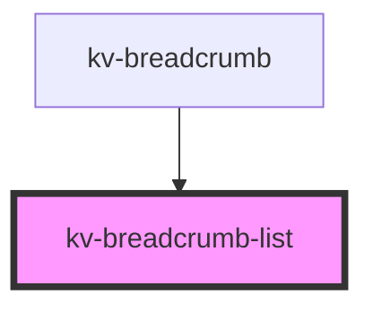

# _<kv-breadcrumb-list>_

<!-- Auto Generated Below -->


## Usage

### React

```tsx
import React from 'react';
import { KvBreadcrumbList } from '@kelvininc/react-ui-components';

export const KvBreadcrumbListExample: React.FC = () => (
	<>
		<KvBreadcrumbList>
			<KvBreadcrumbItem label="Your label here" active></KvBreadcrumbItem>
		</KvBreadcrumbList>
	</>
);
```


## Events

| Event                 | Description                                    | Type                           |
| --------------------- | ---------------------------------------------- | ------------------------------ |
| `breadcrumbItemClick` | Emitted when the user clicks on the breadcrumb | `CustomEvent<IBreadcrumbItem>` |


## Shadow Parts

| Part                | Description                  |
| ------------------- | ---------------------------- |
| `"breadcrumb-list"` | The breadcrumb list element. |


## CSS Custom Properties

| Name                             | Description                     |
| -------------------------------- | ------------------------------- |
| `--breadcrumb-seperator-color`   | Breadcrumb's seperator color.   |
| `--breadcrumb-seperator-content` | Breadcrumb's seperator content. |


## Dependencies

### Used by

 - [kv-breadcrumb](../breadcrumb)

### Graph


----------------------------------------------


