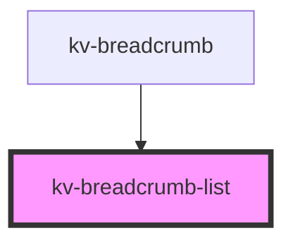

# *<kv-breadcrumb-list>*


<!-- Auto Generated Below -->


## Usage

### Angular

```html
<kv-breadcrumb-list separator='/'>
	<kv-breadcrumb-item
		label="First item"
		link="Your link here"
		[target]="EBreadcrumbItemTarget.NewTab">
	</kv-breadcrumb-item>
	...
	<kv-breadcrumb-item
		label="Last item"
		link="Your link here"
		[target]="EBreadcrumbItemTarget.NewTab"
		active>
	</kv-breadcrumb-item>
</kv-breadcrumb-list>
```


### Javascript

```html
<kv-breadcrumb-list separator='/'>
	<kv-breadcrumb-item
		label="First item"
		link="Your link here"
		target="_blank">
	</kv-breadcrumb-item>
	...
	<kv-breadcrumb-item
		label="Last item"
		link="Your link here"
		target="_blank"
		active>
	</kv-breadcrumb-item>
</kv-breadcrumb-list>
```


### React

```tsx
import React from 'react';
import { KvBreadcrumbList } from '@kelvininc/react-ui-components';

export const KvBreadcrumbListExample: React.FC = () => (
  <>
    <KvBreadcrumbList separator='/'>
		<KvBreadcrumbItem
			label="Your label here"
			link="Your link here"
			target={EBreadcrumbItemTarget.NewTab}
			active>
		</KvBreadcrumbItem>
	</KvBreadcrumbList>
  </>
);
```


### Stencil

```tsx
import { Component, h } from '@stencil/core';
@Component({
  tag: 'kv-link-example',
  styleUrl: 'kv-link-example.css',
  shadow: true,
})
export class SwichButtonExample {
  render() {
    return (
		<kv-breadcrumb-list separator='/'>
			<kv-breadcrumb-item
				label="First item"
				link="Your link here"
				target={EBreadcrumbItemTarget.NewTab}
				active>
			</kv-breadcrumb-item>
			...
			<kv-breadcrumb-item
				label="Last item"
				link="Your link here"
				target={EBreadcrumbItemTarget.NewTab}
				active>
			</kv-breadcrumb-item>
		</kv-breadcrumb-list>
	)
  }
}
```


## Properties

| Property    | Attribute   | Description                                              | Type     | Default |
| ----------- | ----------- | -------------------------------------------------------- | -------- | ------- |
| `separator` | `separator` | (optional) The separator to use between breadcrumb items | `string` | `'/'`   |


## Dependencies

### Used by

 - [kv-breadcrumb](../breadcrumb)

### Graph


----------------------------------------------

*Built with [StencilJS](https://stenciljs.com/)*
