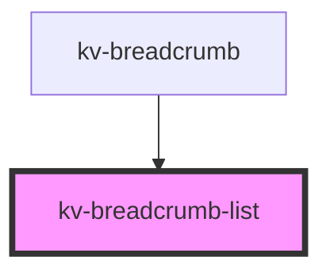

# *<kv-breadcrumb-list>*


<!-- Auto Generated Below -->


## Usage

### Angular

```html
<kv-breadcrumb-list>
	<kv-breadcrumb-item
		label="First item"
		href="https://your-link.here"
		[target]="EBreadcrumbItemTarget.NewTab">
	</kv-breadcrumb-item>
	...
	<kv-breadcrumb-item
		label="Last item"
		href="https://your-link.here"
		[target]="EBreadcrumbItemTarget.NewTab"
		active>
	</kv-breadcrumb-item>
</kv-breadcrumb-list>
```


### React

```tsx
import React from 'react';
import { KvBreadcrumbList } from '@kelvininc/react-ui-components';

export const KvBreadcrumbListExample: React.FC = () => (
  <>
    <KvBreadcrumbList>
		<KvBreadcrumbItem
			label="Your label here"
			href="https://your-link.here"
			target={EBreadcrumbItemTarget.NewTab}
			active>
		</KvBreadcrumbItem>
	</KvBreadcrumbList>
  </>
);
```


## Events

| Event                 | Description                                    | Type                           |
| --------------------- | ---------------------------------------------- | ------------------------------ |
| `breadcrumbItemClick` | Emitted when the user clicks on the breadcrumb | `CustomEvent<IBreadcrumbItem>` |


## Shadow Parts

| Part                | Description                  |
| ------------------- | ---------------------------- |
| `"breadcrumb-list"` | The breadcrumb list element. |


## CSS Custom Properties

| Name                             | Description                     |
| -------------------------------- | ------------------------------- |
| `--breadcrumb-seperator-color`   | Breadcrumb's seperator color.   |
| `--breadcrumb-seperator-content` | Breadcrumb's seperator content. |


## Dependencies

### Used by

 - [kv-breadcrumb](../breadcrumb)

### Graph


----------------------------------------------


