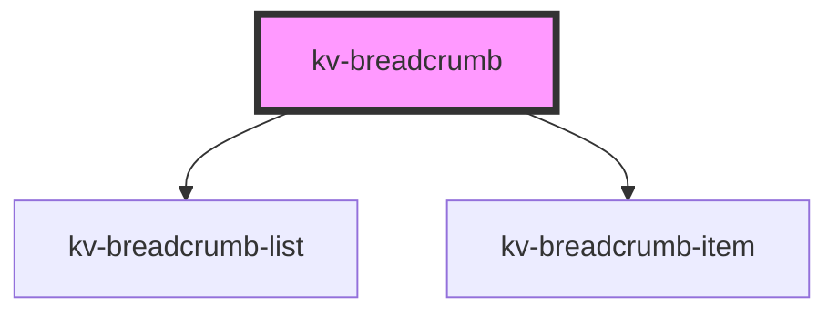

# *<kv-breadcrumb>*


<!-- Auto Generated Below -->


## Usage

### Angular

```html
<kv-breadcrumb [items]="breadcrumbItems"></kv-breadcrumb>
```


### React

```tsx
import React from 'react';
import { KvBreadcrumb } from '@kelvininc/react-ui-components';

export const KvBreadcrumbExample: React.FC = (props) => (
  <>
    {/*-- With items --*/}
    <KvBreadcrumb items={props.items}></KvLink>
  </>
);
```


## Properties

| Property | Attribute | Description                    | Type                | Default |
| -------- | --------- | ------------------------------ | ------------------- | ------- |
| `items`  | --        | (required) List of breadcrumbs | `IBreadcrumbItem[]` | `[]`    |


## Events

| Event                 | Description                                    | Type                           |
| --------------------- | ---------------------------------------------- | ------------------------------ |
| `breadcrumbItemClick` | Emitted when the user clicks on the breadcrumb | `CustomEvent<IBreadcrumbItem>` |


## Dependencies

### Depends on

- [kv-breadcrumb-list](../breadcrumb-list)
- [kv-breadcrumb-item](../breadcrumb-item)

### Graph


----------------------------------------------


