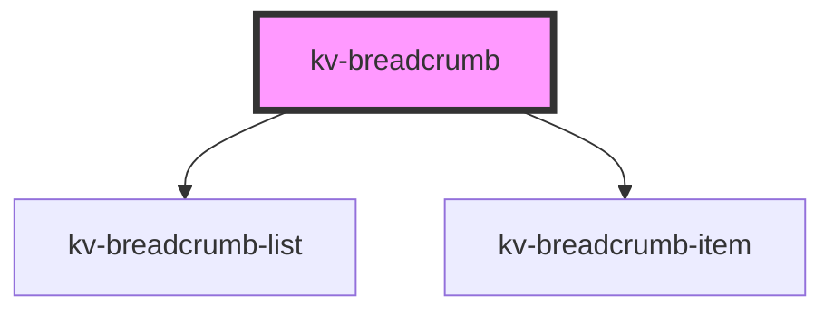

# *<kv-breadcrumb>*


<!-- Auto Generated Below -->


## Usage

### Angular

```html
<kv-breadcrumb [items]="breadcrumbItems"></kv-breadcrumb>
```


### Javascript

```html
<!-- With items -->
<kv-breadcrumb></kv-breadcrumb>

<script>
	const breadcrumbEl = document.querySelector('kv-breadcrumb');
	breadcrumbEl.items = [
		{
			label: 'Your item label here',
			href: 'Your item link here',
			/**
			 * Check https://developer.mozilla.org/en-US/docs/Web/HTML/Element/a#attr-target
			 * for a list of possible values. At the moment 'framename' is not supported.
			*/
			target: '_blank',
			/**
			 * Not mandatory, by default the component will set the 'active' attribute to the last item on 
			 * the array, this will disable click events and emphasize the item in bold.
			*/
			active: undefined
		}
	];
</script>
```


### React

```tsx
import React from 'react';
import { KvBreadcrumb } from '@kelvininc/react-ui-components';

export const KvBreadcrumbExample: React.FC = (props) => (
  <>
    {/*-- With items --*/}
    <KvBreadcrumb items={props.items}></KvLink>
  </>
);
```


### Stencil

```tsx
import { Component, h, State } from '@stencil/core';
import { IBreadcrumbItem, EBreadcrumbItemTarget } from 'ui-components';

@Component({
  tag: 'kv-breadcrumb-example',
  styleUrl: 'kv-breadcrumb-example.css',
  shadow: true,
})
export class KvBreadcrumbExample {
	/** 
	 * Depending on your objective you may consider using @Prop or @State
	 * https://stenciljs.com/docs/properties
	 * https://stenciljs.com/docs/state
	 * 
	*/
	@Prop() items: IBreadcrumbItem[] = [
		{
			label: 'Your item label here',
			href: 'Your item link here',
			/**
			 * Check https://developer.mozilla.org/en-US/docs/Web/HTML/Element/a#attr-target
			 * for a list of possible values. At the moment 'framename' is not supported.
			 *
			 * We also provide a Typescript enum (EBreadcrumbItemTarget) to easily set this value
			*/
			target: '_blank',
			/**
			 * Not mandatory, by default the component will set the 'active' attribute to the last item on 
			 * the array, this will disable click events and emphasize the item in bold.
			*/
			active: undefined
		}
	];

  render() {
    return (
		// With items
		<kv-breadcrumb items={this.items}></kv-breadcrumb>
	);
  }
}
```


## Properties

| Property    | Attribute   | Description                                          | Type                | Default |
| ----------- | ----------- | ---------------------------------------------------- | ------------------- | ------- |
| `items`     | --          | (required) List of breadcrumbs                       | `IBreadcrumbItem[]` | `[]`    |
| `separator` | `separator` | (required) Separator to use between breadcrumb items | `string`            | `'/'`   |


## Events

| Event       | Description                                                 | Type                           |
| ----------- | ----------------------------------------------------------- | ------------------------------ |
| `itemClick` | Emitted when the user clicks on one of the breadcrumb items | `CustomEvent<IBreadcrumbItem>` |


## Dependencies

### Depends on

- [kv-breadcrumb-list](../breadcrumb-list)
- [kv-breadcrumb-item](../breadcrumb-item)

### Graph


----------------------------------------------


