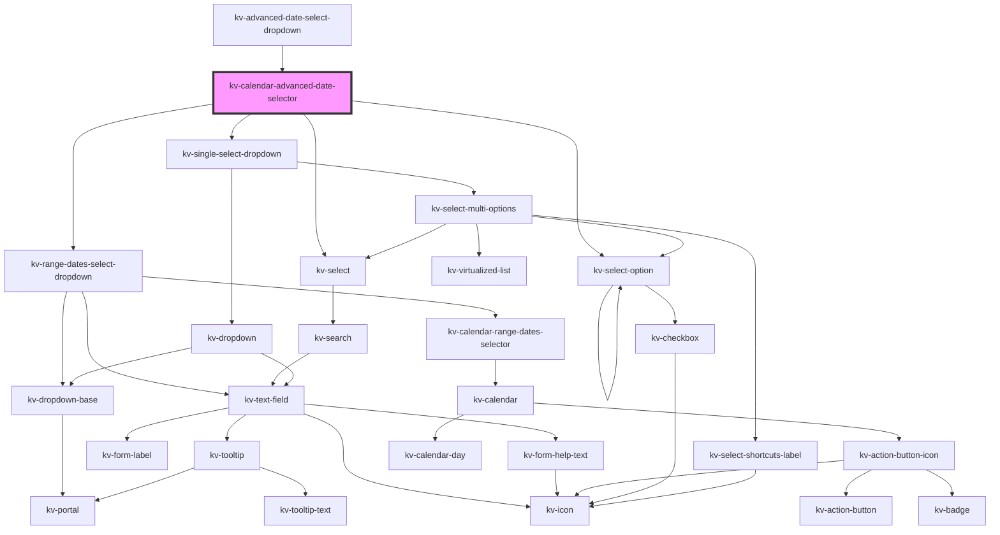

# _calendar-advanced-date-selector_

<!-- Auto Generated Below -->


## Usage

### Angular

```html
<!-- Default -->
<kv-calendar-advanced-date-selector></kv-calendar-advanced-date-selector>

<!-- With selected absolute time -->
<kv-calendar-advanced-date-selector
	[selectedTime]="{
		type: ECalendarAdvanceTimeType.Relative,
		payload: {
			key: 'last-24-h',
			range: ['2021-12-01T00:00:00', '2021-12-05T23:59:59Z']
		}
	}"
></kv-calendar-advanced-date-selector>

<!-- With selected relative time -->
<kv-calendar-advanced-date-selector
	[selectedTime]="{
		type: ECalendarAdvanceTimeType.Absolute,
		payload: {
			key: '2021-12-01T00:00:00Z#2021-12-05T23:59:59Z',
			range: ['2021-12-01T00:00:00', '2021-12-05T23:59:59Z']
		}
	}"
></kv-calendar-advanced-date-selector>

<!-- With selected timezone time -->
<kv-calendar-advanced-date-selector selectedTimezone="Europe/Lisbon"></kv-calendar-advanced-date-selector>
```


### React

```tsx
import React from 'react';

import { KvCalendarAdvancedDateSelector, ECalendarAdvanceTimeType } from '@kelvininc/react-ui-components';

export const KvCalendarAdvancedDateExample: React.FC = () => (
	<>
		{/*-- Default --*/}
		<KvCalendarAdvancedDateSelector />

		{/*-- With selected relative time --*/}
		<KvCalendarAdvancedDateSelector
			selectedTime={{
				type: ECalendarAdvanceTimeType.Relative,
				payload: {
					key: 'last-24-h',
					range: ['2021-12-01T00:00:00', '2021-12-05T23:59:59Z']
				}
			}}
		/>

		{/*-- With selected absolute time --*/}
		<KvCalendarAdvancedDateSelector
			selectedTime={{
				type: ECalendarAdvanceTimeType.Absolute,
				payload: {
					key: '2021-12-01T00:00:00Z#2021-12-05T23:59:59Z',
					range: ['2021-12-01T00:00:00', '2021-12-05T23:59:59Z']
				}
			}}
		/>

		{/*-- With selected timezone --*/}
		<KvCalendarAdvancedDateSelector selectedTimezone="Europe/Lisbon" />
	</>
);
```


## Properties

| Property             | Attribute           | Description                                        | Type                                 | Default               |
| -------------------- | ------------------- | -------------------------------------------------- | ------------------------------------ | --------------------- |
| `absoluteTimeConfig` | --                  | (optional) The absolute time custom configurations | `ICalendarAdvanceAbsoluteTimeConfig` | `undefined`           |
| `relativeTimeConfig` | --                  | (optional) The absolute time custom configurations | `ICalendarAdvanceRelativeTimeConfig` | `undefined`           |
| `selectedTime`       | --                  | (optional) The selected time range                 | `ICalendarAdvanceSelectedTime`       | `undefined`           |
| `selectedTimezone`   | `selected-timezone` | (optional) Currently selected timezone name        | `string`                             | `undefined`           |
| `timezones`          | --                  | (optional) List with all selectable timezones      | `string[]`                           | `getTimezonesNames()` |


## Events

| Event                         | Description                                                 | Type                                                  |
| ----------------------------- | ----------------------------------------------------------- | ----------------------------------------------------- |
| `absoluteTimeChange`          | Emitted when the absolute time selector changes             | `CustomEvent<{ key: string; range: SelectedRange; }>` |
| `rangeDropdownStateChange`    | Emitted when the range calendar dropdown open state changes | `CustomEvent<boolean>`                                |
| `relativeTimeChange`          | Emitted when the relative time selector changes             | `CustomEvent<{ key: string; range: SelectedRange; }>` |
| `timezoneChange`              | Emitted when selected timezone changes                      | `CustomEvent<string>`                                 |
| `timezoneDropdownStateChange` | Emitted when the timezone dropdown open state changes       | `CustomEvent<boolean>`                                |


## Shadow Parts

| Part         | Description             |
| ------------ | ----------------------- |
| `"calendar"` | The calendar container. |


## Dependencies

### Used by

 - [kv-advanced-date-select-dropdown](../advanced-date-select-dropdown)

### Depends on

- [kv-range-dates-select-dropdown](../range-dates-select-dropdown)
- [kv-select](../select)
- [kv-select-option](../select-option)
- [kv-single-select-dropdown](../single-select-dropdown)

### Graph


----------------------------------------------


