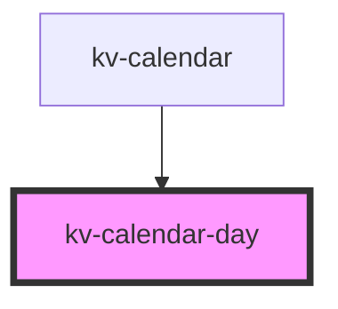

# kv-calendar-day

<!-- Auto Generated Below -->


## Usage

### Angular

```html
<!-- Default -->
<kv-calendar-day [day]="12"></kv-calendar-day>

<!-- Active -->
<kv-calendar-day [day]="12" active></kv-calendar-day>

<!-- Disabled -->
<kv-calendar-day [day]="12" [disabled]="true"></kv-calendar-day>

<!-- In Range -->
<kv-calendar-day [day]="12" [inRange]="true"></kv-calendar-day>
```


### React

```tsx
import React from 'react';

import { KvCalendarDay } from '@kelvininc/react-ui-components';

export const KvCalendarDayExample: React.FC = () => (
	<>
		{/*-- Default --*/}
		<KvCalendarDay day={12} />

		{/*-- Active --*/}
		<KvCalendarDay day={12} active={true} />

		{/*-- Disabled --*/}
		<KvCalendarDay day={12} disabled={true} />

		{/*-- In Range --*/}
		<KvCalendarDay day={12} inRange={true} />
	</>
);
```


## Properties

| Property       | Attribute       | Description                                            | Type      | Default     |
| -------------- | --------------- | ------------------------------------------------------ | --------- | ----------- |
| `active`       | `active`        | (optional) If `true`, the day is with active style     | `boolean` | `false`     |
| `day`          | `day`           | (required) Calendar day                                | `number`  | `undefined` |
| `disabled`     | `disabled`      | (optional) If `true`, the day is disabled              | `boolean` | `false`     |
| `inRange`      | `in-range`      | (optional) If `true`, the day is with 'in-range' style | `boolean` | `false`     |
| `leftRounded`  | `left-rounded`  | (optional) If `true`, the day is left rounded style    | `boolean` | `false`     |
| `rightRounded` | `right-rounded` | (optional) If `true`, the day is right rounded style   | `boolean` | `false`     |


## Events

| Event           | Description                            | Type                            |
| --------------- | -------------------------------------- | ------------------------------- |
| `clickDay`      | Emitted when day button is clicked     | `CustomEvent<IClickDayEvent>`   |
| `mouseEnterDay` | Emitted when day button is mouse enter | `CustomEvent<IMouseEnterEvent>` |
| `mouseLeaveDay` | Emitted when day button is mouse leave | `CustomEvent<IMouseLeaveEvent>` |


## Shadow Parts

| Part              | Description               |
| ----------------- | ------------------------- |
| `"day-container"` | The day button container. |


## CSS Custom Properties

| Name                                           | Description                                                   |
| ---------------------------------------------- | ------------------------------------------------------------- |
| `--calendar-day-background-color-active`       | Background color when state is active.                        |
| `--calendar-day-background-color-active`       | Background color when state is active.                        |
| `--calendar-day-background-color-active-hover` | Background color when state is active and cursor is on hover. |
| `--calendar-day-background-color-active-hover` | Background color when state is active and cursor is on hover. |
| `--calendar-day-background-color-default`      | Background color when state is default.                       |
| `--calendar-day-background-color-default`      | Background color when state is default.                       |
| `--calendar-day-background-color-disabled`     | Background color when state is disabled.                      |
| `--calendar-day-background-color-disabled`     | Background color when state is disabled.                      |
| `--calendar-day-background-color-hover`        | Background color when state is hover.                         |
| `--calendar-day-background-color-hover`        | Background color when state is hover.                         |
| `--calendar-day-background-color-in-range`     | Background color when state is in range.                      |
| `--calendar-day-background-color-in-range`     | Background color when state is in range.                      |
| `--calendar-day-height`                        | The calendar container height.                                |
| `--calendar-day-height`                        | The calendar container height.                                |
| `--calendar-day-text-color-active`             | Text color when state is active.                              |
| `--calendar-day-text-color-active`             | Text color when state is active.                              |
| `--calendar-day-text-color-active-hover`       | Text color when state is active and cursor is on hover.       |
| `--calendar-day-text-color-active-hover`       | Text color when state is active and cursor is on hover.       |
| `--calendar-day-text-color-default`            | Text color when state is default.                             |
| `--calendar-day-text-color-default`            | Text color when state is default.                             |
| `--calendar-day-text-color-disabled`           | Text color when state is disabled.                            |
| `--calendar-day-text-color-disabled`           | Text color when state is disabled.                            |
| `--calendar-day-text-color-hover`              | Text color when state is hover.                               |
| `--calendar-day-text-color-hover`              | Text color when state is hover.                               |
| `--calendar-day-text-color-in-range`           | Text color when state is in-range.                            |
| `--calendar-day-text-color-in-range`           | Text color when state is in-range.                            |
| `--calendar-day-width`                         | The calendar container width.                                 |
| `--calendar-day-width`                         | The calendar container width.                                 |


## Dependencies

### Used by

 - [kv-calendar](../calendar)

### Graph


----------------------------------------------


