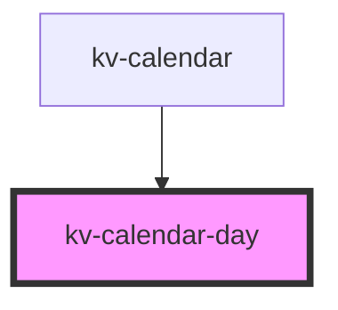

# kv-calendar-day


<!-- Auto Generated Below -->


## Usage

### Angular

```html
<!-- Default -->
<kv-calendar-day [day]="12"></kv-calendar-day>

<!-- Active -->
<kv-calendar-day [day]="12" active></kv-calendar-day>

<!-- Disabled -->
<kv-calendar-day [day]="12" [disabled]="true"></kv-calendar-day>

<!-- In Range -->
<kv-calendar-day [day]="12" [inHoverRange]="true"></kv-calendar-day>
```


### React

```tsx
import React from 'react';

import { KvCalendarDay } from '@kelvininc/react-ui-components';

export const KvCalendarDayExample: React.FC = () => (
	<>
		{/*-- Default --*/}
		<KvCalendarDay day={12} />

		{/*-- Active --*/}
		<KvCalendarDay day={12} active={true} />

		{/*-- Disabled --*/}
		<KvCalendarDay day={12} disabled={true} />

		{/*-- In Range --*/}
		<KvCalendarDay day={12} inHoverRange={true} />
	</>
);
```


## Properties

| Property                 | Attribute                   | Description                                                                            | Type      | Default     |
| ------------------------ | --------------------------- | -------------------------------------------------------------------------------------- | --------- | ----------- |
| `active`                 | `active`                    | (optional) If `true`, the day is with active                                           | `boolean` | `false`     |
| `day`                    | `day`                       | (required) Calendar day                                                                | `number`  | `undefined` |
| `disabled`               | `disabled`                  | (optional) If `true`, the day is disabled                                              | `boolean` | `false`     |
| `inHoverRange`           | `in-hover-range`            | (optional) If `true`, the day is in range from a start date to the current hovered day | `boolean` | `false`     |
| `isBetweenSelectedDates` | `is-between-selected-dates` | (optional) If `true`, the day is between the two selected dates                        | `boolean` | `false`     |
| `isEdge`                 | `is-edge`                   | (optional) If `true` the day is the start or the end of the range                      | `boolean` | `false`     |
| `isToday`                | `is-today`                  | (optional) If `true`, the day is the day of `today`date                                | `boolean` | `false`     |


## Events

| Event           | Description                            | Type                  |
| --------------- | -------------------------------------- | --------------------- |
| `clickDay`      | Emitted when day button is clicked     | `CustomEvent<number>` |
| `mouseEnterDay` | Emitted when day button is mouse enter | `CustomEvent<number>` |
| `mouseLeaveDay` | Emitted when day button is mouse leave | `CustomEvent<number>` |


## Shadow Parts

| Part              | Description               |
| ----------------- | ------------------------- |
| `"day-container"` | The day button container. |


## Dependencies

### Used by

 - [kv-calendar](../calendar)

### Graph


----------------------------------------------


