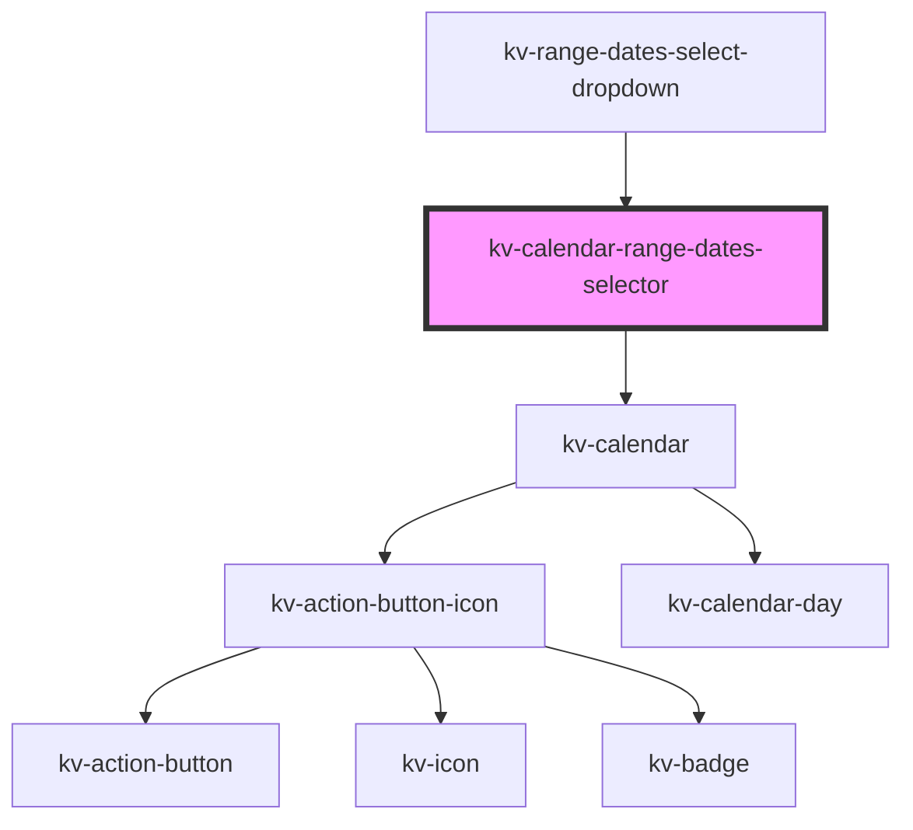

# kv-calendar-range-dates-selector

<!-- Auto Generated Below -->


## Usage

### Angular

```html
<!-- Default -->
<kv-calendar-range-dates-selector></kv-calendar-range-dates-selector>

<!-- With selected ranges date -->
<kv-calendar-range-dates-selector [selectedRangeDates]="['2022-08-04', '2022-09-01']"></kv-calendar-range-dates-selector>

<!-- With initial date -->
<kv-calendar-range-dates-selector initialDate="2022-08-04"></kv-calendar-range-dates-selector>

<!-- With disabled dates-->
<kv-calendar-range-dates-selector [disabledDates]="['2021-12-01', '2021-12-04', '2021-12-05']"></kv-calendar-range-dates-selector>

<!-- With min and max date -->
<kv-calendar-range-dates-selector minDate="2021-12-04" maxDate="2023-02-12"></kv-calendar-range-dates-selector>
```


### React

```tsx
import React from 'react';

import { KvCalendarRangeDatesSelector } from '@kelvininc/react-ui-components';

export const TextFieldExample: React.FC = () => (
	<>
		{/*-- Default --*/}
		<KvCalendarRangeDatesSelector />

		{/*-- With selected date --*/}
		<KvCalendarRangeDatesSelector selectedDateRange={['2022-08-04', '2022-09-01']} />

		{/*-- With initial date --*/}
		<KvCalendarRangeDatesSelector initialDate="2021-12-03" />

		{/*-- With disabled dates --*/}
		<KvCalendarRangeDatesSelector disabledDates={['2021-12-01', '2021-12-04', '2021-12-05']} />

		{/*-- With min and max --*/}
		<KvCalendarRangeDatesSelector minDate="2021-12-04" maxDate="2023-02-12" />
	</>
);
```


## Properties

| Property             | Attribute      | Description                               | Type                                 | Default     |
| -------------------- | -------------- | ----------------------------------------- | ------------------------------------ | ----------- |
| `disabledDates`      | --             | (options) The disabled dates array        | `string[]`                           | `[]`        |
| `initialDate`        | `initial-date` | (optional) Initial date                   | `string`                             | `undefined` |
| `maxDate`            | `max-date`     | (optional) Maximum accepted date          | `string`                             | `undefined` |
| `minDate`            | `min-date`     | (optional) Minimum accepted date          | `string`                             | `undefined` |
| `selectedRangeDates` | --             | (optional) Currently selected range dates | `[] \| [string, string] \| [string]` | `[]`        |


## Events

| Event              | Description                           | Type                             |
| ------------------ | ------------------------------------- | -------------------------------- |
| `selectRangeDates` | Emitted when range dates are selected | `CustomEvent<ISelectRangeDates>` |


## Dependencies

### Used by

 - [kv-range-dates-select-dropdown](../range-dates-select-dropdown)

### Depends on

- [kv-calendar](../calendar)

### Graph


----------------------------------------------


