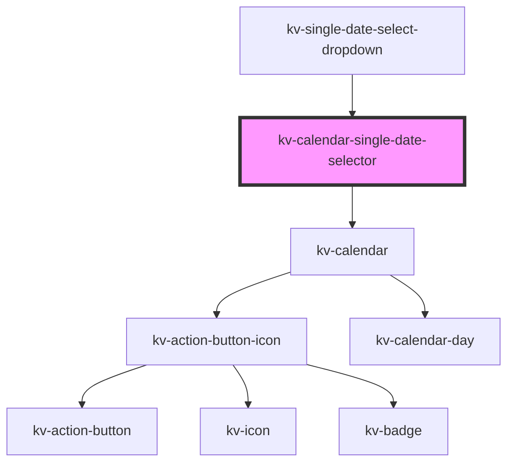

# _kv-calendar-single-date-selector_

<!-- Auto Generated Below -->


## Usage

### Angular

```html
<!-- Default -->
<kv-calendar-single-date-selector></kv-calendar-single-date-selector>

<!-- With selected date -->
<kv-calendar-single-date-selector selectedDate="2022-08-04"></kv-calendar-single-date-selector>

<!-- With initial date -->
<kv-calendar-single-date-selector initialDate="2022-08-04"></kv-calendar-single-date-selector>

<!-- With disabled dates-->
<kv-calendar-single-date-selector [disabledDates]="['2021-12-01', '2021-12-04', '2021-12-05']"></kv-calendar-single-date-selector>

<!-- With min and max date -->
<kv-calendar-single-date-selector minDate="2021-12-04" maxDate="2023-02-12"></kv-calendar-single-date-selector>
```


### React

```tsx
import React from 'react';

import { KvCalendarSingleDateSelector } from '@kelvininc/react-ui-components';

export const KvCalendarSingleDateSelectorExample: React.FC = () => (
	<>
		{/*-- Default --*/}
		<KvCalendarSingleDateSelector />

		{/*-- With selected date --*/}
		<KvCalendarSingleDateSelector selectedDate="2022-08-04" />

		{/*-- With initial date --*/}
		<KvCalendarSingleDateSelector initialDate="2021-12-03" />

		{/*-- With disabled dates --*/}
		<KvCalendarSingleDateSelector disabledDates={['2021-12-01', '2021-12-04', '2021-12-05']} />

		{/*-- With min and max --*/}
		<KvCalendarSingleDateSelector minDate="2021-12-04" maxDate="2023-02-12" />
	</>
);
```


## Properties

| Property        | Attribute       | Description                        | Type       | Default     |
| --------------- | --------------- | ---------------------------------- | ---------- | ----------- |
| `disabledDates` | --              | (options) The disabled dates array | `string[]` | `[]`        |
| `initialDate`   | `initial-date`  | (optional) Initial date            | `string`   | `undefined` |
| `maxDate`       | `max-date`      | (optional) Maximum accepted date   | `string`   | `undefined` |
| `minDate`       | `min-date`      | (optional) Minimum accepted date   | `string`   | `undefined` |
| `selectedDate`  | `selected-date` | (optional) Currently selected date | `string`   | `undefined` |


## Events

| Event        | Description                  | Type                       |
| ------------ | ---------------------------- | -------------------------- |
| `selectDate` | Emitted when day is selected | `CustomEvent<ISelectDate>` |


## Dependencies

### Used by

 - [kv-single-date-select-dropdown](../single-date-select-dropdown)

### Depends on

- [kv-calendar](../calendar)

### Graph


----------------------------------------------


