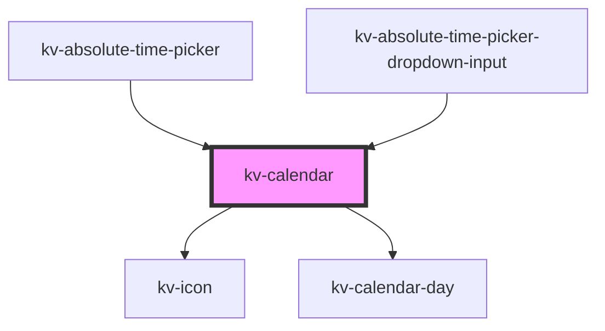

# kv-calendar

<!-- Auto Generated Below -->


## Usage

### React

```tsx
import React from 'react';

import { KvCalendar } from '@kelvininc/react-ui-components';

export const KvCalendarExample: React.FC = () => (
	<>
		{/*-- Default --*/}
		<KvCalendar />

		{/*-- With initial date --*/}
		<KvCalendar initialDate="2022-08-04" />
	</>
);
```


## Properties

| Property                    | Attribute                      | Description                                                                                                           | Type                                                              | Default                         |
| --------------------------- | ------------------------------ | --------------------------------------------------------------------------------------------------------------------- | ----------------------------------------------------------------- | ------------------------------- |
| `disableHoveringStyling`    | `disable-hovering-styling`     | (optional) Disables the hovering styling when the dates are being selected, and when start or end date is not defined | `boolean`                                                         | `false`                         |
| `disabledDates`             | --                             | (options) The disabled dates array                                                                                    | `string[]`                                                        | `[]`                            |
| `displayNextMonthArrow`     | `display-next-month-arrow`     | (optional) Enables the next month click icon                                                                          | `boolean`                                                         | `true`                          |
| `displayPreviousMonthArrow` | `display-previous-month-arrow` | (optional) Enables the previous month click icon                                                                      | `boolean`                                                         | `true`                          |
| `hoveredDate`               | `hovered-date`                 | (optional) Defines if a date is hovered                                                                               | `string`                                                          | `undefined`                     |
| `initialDate`               | `initial-date`                 | (optional) Initial date                                                                                               | `string`                                                          | `undefined`                     |
| `maxDate`                   | `max-date`                     | (optional) Maximum accepted date. Format: YYYY-MM-DD                                                                  | `string`                                                          | `undefined`                     |
| `minDate`                   | `min-date`                     | (optional) Minimum accepted date. Format: YYYY-MM-DD                                                                  | `string`                                                          | `undefined`                     |
| `mode`                      | `mode`                         | (optional) Defines if the calendar is in single date or range mode                                                    | `EAbsoluteTimePickerMode.Range \| EAbsoluteTimePickerMode.Single` | `EAbsoluteTimePickerMode.Range` |
| `selectedDates`             | --                             | (optional) The currently selected dates                                                                               | `string[]`                                                        | `[]`                            |


## Events

| Event               | Description                           | Type                             |
| ------------------- | ------------------------------------- | -------------------------------- |
| `changeMonth`       | Emitted when a month changes          | `CustomEvent<IChangeMonthEvent>` |
| `changeYear`        | Emitted when a year changes           | `CustomEvent<IChangeYearEvent>`  |
| `clickDate`         | Emitted when a date is clicked        | `CustomEvent<IClickDateEvent>`   |
| `hoveredDateChange` | Emitted when the hovered date changes | `CustomEvent<string>`            |


## CSS Custom Properties

| Name                                  | Description                                |
| ------------------------------------- | ------------------------------------------ |
| `--calendar-background-color`         | The calendar background color.             |
| `--calendar-horizontal-padding`       | The calendar container horizontal padding. |
| `--calendar-month-title-text-color`   | The calendar month text color.             |
| `--calendar-month-weekday-text-color` | The calendar week day text color.          |
| `--calendar-vertical-padding`         | The calendar container vertical padding.   |
| `--calendar-width`                    | The calendar container width.              |


## Dependencies

### Used by

 - [kv-absolute-time-picker](../absolute-time-picker)
 - [kv-absolute-time-picker-dropdown-input](../absolute-time-picker-dropdown-input)

### Depends on

- [kv-icon](../icon)
- [kv-calendar-day](../calendar-day)

### Graph


----------------------------------------------


