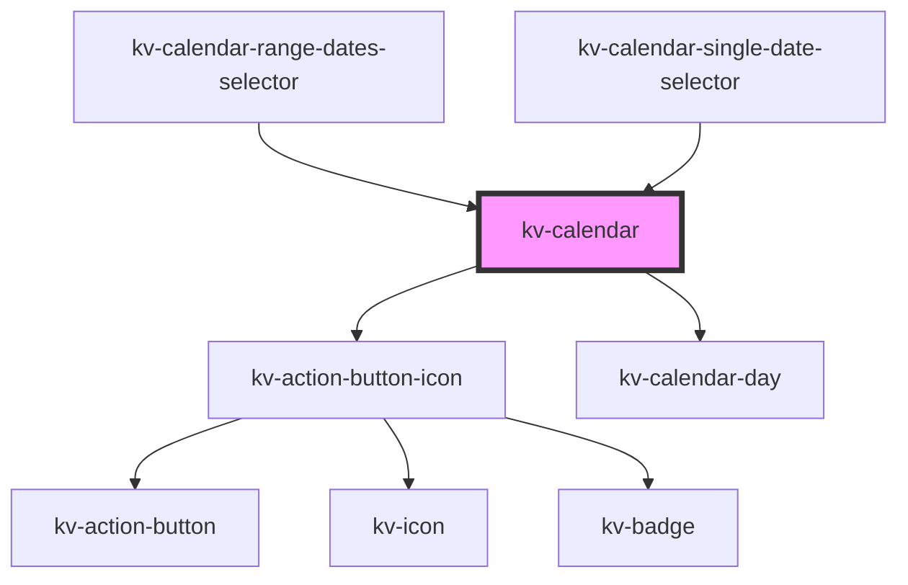

# kv-calendar

<!-- Auto Generated Below -->


## Usage

### Angular

```html
<!-- Default -->
<kv-calendar></kv-calendar>

<!-- With initial date -->
<kv-calendar initialDate="2022-08-04"></kv-calendar>
```


### React

```tsx
import React from 'react';

import { KvCalendar } from '@kelvininc/react-ui-components';

export const KvCalendarExample: React.FC = () => (
	<>
		{/*-- Default --*/}
		<KvCalendar />

		{/*-- With initial date --*/}
		<KvCalendar initialDate="2022-08-04" />
	</>
);
```


## Properties

| Property        | Attribute      | Description                             | Type       | Default     |
| --------------- | -------------- | --------------------------------------- | ---------- | ----------- |
| `disabledDates` | --             | (options) The disabled dates array      | `string[]` | `[]`        |
| `initialDate`   | `initial-date` | (optional) Initial date                 | `string`   | `undefined` |
| `maxDate`       | `max-date`     | (optional) Maximum accepted date        | `string`   | `undefined` |
| `minDate`       | `min-date`     | (optional) Minimum accepted date        | `string`   | `undefined` |
| `selectedDates` | --             | (optional) The currently selected dates | `string[]` | `[]`        |


## Events

| Event         | Description                    | Type                             |
| ------------- | ------------------------------ | -------------------------------- |
| `changeMonth` | Emitted when a month changes   | `CustomEvent<IChangeMonthEvent>` |
| `changeYear`  | Emitted when a year changes    | `CustomEvent<IChangeYearEvent>`  |
| `clickDate`   | Emitted when a date is clicked | `CustomEvent<IClickDateEvent>`   |


## Shadow Parts

| Part                   | Description             |
| ---------------------- | ----------------------- |
| `"calendar-container"` | The calendar container. |
| `"month-container"`    | The month container.    |


## CSS Custom Properties

| Name                                  | Description                                |
| ------------------------------------- | ------------------------------------------ |
| `--calendar-background-color`         | The calendar background color.             |
| `--calendar-horizontal-padding`       | The calendar container horizontal padding. |
| `--calendar-month-title-text-color`   | The calendar month text color.             |
| `--calendar-month-weekday-text-color` | The calendar week day text color.          |
| `--calendar-vertical-padding`         | The calendar container vertical padding.   |
| `--calendar-width`                    | The calendar container width.              |


## Dependencies

### Used by

 - [kv-calendar-range-dates-selector](../calendar-range-dates-selector)
 - [kv-calendar-single-date-selector](../calendar-single-date-selector)

### Depends on

- [kv-action-button-icon](../action-button-icon)
- [kv-calendar-day](../calendar-day)

### Graph


----------------------------------------------


