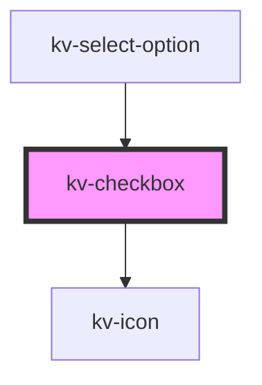

# kv-checkbox


<!-- Auto Generated Below -->


## Usage

### React

```tsx
import React from 'react';

import { KvCheckbox } from '@kelvininc/react-ui-components';

export const RadioExample: React.FC = () => (
	<>
		{/*-- Default --*/}
		<KvCheckbox />

		{/*-- Checked --*/}
		<KvCheckbox checked />

		{/*-- Disabled --*/}
		<KvCheckbox disabled />

		{/*-- Inderterminated --*/}
		<KvCheckbox indeterminate />
	</>
);
```


## Properties

| Property        | Attribute       | Description                                                                   | Type      | Default     |
| --------------- | --------------- | ----------------------------------------------------------------------------- | --------- | ----------- |
| `checked`       | `checked`       | (optional) If `true` the checkbox is with checked state. Default: false       | `boolean` | `false`     |
| `disabled`      | `disabled`      | (optional) If `true` the checkbox is with disabled state. Default: false      | `boolean` | `false`     |
| `indeterminate` | `indeterminate` | (optional) If `true` the checkbox is with indeterminate state. Default: false | `boolean` | `false`     |
| `label`         | `label`         | (optional) The label text for the checkbox.                                   | `string`  | `undefined` |


## Events

| Event           | Description                                     | Type                      |
| --------------- | ----------------------------------------------- | ------------------------- |
| `clickCheckbox` | Emitted when the checkbox checked state changes | `CustomEvent<MouseEvent>` |


## Shadow Parts

| Part      | Description        |
| --------- | ------------------ |
| `"icon"`  | The icon element.  |
| `"label"` | The label element. |


## CSS Custom Properties

| Name                              | Description                                     |
| --------------------------------- | ----------------------------------------------- |
| `--checkbox-icon-size`            | Text checkbox height and width. Default: 16px.  |
| `--checkbox-label-color`          | Text label color.                               |
| `--checkbox-label-disabled-color` | Text label color when the checkbox is disabled. |
| `--checkbox-size`                 | Text checkbox height and width. Default: 16px.  |


## Dependencies

### Used by

 - [kv-select-option](../select-option)

### Depends on

- [kv-icon](../icon)

### Graph


----------------------------------------------


