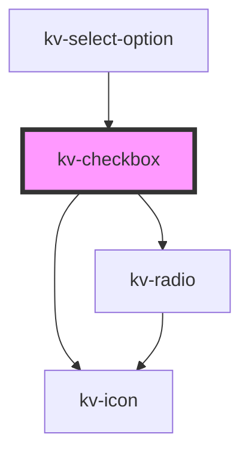

# kv-checkbox


<!-- Auto Generated Below -->


## Usage

### React

```tsx
import React from 'react';

import { KvCheckbox } from '@kelvininc/react-ui-components/client';

export const RadioExample: React.FC = () => (
	<>
		{/*-- Default --*/}
		<KvCheckbox />

		{/*-- Checked --*/}
		<KvCheckbox checked />

		{/*-- Disabled --*/}
		<KvCheckbox disabled />

		{/*-- Inderterminated --*/}
		<KvCheckbox indeterminate />
	</>
);
```


## Properties

| Property        | Attribute       | Description                                                                   | Type                                           | Default                |
| --------------- | --------------- | ----------------------------------------------------------------------------- | ---------------------------------------------- | ---------------------- |
| `checked`       | `checked`       | (optional) If `true` the radio is with checked state. Default: false          | `boolean \| undefined`                         | `false`                |
| `disabled`      | `disabled`      | (optional) If `true` the radio is with disabled state. Default: false         | `boolean \| undefined`                         | `false`                |
| `indeterminate` | `indeterminate` | (optional) If `true` the checkbox is with indeterminate state. Default: false | `boolean \| undefined`                         | `false`                |
| `label`         | `label`         | (optional) The label text for the radio.                                      | `string \| undefined`                          | `undefined`            |
| `size`          | `size`          | (optional) Sets this component item to a different styling configuration      | `EComponentSize.Large \| EComponentSize.Small` | `EComponentSize.Small` |


## Events

| Event           | Description                                     | Type                 |
| --------------- | ----------------------------------------------- | -------------------- |
| `clickCheckbox` | Emitted when the checkbox checked state changes | `CustomEvent<Event>` |


## Shadow Parts

| Part      | Description        |
| --------- | ------------------ |
| `"icon"`  | The icon element.  |
| `"label"` | The label element. |


## Dependencies

### Used by

 - [kv-select-option](../select-option)

### Depends on

- [kv-radio](../radio)
- [kv-icon](../icon)

### Graph

```mermaid
graph TD;
  kv-checkbox --> kv-radio
  kv-checkbox --> kv-icon
  kv-radio --> kv-icon
  kv-select-option --> kv-checkbox
  style kv-checkbox fill:#f9f,stroke:#333,stroke-width:4px
```

----------------------------------------------


