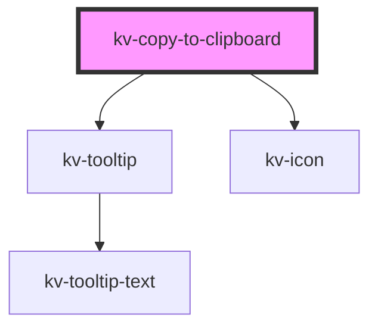

# _<kv-copy-to-clipboard>_


<!-- Auto Generated Below -->


## Usage

### Angular

```html
<!-- Default -->
<kv-copy-to-clipboard copiableText="https://kelvin.ai" />

<!-- With custom copy tooltip suffix -->
<kv-copy-to-clipboard copiableText="https://kelvin.ai" tooltipSuffix="Link" />

<!-- With content projection -->
<kv-copy-to-clipboard copiableText="https://kelvin.ai" tooltipSuffix="Link">
	<span>Kelvin Website Link</span>
</kv-copy-to-clipboard>

```


### React

```tsx
import React from 'react';

import { KvCopyToClipboard } from '@kelvininc/react-ui-components';

export const KvCopyToClipboardExample: React.FC = () => (
	<>
		{/*-- Default --*/}
		<KvCopyToClipboard copiableText="https://kelvin.ai" />

		{/*-- With custom copy tooltip suffix --*/}
		<KvCopyToClipboard copiableText="https://kelvin.ai" tooltipSuffix="Link" />

		{/*-- With content projection --*/}
		<KvCopyToClipboard copiableText="https://kelvin.ai" tooltipSuffix="Link">
			<span>Kelvin Website Link</span>
		</KvCopyToClipboard>
	</>
);
```


## Properties

| Property        | Attribute        | Description                                                        | Type     | Default     |
| --------------- | ---------------- | ------------------------------------------------------------------ | -------- | ----------- |
| `copiableText`  | `copiable-text`  | (required) The text to copy to the clipboard when clicking         | `string` | `undefined` |
| `tooltipSuffix` | `tooltip-suffix` | (optional) The suffix to show on the `Copy` tooltip before copying | `string` | `undefined` |


## Shadow Parts

| Part        | Description                   |
| ----------- | ----------------------------- |
| `"content"` | The container for the content |


## CSS Custom Properties

| Name                   | Description            |
| ---------------------- | ---------------------- |
| `--container-width`    | Width of the container |
| `--icon-color-default` | Start icon color       |
| `--icon-color-success` | Success icon color     |
| `--icon-start-opacity` | Start icon opacity     |


## Dependencies

### Depends on

- [kv-tooltip](../tooltip)
- [kv-icon](../icon)

### Graph


----------------------------------------------


