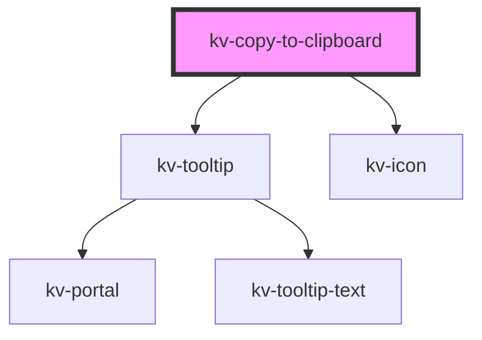

# _<kv-copy-to-clipboard>_


<!-- Auto Generated Below -->


## Usage

### React

```tsx
import React from 'react';

import { KvCopyToClipboard } from '@kelvininc/react-ui-components/client';

export const KvCopyToClipboardExample: React.FC = () => (
	<>
		{/*-- Default --*/}
		<KvCopyToClipboard copiableText="https://kelvin.ai" />

		{/*-- With custom copy tooltip suffix --*/}
		<KvCopyToClipboard copiableText="https://kelvin.ai" tooltipSuffix="Link" />

		{/*-- With content projection --*/}
		<KvCopyToClipboard copiableText="https://kelvin.ai" tooltipSuffix="Link">
			<span>Kelvin Website Link</span>
		</KvCopyToClipboard>
	</>
);
```


## Properties

| Property        | Attribute        | Description                                                        | Type                                                                                                                                                                                                                                                                                                                                                                           | Default                  |
| --------------- | ---------------- | ------------------------------------------------------------------ | ------------------------------------------------------------------------------------------------------------------------------------------------------------------------------------------------------------------------------------------------------------------------------------------------------------------------------------------------------------------------------ | ------------------------ |
| `copiableText`  | `copiable-text`  | (required) The text to copy to the clipboard when clicking         | `string`                                                                                                                                                                                                                                                                                                                                                                       | `undefined`              |
| `tooltipConfig` | `tooltip-config` | (optional) Object with tooltip position options                    | `{ strategy?: Strategy; placement?: Placement; middleware?: (false \| { name: string; options?: any; fn: (state: { x: number; y: number; initialPlacement: Placement; strategy: Strategy; platform: Platform; placement: Placement; middlewareData: MiddlewareData; rects: ElementRects; elements: Elements; }) => Promisable<MiddlewareReturn>; })[]; platform?: Platform; }` | `DEFAULT_TOOLTIP_CONFIG` |
| `tooltipDelay`  | `tooltip-delay`  | (optional) Delay to show tooltip in milliseconds.                  | `number`                                                                                                                                                                                                                                                                                                                                                                       | `DEFAULT_TOOLTIP_DELAY`  |
| `tooltipSuffix` | `tooltip-suffix` | (optional) The suffix to show on the `Copy` tooltip before copying | `string`                                                                                                                                                                                                                                                                                                                                                                       | `undefined`              |


## Shadow Parts

| Part        | Description                   |
| ----------- | ----------------------------- |
| `"content"` | The container for the content |
| `"icon"`    | The copy icon                 |


## CSS Custom Properties

| Name                                 | Description                                  |
| ------------------------------------ | -------------------------------------------- |
| `--container-gap`                    | The gap between the container's elements     |
| `--container-hover-background-color` | The container's hover state background color |
| `--container-padding`                | The container's padding                      |
| `--container-width`                  | Width of the container                       |
| `--icon-background-color-success`    | Success icon background color                |
| `--icon-color-default`               | Start icon color                             |
| `--icon-color-success`               | Success icon color                           |
| `--icon-size`                        | The copy icon size                           |
| `--icon-start-opacity`               | Start icon opacity                           |


## Dependencies

### Depends on

- [kv-tooltip](../tooltip)
- [kv-icon](../icon)

### Graph


----------------------------------------------


