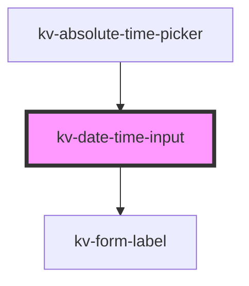

# kv-date-time-input

<!-- Auto Generated Below -->

## Properties

| Property       | Attribute        | Description                                                                      | Type                                           | Default                |
| -------------- | ---------------- | -------------------------------------------------------------------------------- | ---------------------------------------------- | ---------------------- |
| `forcedFocus`  | `forced-focus`   | (optional) Date time focus state                                                 | `boolean`                                      | `false`                |
| `highlighted`  | `highlighted`    | (optional) Similar to forcedFocus but does not emmit events                      | `boolean`                                      | `false`                |
| `inputName`    | `input-name`     | (optional) Date time input name                                                  | `string`                                       | `undefined`            |
| `label`        | `label`          | (optional) Date time input label                                                 | `string`                                       | `undefined`            |
| `max`          | `max`            | (optional) Date time maximum value                                               | `string`                                       | `undefined`            |
| `min`          | `min`            | (optional) Date time minimum value                                               | `string`                                       | `undefined`            |
| `placeholder`  | `placeholder`    | (optional) Date time place holder                                                | `string`                                       | `''`                   |
| `size`         | `size`           | (optional) Sets this tab item to a different styling configuration               | `EComponentSize.Large \| EComponentSize.Small` | `EComponentSize.Large` |
| `useInputMask` | `use-input-mask` | (optional) Use a input mask when the Date time type is a Datetime (default true) | `boolean`                                      | `false`                |
| `value`        | `value`          | (optional) Date time value                                                       | `string`                                       | `''`                   |

## Events

| Event          | Description                            | Type                      |
| -------------- | -------------------------------------- | ------------------------- |
| `dateTimeBlur` | Emitted when date time lost focus      | `CustomEvent<string>`     |
| `inputFocus`   | Emitted when the input is foccused     | `CustomEvent<FocusEvent>` |
| `textChange`   | Emitted when a keyboard input occurred | `CustomEvent<string>`     |

## Dependencies

### Used by

 - [kv-absolute-time-picker](../absolute-time-picker)

### Depends on

- [kv-form-label](../form-label)

### Graph

----------------------------------------------

