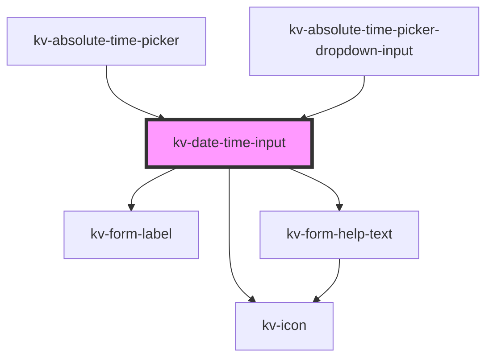

# kv-date-time-input


<!-- Auto Generated Below -->


## Usage

### React

```tsx
import React from 'react';

import { KvDateTimeInput } from '@kelvininc/react-ui-components';

export const DateTimeInputExample: React.FC = () => (
	<>
		{/*-- Default --*/}
		<KvDateTimeInput />

		{/*-- Labeled --*/}
		<KvDateTimeInput label="Text Field" />
	</>
);
```


## Properties

| Property         | Attribute          | Description                                                                      | Type                                                                                                             | Default                             |
| ---------------- | ------------------ | -------------------------------------------------------------------------------- | ---------------------------------------------------------------------------------------------------------------- | ----------------------------------- |
| `dateFormat`     | `date-format`      | (optional) Format of the provided date                                           | `string`                                                                                                         | `DEFAULT_DATE_FORMAT`               |
| `disabled`       | `disabled`         | (optional) Date time input disabled                                              | `boolean`                                                                                                        | `false`                             |
| `forcedFocus`    | `forced-focus`     | (optional) Date time focus state                                                 | `boolean`                                                                                                        | `false`                             |
| `helpText`       | `help-text`        | (optional) Date time input help text                                             | `string \| string[]`                                                                                             | `[]`                                |
| `highlighted`    | `highlighted`      | (optional) Similar to forcedFocus but does not emmit events                      | `boolean`                                                                                                        | `false`                             |
| `inputName`      | `input-name`       | (optional) Date time input name                                                  | `string`                                                                                                         | `undefined`                         |
| `inputStyleType` | `input-style-type` | (optional) Specifies if the inputs should be joined together or separated        | `EDateTimeInputTypeStyle.MergedLeft \| EDateTimeInputTypeStyle.MergedRight \| EDateTimeInputTypeStyle.Separated` | `EDateTimeInputTypeStyle.Separated` |
| `label`          | `label`            | (optional) Date time input label                                                 | `string`                                                                                                         | `undefined`                         |
| `leftIcon`       | `left-icon`        | (optional) Input left icon                                                       | `EIconName \| EOtherIconName`                                                                                    | `undefined`                         |
| `placeholder`    | `placeholder`      | (optional) Date time place holder                                                | `string`                                                                                                         | `DEFAULT_PLACEHOLDER`               |
| `required`       | `required`         | (optional) Date time input required                                              | `boolean`                                                                                                        | `false`                             |
| `rightIcon`      | `right-icon`       | (optional) Input right icon                                                      | `EIconName \| EOtherIconName`                                                                                    | `undefined`                         |
| `size`           | `size`             | (optional) Sets this tab item to a different styling configuration               | `EComponentSize.Large \| EComponentSize.Small`                                                                   | `EComponentSize.Large`              |
| `state`          | `state`            | (optional) Date time input state                                                 | `EValidationState.Invalid \| EValidationState.None \| EValidationState.Valid`                                    | `EValidationState.None`             |
| `useInputMask`   | `use-input-mask`   | (optional) Use a input mask when the Date time type is a Datetime (default true) | `boolean`                                                                                                        | `false`                             |
| `value`          | `value`            | (optional) Date time value                                                       | `string`                                                                                                         | `''`                                |


## Events

| Event            | Description                            | Type                      |
| ---------------- | -------------------------------------- | ------------------------- |
| `dateTimeBlur`   | Emitted when date time lost focus      | `CustomEvent<string>`     |
| `inputFocus`     | Emitted when the input is foccused     | `CustomEvent<FocusEvent>` |
| `rightIconClick` | Emitted when the right icon is clicked | `CustomEvent<string>`     |
| `textChange`     | Emitted when a keyboard input occurred | `CustomEvent<string>`     |


## Dependencies

### Used by

 - [kv-absolute-time-picker](../absolute-time-picker)
 - [kv-absolute-time-picker-dropdown-input](../absolute-time-picker-dropdown-input)

### Depends on

- [kv-form-label](../form-label)
- [kv-icon](../icon)
- [kv-form-help-text](../form-help-text)

### Graph


----------------------------------------------


