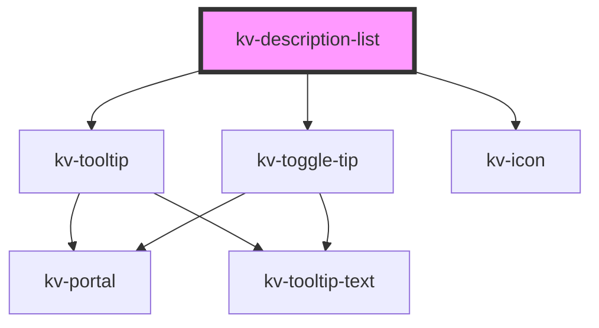

# _<kv-description-list>_


<!-- Auto Generated Below -->


## Usage

### React

```tsx
import React from 'react';

import { KvDescriptionList } from '@kelvininc/react-ui-components';

const defaultConfig: IDescriptionListItem[] = [
	{
		title: 'Name ID',
		description: 'cluster-a-brownie',
		popoverInfo: {
			text: `This name cannot be changed`,
			icon: EIconName.Info
		}
	},
	{
		title: 'Kubernetes Version',
		description: '1.20.5'
	},
	{
		title: 'Kelvin Version',
		description: '4.2.4'
	}
];

const withTextTooltip: IDescriptionListItem[] = [
	{
		title: 'Name ID',
		description: 'cluster-a-brownie',
		popoverInfo: {
			text: `This name cannot be changed`
		}
	},
	{
		title: 'Kubernetes Version',
		description: '1.20.5'
	},
	{
		title: 'Kelvin Version',
		description: '4.2.4'
	}
];

const withIconTooltip: IDescriptionListItem[] = [
	{
		title: 'Name ID',
		description: 'cluster-a-brownie',
		popoverInfo: {
			text: `This name cannot be changed`,
			icon: EIconName.Info
		}
	},
	{
		title: 'Kubernetes Version',
		description: '1.20.5'
	},
	{
		title: 'Kelvin Version',
		description: '4.2.4'
	}
];

export const KvDescriptionListExample: React.FC = () => (
	<>
		{/*-- Default --*/}
		<KvDescriptionList items={defaultConfig} />

		{/*-- With text tooltip --*/}
		<KvDescriptionList items={withTextTooltip} />

		{/*--  With icon tooltip --*/}
		<KvDescriptionList items={withIconTooltip} />
	</>
);
```


## Properties

| Property                   | Attribute      | Description                                                                                                                                                                             | Type                                                                                                                                                                                                                                                                                                                                                                           | Default                         |
| -------------------------- | -------------- | --------------------------------------------------------------------------------------------------------------------------------------------------------------------------------------- | ------------------------------------------------------------------------------------------------------------------------------------------------------------------------------------------------------------------------------------------------------------------------------------------------------------------------------------------------------------------------------ | ------------------------------- |
| `customClass`              | `custom-class` | (optional) Additional classes to apply for custom CSS. If multiple classes are provided they should be separated by spaces. It is also valid to provide CssClassMap with boolean logic. | `CssClassMap \| string \| string[]`                                                                                                                                                                                                                                                                                                                                            | `''`                            |
| `descriptionTooltipConfig` | --             | (optional) The config to use on the tooltip that shows hovering the text                                                                                                                | `{ strategy?: Strategy; placement?: Placement; middleware?: (false \| { name: string; options?: any; fn: (state: { x: number; y: number; initialPlacement: Placement; strategy: Strategy; platform: Platform; placement: Placement; middlewareData: MiddlewareData; rects: ElementRects; elements: Elements; }) => Promisable<MiddlewareReturn>; })[]; platform?: Platform; }` | `DEFAULT_TEXT_TOOLTIP_CONFIG`   |
| `iconToggletipConfig`      | --             | (optional) The config to use on the icon toggletip                                                                                                                                      | `IDescriptionListItemToggletipConfig`                                                                                                                                                                                                                                                                                                                                          | `DEFAULT_ICON_TOGGLETIP_CONFIG` |
| `items` _(required)_       | --             | (required) The array of items to display in the list                                                                                                                                    | `IDescriptionListItem[]`                                                                                                                                                                                                                                                                                                                                                       | `undefined`                     |


## Dependencies

### Depends on

- [kv-tooltip](../tooltip)
- [kv-toggle-tip](../toggle-tip)
- [kv-icon](../icon)

### Graph


----------------------------------------------


