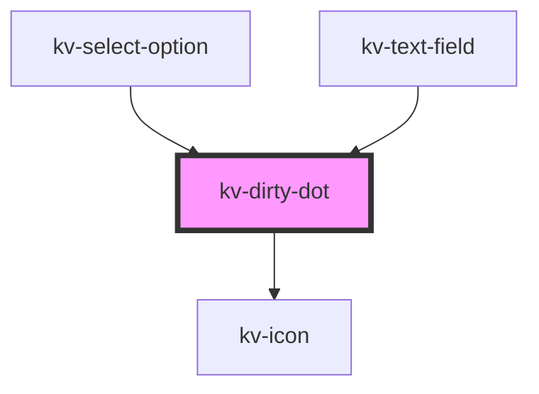

# _<kv-dirty-dot>_

<!-- Auto Generated Below -->

## Shadow Parts

| Part    | Description        |
| ------- | ------------------ |
| `"dot"` | The dot container. |

## CSS Custom Properties

| Name                     | Description                  |
| ------------------------ | ---------------------------- |
| `--dot-background-color` | DirtyDot's background color. |
| `--dot-height`           | DirtyDot's height.           |
| `--dot-width`            | DirtyDot's width.            |

## Dependencies

### Used by

 - [kv-select-option](../select-option)
 - [kv-text-field](../text-field)

### Depends on

- [kv-icon](../icon)

### Graph

----------------------------------------------

