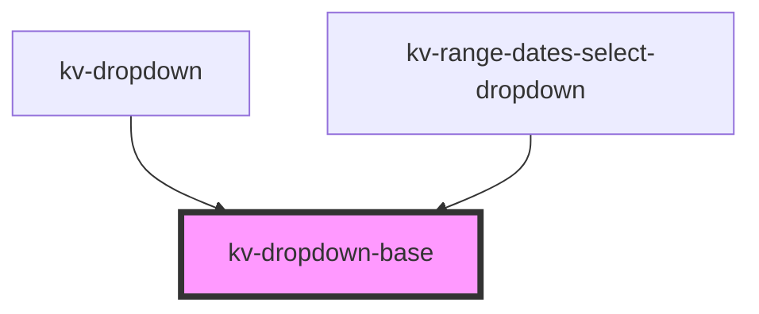

# *<kv-dropdown-base>*

<!-- Auto Generated Below -->

## Properties

| Property    | Attribute   | Description                                                 | Type                                                                                                                                                                 | Default    |
| ----------- | ----------- | ----------------------------------------------------------- | -------------------------------------------------------------------------------------------------------------------------------------------------------------------- | ---------- |
| `isOpen`    | `is-open`   | (optional) If `true` the list is opened                     | `boolean`                                                                                                                                                            | `false`    |
| `placement` | `placement` | (optional) The dropdown placement relative to the container | `"bottom" \| "bottom-end" \| "bottom-start" \| "left" \| "left-end" \| "left-start" \| "right" \| "right-end" \| "right-start" \| "top" \| "top-end" \| "top-start"` | `'bottom'` |

## Events

| Event             | Description                                   | Type                   |
| ----------------- | --------------------------------------------- | ---------------------- |
| `openStateChange` | Emitted when the dropdown opens state changes | `CustomEvent<boolean>` |

## Dependencies

### Used by

 - [kv-dropdown](../dropdown)
 - [kv-range-dates-select-dropdown](../range-dates-select-dropdown)

### Graph

----------------------------------------------

