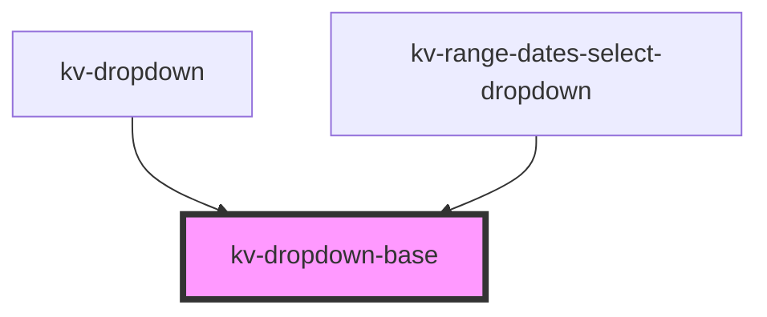

# *<kv-dropdown-base>*

<!-- Auto Generated Below -->

## Properties

| Property        | Attribute  | Description                                                                                      | Type                                                                                                                                                                                                                                                                                                                                                                           | Default                   |
| --------------- | ---------- | ------------------------------------------------------------------------------------------------ | ------------------------------------------------------------------------------------------------------------------------------------------------------------------------------------------------------------------------------------------------------------------------------------------------------------------------------------------------------------------------------ | ------------------------- |
| `actionElement` | --         | (optional) A reference to the dropdown action element                                            | `HTMLElement`                                                                                                                                                                                                                                                                                                                                                                  | `null`                    |
| `disabled`      | `disabled` | (optional) If `true` clicking outside the dropdown will not trigger state change. Default: false | `boolean`                                                                                                                                                                                                                                                                                                                                                                      | `false`                   |
| `isOpen`        | `is-open`  | (optional) If `true` the list is opened                                                          | `boolean`                                                                                                                                                                                                                                                                                                                                                                      | `false`                   |
| `listElement`   | --         | (optional) A reference to the dropdown list element                                              | `HTMLElement`                                                                                                                                                                                                                                                                                                                                                                  | `null`                    |
| `options`       | --         | (optional) The dropdown position config options                                                  | `{ placement?: Placement; strategy?: Strategy; middleware?: (false \| { name: string; options?: any; fn: (state: { platform: Platform; placement: Placement; strategy: Strategy; x: number; y: number; initialPlacement: Placement; middlewareData: MiddlewareData; rects: ElementRects; elements: Elements; }) => Promisable<MiddlewareReturn>; })[]; platform?: Platform; }` | `DEFAULT_POSITION_CONFIG` |

## Events

| Event             | Description                                   | Type                   |
| ----------------- | --------------------------------------------- | ---------------------- |
| `openStateChange` | Emitted when the dropdown opens state changes | `CustomEvent<boolean>` |

## Dependencies

### Used by

 - [kv-dropdown](../dropdown)
 - [kv-range-dates-select-dropdown](../range-dates-select-dropdown)

### Graph

----------------------------------------------

