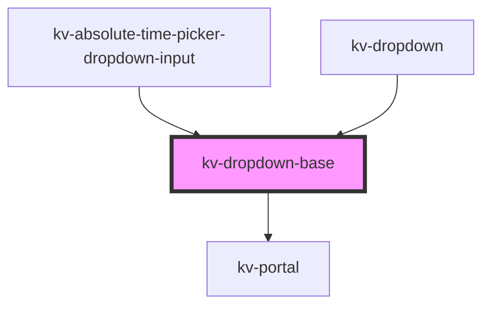

# *<kv-dropdown-base>*

<!-- Auto Generated Below -->

## Properties

| Property            | Attribute             | Description                                                                                      | Type                                                                                                                                                                                                                                                                                                                                                                           | Default                    |
| ------------------- | --------------------- | ------------------------------------------------------------------------------------------------ | ------------------------------------------------------------------------------------------------------------------------------------------------------------------------------------------------------------------------------------------------------------------------------------------------------------------------------------------------------------------------------ | -------------------------- |
| `actionElement`     | `action-element`      | (optional) A reference to the dropdown action element                                            | `HTMLElement`                                                                                                                                                                                                                                                                                                                                                                  | `null`                     |
| `clickOutsideClose` | `click-outside-close` | (optional) If `false` clicking outside the dropdown will not trigger state change. Default: true | `boolean`                                                                                                                                                                                                                                                                                                                                                                      | `true`                     |
| `isOpen`            | `is-open`             | (optional) If `true` the list is opened                                                          | `boolean`                                                                                                                                                                                                                                                                                                                                                                      | `false`                    |
| `listElement`       | `list-element`        | (optional) A reference to the dropdown list element                                              | `HTMLElement`                                                                                                                                                                                                                                                                                                                                                                  | `null`                     |
| `options`           | `options`             | (optional) The dropdown position config options                                                  | `{ strategy?: Strategy; placement?: Placement; middleware?: (false \| { name: string; options?: any; fn: (state: { x: number; y: number; initialPlacement: Placement; strategy: Strategy; platform: Platform; placement: Placement; middlewareData: MiddlewareData; rects: ElementRects; elements: Elements; }) => Promisable<MiddlewareReturn>; })[]; platform?: Platform; }` | `DEFAULT_POSITION_CONFIG`  |
| `zIndex`            | `z-index`             | (optional) the dropdown list z-index (default: 9004)                                             | `number`                                                                                                                                                                                                                                                                                                                                                                       | `DEFAULT_DROPDOWN_Z_INDEX` |

## Events

| Event             | Description                                                   | Type                   |
| ----------------- | ------------------------------------------------------------- | ---------------------- |
| `clickOutside`    | Emitted when there's a click outside the dropdown's bondaries | `CustomEvent<void>`    |
| `openStateChange` | Emitted when the dropdown opens state changes                 | `CustomEvent<boolean>` |

## Dependencies

### Used by

 - [kv-absolute-time-picker-dropdown-input](../absolute-time-picker-dropdown-input)
 - [kv-dropdown](../dropdown)

### Depends on

- [kv-portal](../portal)

### Graph

----------------------------------------------

