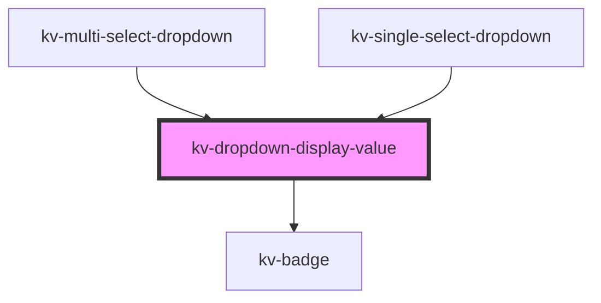

# dropdown-display-value

<!-- Auto Generated Below -->

## Properties

| Property               | Attribute      | Description                                                                                                             | Type                                           | Default                |
| ---------------------- | -------------- | ----------------------------------------------------------------------------------------------------------------------- | ---------------------------------------------- | ---------------------- |
| `badge`                | `badge`        | (optional) Defines the badge text to use                                                                                | `string`                                       | `undefined`            |
| `disabled`             | `disabled`     | (optional) Defines if the text should use `disabled` styling                                                            | `boolean`                                      | `undefined`            |
| `size`                 | `size`         | (optional) Sets the size of this component to one of 'EComponentSize.Small' or 'EComponentSize.Large' defaults to large | `EComponentSize.Large \| EComponentSize.Small` | `EComponentSize.Large` |
| `value`                | `value`        | (optional) Defines the display value                                                                                    | `string`                                       | `undefined`            |
| `valuePrefix`          | `value-prefix` | (optional) Defines the prefix that adds context to displayed values                                                     | `string`                                       | `undefined`            |
| `visible` _(required)_ | `visible`      | (required) Defines if the text and badge should be visible                                                              | `boolean`                                      | `undefined`            |

## Shadow Parts

| Part          | Description                 |
| ------------- | --------------------------- |
| `"container"` | the display value container |

## Dependencies

### Used by

 - [kv-multi-select-dropdown](../multi-select-dropdown)
 - [kv-single-select-dropdown](../single-select-dropdown)

### Depends on

- [kv-badge](../badge)

### Graph

----------------------------------------------

