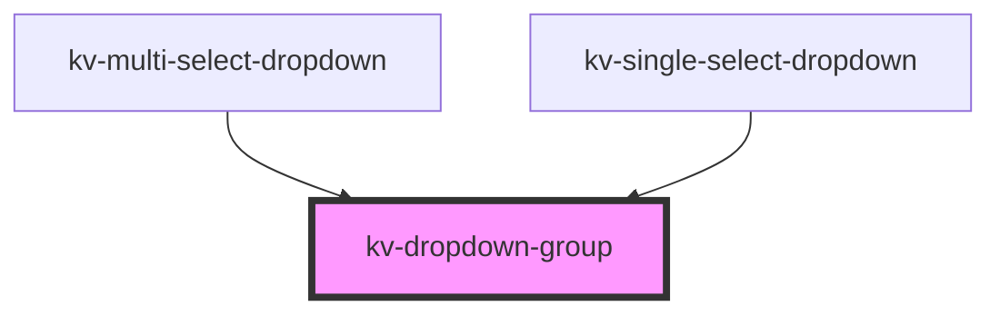

# *<kv-dropdown-group>*

<!-- Auto Generated Below -->


## Usage

### Angular

```html
<kv-dropdown-group label="Default Timezone"> </kv-dropdown-group>
```


### React

```tsx
import React from 'react';
import { KvDropdownGroup } from '@kelvininc/react-ui-components';

export const KvDropdownGroupExample: React.FC = props => (
	<>
		<KvDropdownGroup label="Default Timezone"></KvDropdownGroup>
	</>
);
```


## Properties

| Property | Attribute | Description                                                | Type     | Default     |
| -------- | --------- | ---------------------------------------------------------- | -------- | ----------- |
| `label`  | `label`   | (optional) The text to display on the dropdown group label | `string` | `undefined` |


## Shadow Parts

| Part                | Description                  |
| ------------------- | ---------------------------- |
| `"group-container"` | The group element container. |


## CSS Custom Properties

| Name                                     | Description                           |
| ---------------------------------------- | ------------------------------------- |
| `--dropdown-group-item-background-color` | Dropdown group item background color. |
| `--dropdown-group-item-height`           | Dropdown group item height.           |
| `--dropdown-group-item-label-color`      | Dropdown group item label color.      |


## Dependencies

### Used by

 - [kv-multi-select-dropdown](../multi-select-dropdown)
 - [kv-single-select-dropdown](../single-select-dropdown)

### Graph


----------------------------------------------


